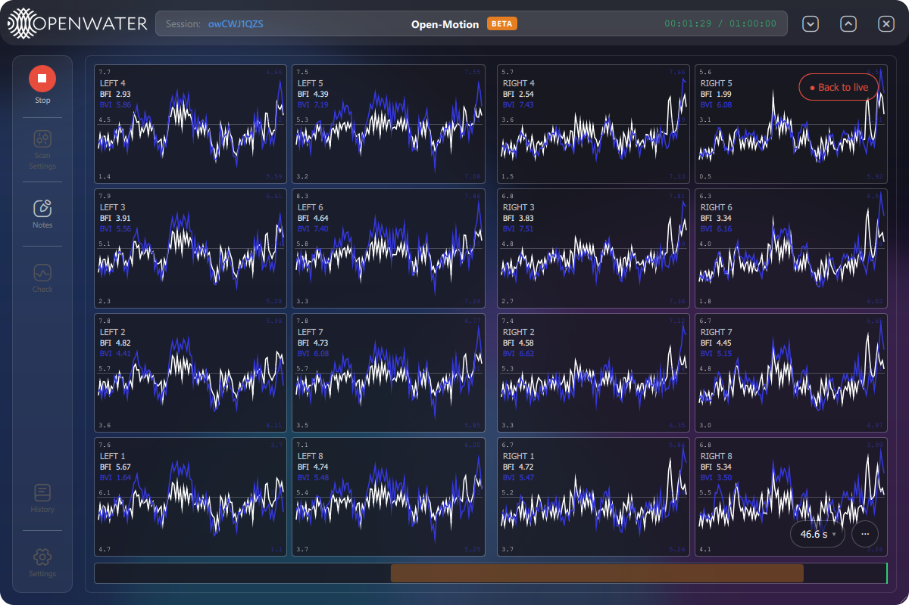

# Open-Motion Bloodflow Application

Python Application UI for OpenMotion Bloodflow monitoring.



## Supported Platforms

| Platform | Status |
|----------|--------|
| Windows 10/11 | Supported (PyInstaller .exe) |
| macOS 12+ (Apple Silicon & Intel) | **In development** — builds and launches, but device communication is not yet fully working |
| Linux | Runs from source (Python 3.12+) |

## Prerequisites

- **Python 3.12 or later**
- **Open-Motion SDK** (`openmotion-pylib`) — installed from the [openmotion-sdk](https://github.com/OpenwaterHealth/OpenMOTION-Pylib) repo
- **libusb** — required for USB communication with sensor modules
  - macOS: `brew install libusb`
  - Linux: `sudo apt install libusb-1.0-0-dev` (Debian/Ubuntu)
  - Windows: Bundled with the SDK

## Running from Source

```bash
# Create a virtual environment (Python 3.12+)
python3.12 -m venv .venv
source .venv/bin/activate    # macOS/Linux
# .venv\Scripts\activate     # Windows

# Install the Open-Motion SDK (from the neighboring repo)
pip install -e ../openmotion-sdk

# Install app dependencies
pip install -r requirements.txt

# Run the application
python main.py
```

## Building Distributable Packages

### macOS (.app + DMG) — *in development*

```bash
source .venv/bin/activate
./build_macos.sh
```

Produces `dist/OpenWater Bloodflow.app` and a DMG installer in `dist/`.

> **Note:** macOS support is still a work in progress. The app builds and launches,
> but end-to-end device communication with the console and sensor modules is not yet
> fully working. Use Windows for production scans.

### Windows (.exe)

```powershell
powershell -ExecutionPolicy Bypass -File build_and_zip.ps1 -OpenFolder
```

Or manually:

```
python -m PyInstaller -y openwater.spec
```

## USB Drivers

The OpenMotion sensor modules require platform-specific USB driver setup. See the [driver documentation](../openmotion-sdk/drivers/README.md) in the SDK repo.

- **Windows:** WinUSB driver installation required (run `drivers/windows/install.bat` as Administrator)
- **Linux:** udev rules required (run `sudo drivers/linux/install.sh`)
- **macOS:** No driver needed — just `brew install libusb` *(device I/O still being stabilized)*

## Data & Log Directories

The application creates the following directories for output:

| Directory | Contents |
|-----------|----------|
| `app-logs/` | Application log files (timestamped) |
| `scan_data/` | Captured histogram data and processed CSV files |

**Where these are created:**

Both directories live under a single root, chosen in this order:

1. `dataDirectory` from `config/app_config.json` (also settable from the UI directory picker)
2. The current working directory, when writable
3. `~/Documents/OpenWater Bloodflow/` as a last-resort fallback (e.g. when the .app is launched from Finder on macOS and cwd is `/`)

## Configuration

Edit `config/app_config.json` to customize behavior:

| Key | Default | Description |
|-----|---------|-------------|
| `dataDirectory` | `null` | Root directory for scan data and app-logs (null = auto-detect) |
| `developerMode` | `false` | Enable developer UI features |
| `reducedMode` | `false` | Simplified clinical UI: forces far camera config + free run, hides scan settings, shows large left/right BFI/BVI panels |
| `leftMask` / `rightMask` | `0x66` | Camera bitmask for left/right sensor modules |
| `writeRawCsv` | `true` | Write raw histogram CSV during capture |
| `rawCsvDurationSec` | `null` | Limit raw CSV capture duration (null = unlimited) |
| `showBfiBvi` | `true` | Plot BFI/BVI instead of raw mean/contrast |
| `plotWindowSec` | `15` | Realtime plot time window (3 / 5 / 15 / 30) |
| `autoScale` | `true` | Auto-scale realtime plot Y-axes (always per-plot) |
| `bfiColor` / `bviColor` | `#ff0000` / `#3437db` | Trace colors for BFI / BVI |
| `bfiClampLow` / `bfiClampHigh` | `0.0` / `10.0` | BFI display clamps — values outside show `--` |
| `bviClampLow` / `bviClampHigh` | `0.0` / `10.0` | BVI display clamps — values outside show `--` |
| `bviLowPassEnabled` | `false` | Enable 1-pole low-pass filter on BVI samples |
| `bviLowPassCutoffHz` | `40.0` | Cutoff frequency for the BVI LPF |
| `bfiMin` / `bfiMax` | `4.0` / `9.0` | Manual BFI plot bounds (when autoscale is off) |
| `bviMin` / `bviMax` | `4.0` / `8.0` | Manual BVI plot bounds (when autoscale is off) |
| `meanMin` / `meanMax` | `0` / `200` | Manual mean plot bounds |
| `contrastMin` / `contrastMax` | `0.0` / `0.7` | Manual contrast plot bounds |
| `support_email` | `support@openwater.health` | Destination for the critical-error modal's **Send Bug Report** button |
| `bug_report_smtp` | _(absent)_ | Optional `{host, port, username, password, from_addr, use_tls}` block. When set, bug reports are emailed automatically with the session log attached; otherwise the app opens your mail client for manual send |
| `connectionTimeoutSec` | `30` | Startup connection watchdog grace period before warning about missing devices (E-104/E-106, yellow toast); `0` disables it |
| `requireConsole` | `true` | Watchdog warns (E-104) if no console connected at startup |
| `minSensors` | `1` | Watchdog warns (E-106) if fewer than this many sensors connected at startup |

Most of these are also editable from the in-app **Settings** panel and persisted automatically.

## Critical Errors

Showstopper conditions (e.g. the sensor's boot-time I2C self-check failing) raise
a dismissible modal carrying a stable error code such as `E-101`. See
[docs/ERROR_CODES.md](docs/ERROR_CODES.md) for the full catalog and recommended
actions.

## Antivirus Note (Windows)

Some antivirus software may block the application from running, including Microsoft Defender or Smart App Control on Windows 11. Users may need to create an exception or temporarily disable these features.

## macOS Gatekeeper Note

Since the application is not notarized with Apple, macOS may block it on first launch. To open it:

1. **Right-click** the app and select **Open** (not double-click)
2. Click **Open** in the confirmation dialog
3. Subsequent launches will work normally via double-click

Alternatively: **System Settings > Privacy & Security > Open Anyway**
