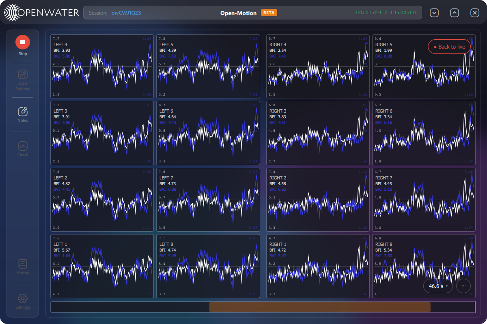

# Open-Motion Research

## Disclaimer

CAUTION - The system described here has not been evaluated by the FDA and is not designed for the treatment or diagnosis of any disease. It is provided AS-IS, with no warranties. User assumes all liability and responsibility for identifying and mitigating risks associated with using this software.

> **For Research Use Only. Not for use in diagnostic procedures.**
> Every build published from this repository is the Open-Motion **Research**
> application.

Desktop application for the Openwater **Open-Motion** system: an optical speckle
imaging device that measures blood flow and blood volume non-invasively. The app
connects to the Open-Motion console and sensor modules, runs scans, and plots
the Blood Flow Index (BFI) and Blood Volume Index (BVI) for each camera in real
time. Every scan is stored locally so you can replay and export it later.



The app is built with PyQt6 and QML. It talks to the hardware only through
[`openmotion-sdk`](https://github.com/OpenwaterHealth/openmotion-sdk), which is
imported as `omotion`.

## Download

Prebuilt **Research** builds are published on the
[Releases page](https://github.com/OpenwaterHealth/openmotion-bloodflow-app/releases).
These are the only builds this repository publishes.

| File | Platform | Notes |
|---|---|---|
| `Open-Motion-Research-Setup-<version>.exe` | Windows 10/11 | Installer. It also installs the USB driver for the sensor modules. **Recommended.** |
| `Open-Motion-Research-<version>.zip` | Windows 10/11 | Portable. Unzip it anywhere and run `Open-Motion.exe`. Install the [USB driver](#usb-drivers) separately. Pre-releases only. |
| `Open-Motion-<version>-macOS.dmg` | macOS (Apple Silicon) | See [macOS](#macos) below. |

**Versions.** Tags such as `1.5.3` are full releases. `-rc.N` (release
candidate) and `-dev.N` (development) tags are pre-releases for testing. Release
candidates and full releases are code-signed with Openwater's EV certificate;
dev builds are unsigned. Research builds check GitHub for updates, and the
in-app updater installs only builds signed with that certificate.

### Windows notes

Windows SmartScreen, Smart App Control or antivirus software may block a new
release the first time it runs, especially an unsigned dev build. If that
happens, allow the app or add an exception for it.

### macOS

The DMG is built on every release but is **still in development**: the app
builds and launches, but device communication is not yet fully validated. Use
Windows for real scans.

The DMG is ad-hoc signed and not notarized, so Gatekeeper blocks it the first
time it launches. Right-click the app, choose **Open**, then click **Open** in
the dialog. You can also allow it under **System Settings → Privacy & Security →
Open Anyway**, or clear the quarantine flag:

```bash
xattr -dr com.apple.quarantine /Applications/Open-Motion.app
```

## Using the app

- **No hardware?** If no console or sensor connects within a few seconds of
  startup, the app offers to open a bundled sample scan. You can then pan, zoom
  and scrub real BFI/BVI traces in the plot viewer. Nothing loads unless you
  accept.
- **History → Export CSV** exports any stored scan. By default the app writes no
  per-scan CSV files; everything is kept in the local scan database.
- **Errors** show a stable code such as `E-104`. The
  [error code catalog](docs/ERROR_CODES.md) explains each code and what to do
  about it.
- **Settings → About → Send Debug Logs** packages the last 48 hours of app
  logs, the app configuration and system information for a bug report. The
  logs include subject IDs but no scan data. Critical error dialogs also have
  a **Contact Support** button.

### Where data and logs go

The app writes two folders under a single root folder:

| Folder | Contents |
|---|---|
| `logs/` | One timestamped log per launch (`open-motion-<YYYYMMDD_HHMMSS>.log`) |
| `data/` | `scans.db` (scans, notes and saved preferences), calibrations, debug-log bundles, updater downloads, and any optional CSV output |

The root folder depends on how the app runs:

| How the app runs | Root folder |
|---|---|
| Installed (Setup .exe) | `%LOCALAPPDATA%\Openwater` (per Windows user) |
| Portable zip | The folder that contains `Open-Motion.exe` |
| macOS | `~/Library/Application Support/Openwater` |
| From source | The current working directory, or `--data-root <dir>` |

If that location isn't writable, the app falls back to `~/Documents/Open-Motion`.

### Settings

Display options live in the in-app **Settings** panel and in the plot's ⋯
menu. Your changes are saved in `scans.db` and persist across launches.

**Settings panel**

| Setting | Default | What it does |
|---|---|---|
| Default Camera Configuration: Left / Right Sensor | `0x66` | Which of the 8 cameras on each sensor module are scanned |
| Display mode | BFI / BVI | Plot BFI/BVI, or raw Mean / Contrast |
| Time window | 5 s | Width of the realtime plot window (3, 5, 15 or 30 s) |
| Auto-scale Y-axes | off | Fit the Y-axes to the data instead of the manual bounds |
| BVI low-pass filter | on | Smooths the **displayed** BVI trace (20 Hz, 1-pole). Stored data is never filtered |
| Trace colors | BFI `#ffffff`, BVI `#3437db` | Plot trace colors |
| Manual Plot Bounds | BFI 0–10, BVI 0–10, Mean 0–200, Contrast 0–0.7 | Y-axis ranges used when autoscale is off |
| Theme | Dark Mode (Liquid Glass on macOS) | Also Liquid Glass or Light Mode |
| Save raw CSV | off | Also write raw histogram CSVs for each scan. **Raw CSV duration** caps how many seconds are written |

**Plot ⋯ menu**

| Setting | Default | What it does |
|---|---|---|
| BFI / BVI ↔ Mean / Contrast | BFI / BVI | Same choice as Display mode in Settings |
| Autoscale | off | Same as Auto-scale Y-axes in Settings |
| Per-plot scale | off (global) | Shown while Autoscale is on: fit each plot to its own data instead of one shared range per metric |
| Axis labels | on | Show the Y-axis values on each plot |

All other values (thresholds, timings, firmware flags) are compiled into the app
in [`config/app_config.py`](config/app_config.py) and change only with a new
build. There is no user-editable configuration file.

## USB drivers

| OS | What to do |
|---|---|
| Windows | The **Setup installer** installs the WinUSB driver for the sensor modules. For the portable zip or a source run, install it from the SDK: run `drivers\windows\install.bat` from an [`openmotion-sdk`](https://github.com/OpenwaterHealth/openmotion-sdk) checkout as Administrator. The console uses the built-in Windows serial driver. |
| macOS | No driver. Install libusb: `brew install libusb`. |
| Linux | Install udev rules from the SDK: `sudo drivers/linux/install.sh` in an `openmotion-sdk` checkout. |

Details are in the SDK's
[driver documentation](https://github.com/OpenwaterHealth/openmotion-sdk/blob/main/drivers/README.md).

---

## Development

### Run from source

You need Python 3.12 or later (the app is tested on 3.13), plus libusb on macOS
and Linux. Clone this repo and `openmotion-sdk` side by side:

```bash
git clone https://github.com/OpenwaterHealth/openmotion-bloodflow-app.git
git clone https://github.com/OpenwaterHealth/openmotion-sdk.git
cd openmotion-bloodflow-app

python -m venv .venv
.venv\Scripts\activate          # Windows
# source .venv/bin/activate     # macOS / Linux

pip install -r requirements.txt
pip install -e ../openmotion-sdk   # editable: SDK changes show up immediately

python main.py
```

Source runs accept a few developer flags. Packaged builds ignore them.

| Flag | Effect |
|---|---|
| `--data-root <dir>` | Write `logs/` and `data/` under `<dir>` |
| `--portable` | Label the run as a portable build |
| `--config-override '{"key": value}'` | Override any compiled config value from `config/app_config.py` for this run |

The app reads **no environment variables**. Command-line flags are the only way
to change its behavior at launch. QML does not hot-reload, so restart the app
after editing a `.qml` file.

### Tests

```bash
python -m pytest tests -m unit
```

Tests marked `unit` mock the hardware and run anywhere. The `dev` and `release`
suites drive real hardware and are run by hand on a bench.

### Build

**Windows.** The default compiler is [Nuitka](https://nuitka.net/), which
produces a single self-contained `Open-Motion.exe`. PyInstaller is kept as a
fallback.

```powershell
powershell -File scripts\build_nuitka.ps1 -Variant research   # → dist\research\Open-Motion\Open-Motion.exe
python -m PyInstaller -y openwater.spec                       # PyInstaller fallback
.\build_and_zip.ps1                                           # build + package every variant's zip and Setup installer
```

The Setup installer needs WiX 5 and the .NET 8 SDK. Without them,
`build_and_zip.ps1` builds the portable zip only and prints a warning.

**macOS.**

```bash
brew install libusb
pip install --upgrade "pyinstaller>=6.13"
./build_macos.sh          # → dist/Open-Motion.app + dist/Open-Motion-<version>-macOS.dmg
```

**Releases** are built by CI (`.github/workflows/release-build.yml`) when a
version tag is pushed. The version comes from the git tag. Release candidates
and full releases install the exact SDK version pinned in `sdk-version.txt`.
Code signing is described in [docs/SIGNING.md](docs/SIGNING.md), and the release
procedure in [AGENTS.md](AGENTS.md).

### Repository layout

| Path | What it is |
|---|---|
| `main.py` | Entry point: Qt app, QML engine, logging, dev flags |
| `motion_connector.py` | The `MotionInterface` QML singleton: all UI ⇄ hardware glue |
| `main.qml`, `pages/`, `components/` | QML UI. `pages/BloodFlow.qml` is the main screen |
| `config/` | Compiled app configuration |
| `utils/` | Paths, settings storage, frozen-build helpers |
| `installer/` | WiX installer sources and the signing script |
| `scripts/` | Build and packaging scripts |
| `tests/` | pytest suite (unit and hardware-in-the-loop) |

## Contributing

Work happens on the `next` branch: branch from `next`, open pull requests
against `next`, and sign off every commit (`git commit -s`). See
[CONTRIBUTING.md](CONTRIBUTING.md).

## License

[Apache-2.0](LICENSE)
