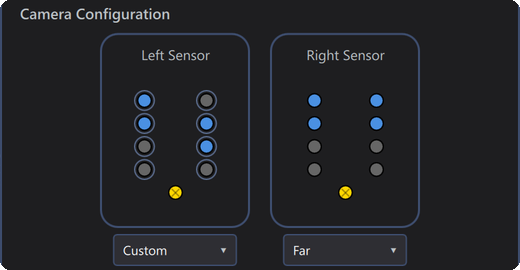
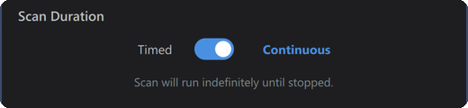
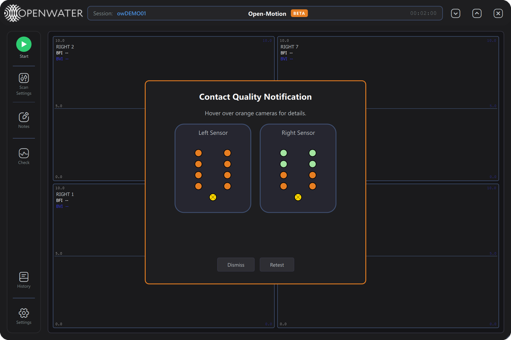
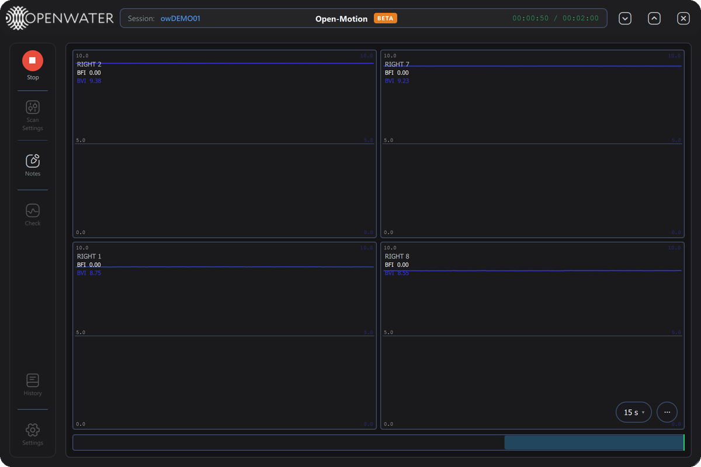
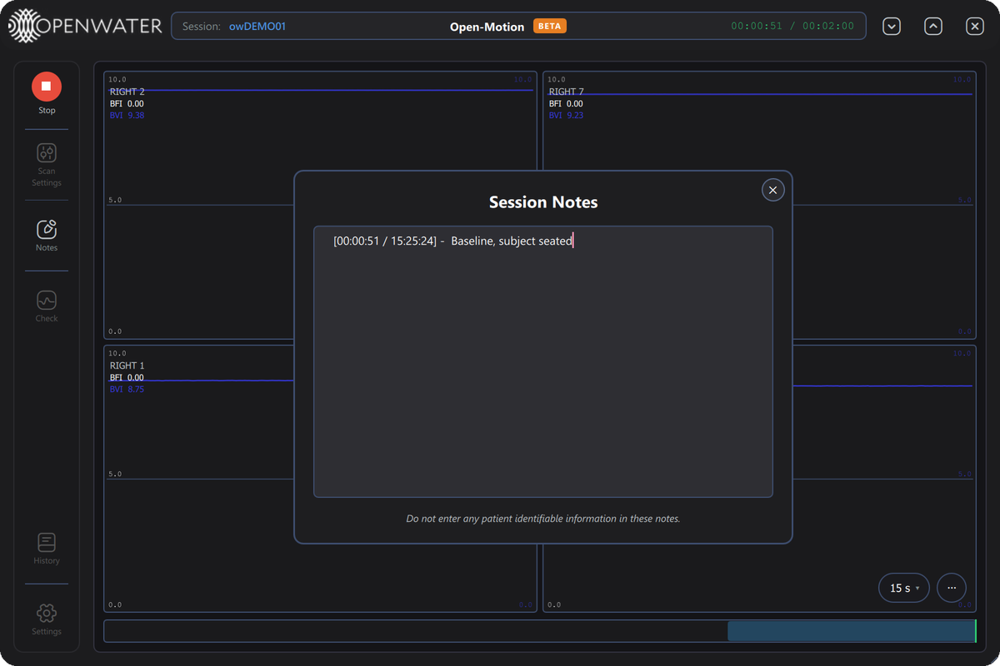
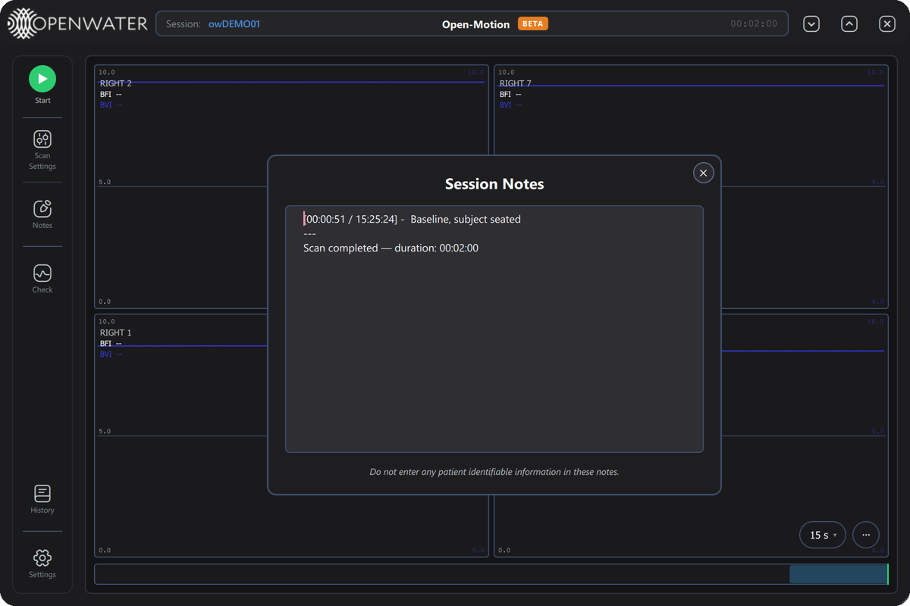
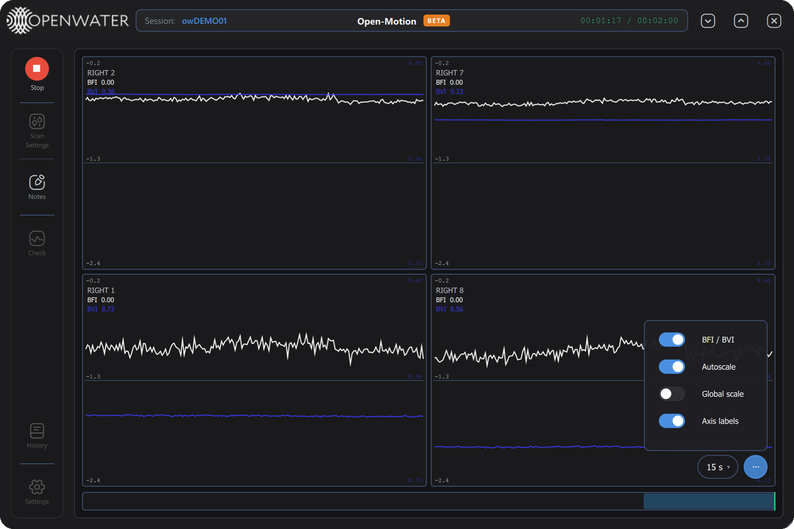
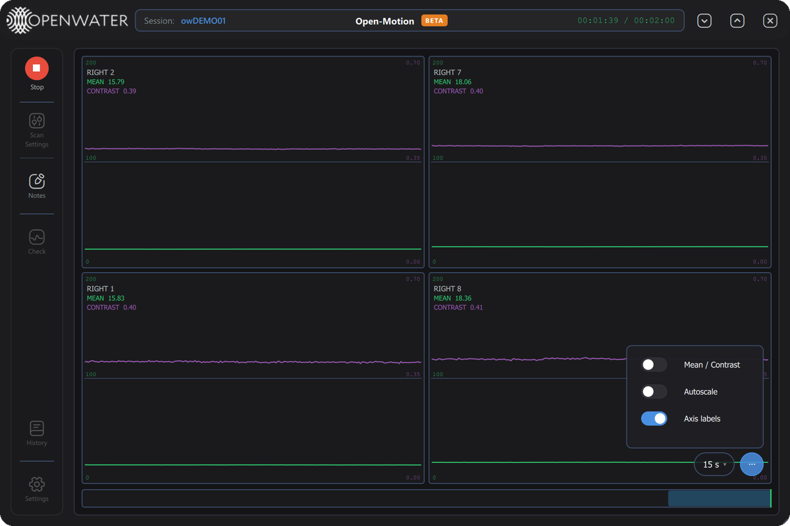
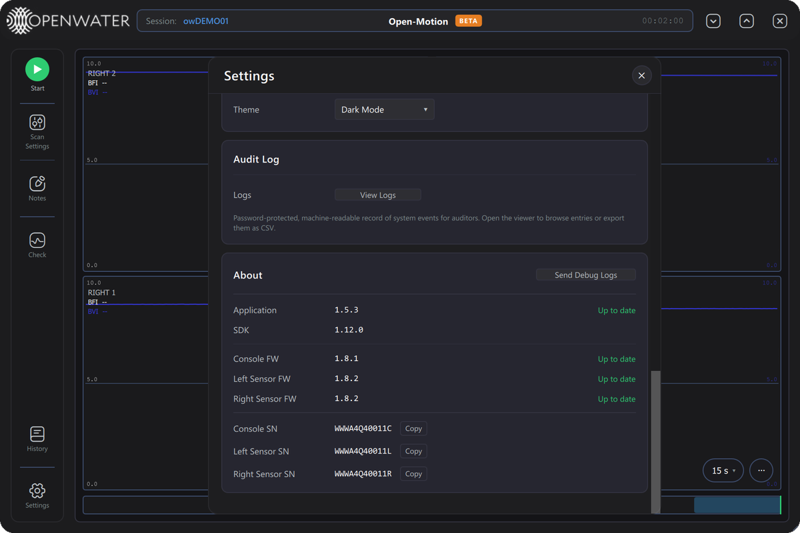

{.cover-logo}

# Open-Motion Research

User Manual
{: .subtitle }

| | |
|---|---|
| **Product** | Open-Motion blood-flow monitor — Research build |
| **Application version** | 1.5.3 |
| **Compatible firmware** | Console 1.8.1 · Sensor modules 1.8.2 |
| **Document revision** | September 2026 — draft |
| **Audience** | Research and study operators |

> **DRAFT — not a controlled document.** This manual is a documentation preview written
> against Open-Motion Research 1.5.3 and illustrated with screenshots of that version
> running on bench hardware. Open-Motion Research is intended for investigational use
> only.

---

## 1. About the system

Open-Motion is Openwater's optical blood-flow monitor. Two forehead **sensor modules**
(eight cameras each) and a **console** containing a near-infrared laser measure
laser-speckle images through the skin and compute, 40 times per second for every active
camera:

- **BFI — Blood Flow Index**: a relative index of blood flow (white trace).
- **BVI — Blood Volume Index**: a relative index of blood volume (blue trace).
- **Mean** and **Contrast**: the raw speckle-image statistics that BFI and BVI are derived
  from, available as an alternative display.

**Open-Motion Research** is the research build of the Open-Motion application. It shows
an orange **BETA** badge in the header and gives full control over acquisition: you
choose which cameras to record, whether a scan is timed or continuous, and how the data
is displayed, with one live plot per camera.

Laser safety is enforced by a hardware interlock inside the console, independently of
this software.

---

## 2. Installing, updating and starting

### 2.1 Installing

- Download **Open-Motion-Research-Setup-1.5.3.exe** from the Open-Motion releases page
  on GitHub (`github.com/OpenwaterHealth/openmotion-bloodflow-app/releases`). The installer
  and the application are code-signed by Openwater.
- The installer installs the USB driver for the sensor modules, then the application, and
  offers a desktop shortcut. It needs administrator rights.
- **Each Windows account has its own scan history, settings and logs** (§11).
- **Upgrading from 1.5.2 or earlier:** the application starts with an empty scan history
  and default display preferences. Earlier scans are not deleted — they remain in
  `C:\ProgramData\Openwater\data` — but this version does not show them.
- A macOS build (`Open-Motion-1.5.3-macOS.dmg`) is published on the same page. This
  manual describes the Windows build.

### 2.2 Updating the application

About 3 seconds after launch, the application checks GitHub for a newer release (this
needs internet access). If one exists, a banner appears under the header:
*"A new version is available: X.Y.Z"* with an **Update** button and a `✕` to hide it.
The same status appears in Settings → About (§10).

Pressing **Update** downloads the new installer (*"Downloading update…"*), checks that it
carries a valid Openwater signature, then closes the application, installs the update and
starts the new version (*"Installing update…"*). Windows may ask for permission to
install. An installer without a valid Openwater signature is refused and nothing is
installed. You can always install a release manually instead (§2.1).

### 2.3 Updating device firmware

When newer firmware is available for a connected device, a banner reads *"Device firmware
update available"*. **View** opens Settings, where the device's row in the About card
shows an **Update** button. Pressing it asks for confirmation:

> *"Console FW will reboot into DFU mode and be re-flashed. Do not unplug it until this
> completes."*

Progress is shown under the firmware rows. Do not unplug or power off the device while it
updates, and do not update firmware while a study is in progress.

### 2.4 Starting the application

Launch **Open-Motion Research** from the Start menu or the desktop shortcut. The
application is a single signed file that unpacks itself on launch, so the window takes a
few seconds to appear.

- Only one copy of Open-Motion can run at a time. A second launch shows *"Another instance
  of the application is already running. Please close the existing instance before opening
  a new one."*
- The application connects to the console and the sensor modules **automatically**
  whenever they are plugged in and powered on. There is no Connect button.
- About 12 seconds after launch the application checks what it found. If a device is
  missing, a yellow message appears in the bottom-right corner:
    - *"Console not detected. Check the console USB cable and power, then reconnect."*
    - *"Sensor not detected. Check the sensor USB cable and power, then reconnect."*
    - *"System not found. Check that the console and sensor are connected and powered on."*
      (nothing was found)
- **Sample dataset:** if no device at all is connected at that point, a dialog titled
  *"No console detected"* offers to open a sample recording — *"You can explore real
  BFI/BVI traces without any hardware connected."* Choose **Open sample dataset** to load
  it into the plot viewer, or **Not now**. The offer is made once per launch.
- After a sensor module connects, the system initializes it for a few seconds. The
  **Start** label stays dimmed and cannot be pressed until initialization finishes.

### 2.5 Connection states

The round badge at the top of the left toolbar shows the system state:

| Badge | Label | Meaning |
|---|---|---|
| Grey circle, chain-link icon | `Disconnected` | The console or both sensor modules are not connected. Scanning is disabled. |
| Green circle, dimmed label | `Start` | Connected; a sensor module is still initializing. Wait a few seconds. |
| Green circle, play icon | `Start` | Ready to scan. |
| Yellow circle | `Start` | Start was pressed; the system is finishing the previous step before the scan begins (normally a few seconds). |
| Red circle, stop icon | `Stop` | A scan is running. Press to stop it. |

### 2.6 Console indicator light

| Console light | Meaning |
|---|---|
| Solid green | Powered and idle. |
| Solid blue | The laser is active (during a check or a scan). |
| Blinking blue | An error. The application shows an error dialog (§12.3); the light returns to green once the dialog is dismissed. If the light blinks with no dialog in the application, power-cycle the console. |

---

## 3. The main screen

| # | Element | What it does |
|---|---|---|
| 1 | **Openwater logo** | Branding. |
| 2 | **Session** | The session label (e.g. `owH05GL6`). A new label is generated at each launch; set your own in Scan Settings (§4). Stored with every scan. |
| 3 | **BETA badge** | Identifies the Research build. |
| 4 | **Scan clock** | Idle: the configured scan length (e.g. `01:00:00`) or `Continuous`. Scanning: `elapsed / total` in green, or `Continuous` and the elapsed time. |
| 5 | **Window controls** | Minimize, maximize/restore, and close. |
| 6 | **Start / Stop badge** | Starts the scan immediately, or stops the running scan (§2.5). |
| 7 | **Scan Settings** | Session label, camera selection and scan length (§4). Disabled during a scan. |
| 8 | **Notes** | Opens Session Notes (§8). Always available. |
| 9 | **Check** | Runs a contact-quality check (§5). Disabled during a scan. |
| 10 | **History** | Opens Scan History — review, replay, export or delete past scans (§9). Disabled during a scan. |
| 11 | **Settings** | Opens Settings (§10). Disabled during a scan. |
| 12 | **Plot grid** | One plot per active camera, labeled `LEFT n` / `RIGHT n` (§7). |

Window behavior:

- **Move** the window by dragging the header bar.
- **Resize** with the diagonal grip in the bottom-right corner (minimum 800 × 600).
- **Close while busy:** if you press `✕` during a scan or check, the application does not
  exit immediately. A yellow message such as *"Scan in progress. Click X again to cancel
  and exit."* appears. Press `✕` again within 5 seconds to cancel the work and exit.

---

## 4. Scan Settings

Press **Scan Settings** to set up the next scan. Closing the dialog (`✕`, `Esc`, or
clicking outside it) applies the settings.

*Scan Settings with the label `DEMO01`, no cameras on the left sensor, the Far pattern on
the right sensor, and a 2-minute timed scan.*

### 4.1 Session

**User Label** names the session. Letters and digits are kept, converted to upper case and
prefixed with `ow` — typing `demo01` gives `owDEMO01`. The label appears in the header, in
Scan History, and in every scan's full label (e.g. `20260925_222432_owDEMO01`, with the
scan's start time in UTC). The label stays in effect until you change it or restart the
application.

> Use a study or subject code, never a name or other patient-identifiable information.

### 4.2 Camera Configuration

Each sensor diagram shows the module's eight cameras: cameras 1 to 4 down the left column,
8 to 5 down the right column, and the laser aperture (yellow ⊗) at the bottom. **Blue**
cameras will be recorded; **grey** cameras will not. Hover over a camera to see its
number. A disconnected sensor's diagram is dimmed and cannot be changed.

Choose a pattern for each sensor from the list under its diagram:

| Pattern | Cameras recorded |
|---|---|
| **None** | none — the sensor is not used |
| **Near** | 2, 4, 5, 7 |
| **Middle** | 2, 3, 6, 7 (default) |
| **Far** | 1, 2, 7, 8 |
| **Outer** | 1, 4, 5, 8 |
| **Left** | 1, 2, 3, 4 |
| **Right** | 5, 6, 7, 8 |
| **Third Row** | 2, 7 |
| **All** | all eight |
| **Custom** | any combination — see below |

**Custom:** a ring appears around each camera and clicking a camera turns it on or off.
Custom starts from the cameras currently shown.

*Custom mode on the left sensor: each camera can be clicked to include or exclude it.*

More cameras give more coverage but denser plots and larger recordings. The selection is
kept if a sensor briefly disconnects and reconnects. The patterns selected when the
application starts come from Settings → Default Camera Configuration (§10).

### 4.3 Scan Duration

| Control | What it does |
|---|---|
| **Timed / Continuous** switch | **Timed**: the scan stops by itself after the set time. **Continuous**: the scan runs until you press Stop (*"Scan will run indefinitely until stopped."*), up to a maximum of 12 hours. |
| **H : M : S** | The timed length (default 1:00:00, up to 99:59:59). A length of 0:00:00 is not allowed; it is reset to 1 minute with the message *"Scan duration cannot be 0 seconds — reset to 1 minute."* |

---

## 5. Checking contact quality

Press **Check** (not available during a scan) to check sensor contact without recording.
The laser is on during the check, which takes about 10 seconds. The check tests **all
eight cameras** on each connected sensor, whatever is selected in Scan Settings.

*A check with problems: the left sensor was not in contact, and the right sensor had good
contact on its top four cameras only.*

| Border | Title | Meaning |
|---|---|---|
| **Green** | *Good signal quality* | All cameras report acceptable ambient light and contact levels. |
| **Orange** | *Contact Quality Notification* | One or more cameras have a problem. Hover over an orange camera for the reason. |
| **Red** | *Contact check failed* | The check could not be completed; the reason is shown in red. |

Camera dots: **green** = good contact · **orange** = problem · **grey** = not evaluated.
Hovering over a camera shows its label (L = left, R = right, then the camera number) and
the problem:

| Reason | What to do |
|---|---|
| **Poor sensor contact** | The camera is not receiving enough light back from the skin. Re-seat the module flat against the skin and check for hair or debris. |
| **Ambient light detected** | Room light is reaching the camera. Improve the seal against the skin or shade the sensors. |

**Dismiss** closes the dialog; **Retest** runs the check again after you adjust the
sensors. A scan does not run the check for you — run it before pressing Start when contact
matters.

---

## 6. Running a scan

1. Set up the scan in **Scan Settings** (§4). The defaults (Middle pattern, 1-hour timed
   scan) are a reasonable starting point.
2. Run **Check** (§5) and re-seat the sensors until the cameras you plan to record are
   green.
3. Press **Start**. The scan starts immediately: the badge may turn yellow for a moment,
   then red (**Stop**), and the header clock starts counting.

*A 2-minute timed scan on four cameras of the right sensor, 26 seconds in. Bench capture —
the sensors were not on a subject, so the values are not physiological.*

During the scan:

- Each plot shows one camera's BFI (white) and BVI (blue) traces, with the latest values
  under its label (§7).
- **Scan Settings**, **Check**, **History** and **Settings** are disabled. **Notes** stays
  available.
- Press **Space** to open Session Notes with a timestamp already inserted:

*Space during a scan inserts `[elapsed / clock time] - ` — type the observation and close
the window with ✕ to save it.*

**Contact warnings during a scan.** If contact degrades on a recorded camera, the
contact-quality dialog opens on top of the plots. Only the recorded cameras are evaluated;
the others are grey. The scan keeps recording while the dialog is shown.

| Button | Action |
|---|---|
| **Stop scan** | End the scan now. |
| **Continue** | Return to the plots. Enabled only after every problem has stayed clear for a few seconds — re-seat the sensor and wait for the border to turn green and the message *"All contact quality issues are currently inactive. You may dismiss."* |

**Camera messages.** Short messages in the bottom-right corner report individual cameras:

- *"Camera RIGHT 2 connection lost at 00:01:23 — last temp 41.2°C"* — that camera has
  delivered no data for more than 2 seconds, and its plot shows **CONNECTION LOST**. The
  scan continues on the remaining cameras. Check the sensor module's cable and power.
- *"Camera RIGHT 2 reconnected at 00:01:40"* — data from that camera resumed.
- *"Camera RIGHT 2 temperature … — above 110°C threshold. Check the airflow around the
  sensor module."* — a camera is running hot. Make sure nothing covers the module's vents.

If every camera stops delivering data, the scan is stopped automatically (E-303, §12.4).

**Ending the scan.** A timed scan stops by itself; otherwise press the red **Stop** badge
(or **Stop scan** in a contact warning). After a few seconds, **Session Notes** opens with
a closing line — *"Scan completed — duration: 00:02:00"* for a timed scan that ran to the
end, *"Scan stopped — duration: …"* when stopped early.

- If gaps longer than 1 second were detected in the data, a *"Data gaps (>1.0s): …"* line
  is added.
- All scan data is saved automatically to the scan database (§11); raw CSV files are also
  written if enabled in Settings (§10).
- If a scan ends unexpectedly, a message reports what was kept:
    - *"Scan ended unexpectedly — partial data was saved. The final segment could not be
      dark-corrected and was discarded."* (yellow)
    - *"Scan ended unexpectedly and no data was recorded (the device may have disconnected
      mid-scan). This scan was not saved."* (red; stays on screen until dismissed)

---

## 7. Reading and navigating the plots

### 7.1 The plot grid

There is one plot per recorded camera. The grid mirrors the sensor modules: the left
module's cameras on the left, the right module's on the right, and each row pairs the
cameras that sit opposite each other — 4 and 5, 3 and 6, 2 and 7, 1 and 8 from top to
bottom. Rows with no recorded camera are left out.

Each plot shows:

- the camera label (`LEFT 3`, `RIGHT 7`, …) and its latest values under it;
- the traces: BFI (white) and BVI (blue), or Mean (green) and Contrast (purple);
- axis labels: the left scale belongs to the first trace (BFI or Mean), the right scale to
  the second (BVI or Contrast);
- **CONNECTION LOST** while that camera is not delivering data during a live scan.

BFI and BVI values are limited to a 0–10 display range: a value below 0 shows as `0.00`
and a value above 10 as `10.00`. `--` means there is no valid reading.

### 7.2 Display options — the `⋯` menu

The `⋯` button at the bottom-right of the plots opens the display options:

| Switch | What it does |
|---|---|
| **BFI / BVI** ↔ **Mean / Contrast** | Switches every plot between BFI/BVI and the raw Mean/Contrast statistics. |
| **Autoscale** | Fits the vertical axis to the data instead of using the Manual Plot Bounds from Settings. |
| **Global scale** ↔ **Per-plot scale** | Shown while Autoscale is on. Global: all plots share one range. Per-plot: each plot fits its own data. |
| **Axis labels** | Shows or hides the numbers on the vertical axes. |

These switches are the same settings as in Settings → Realtime Plot Display and stay set
across restarts.

*Autoscale on: each axis fits the data, so small changes become visible.*

*Mean / Contrast display: Mean (green) and speckle Contrast (purple) for each camera.*

### 7.3 Navigation

The plot area works like a video recorder: you can rewind during or after a scan without
losing the live recording.

| Control | Where | What it does |
|---|---|---|
| **Window-length pill** (e.g. `15 s ▾`) | Bottom-right of the plots | Chooses how much time is visible: 5 s, 15 s, 30 s, 1 min or 5 min. The plots open at 15 s. |
| **Timeline bar** | Under the plots | Shows the whole scan. Drag the highlighted window to move through time, or click the bar to jump. Blue = following the live edge; orange = paused in the past. |
| **Drag on a plot** | Plot area | Pans back or forward in time (stops following live). |
| **Mouse wheel on a plot** | Plot area | Zooms the time window in or out around the pointer. |
| **Hover** | Plot area | Shows a readout box (top-right) with the time and every camera's values under the pointer. |
| **`● Back to live`** | Top-right of the plots | Appears when you have moved into the past during a scan. Click to return to the live edge. |

Keyboard shortcuts (active when the plot area has keyboard focus — click a plot first):

| Key | Action |
|---|---|
| `←` / `→` | Pan 1 second back / forward (hold `Shift` to pan a full window) |
| `+` or `↑` | Zoom in |
| `-` or `↓` | Zoom out |
| `0` | Reset the zoom and return to live |
| `Home` / `End` | Jump to the start of the scan / return to the live edge |
| `Esc` | Release keyboard focus from the plots |
| `Space` | Open Session Notes with a timestamp (during a scan) |

---

## 8. Session Notes

- Open the notes with the **Notes** button at any time. They open automatically after
  every scan, and **Space** during a scan opens them with a timestamp line
  (`[elapsed / clock time] - `) ready for you to type after.
- Notes are attached to a scan. During a scan they belong to that scan; after a scan they
  edit the scan just recorded. Each new scan starts with empty notes, so text typed before
  a session's first scan is cleared when that scan starts.
- Notes are saved when the window closes — with `✕`, `Esc`, or by clicking outside the
  window. *"Note saved."* confirms it. **Always close the Notes window after typing** so
  the text is saved.
- Saved notes appear, read-only, in Scan History (§9). They are kept in the scan database
  and are not included in exported CSV files.

> **Do not enter patient-identifiable information in the notes.** The same reminder is
> shown at the bottom of the Notes window.

---

## 9. Scan History

Press **History** (available when no scan is running) to review past scans.

| Column / control | What it shows or does |
|---|---|
| **User Label** | The session label the scan was recorded under. Scans from one session share a label; use the date and time to tell them apart. |
| **Date / Time** | When the scan started, in the computer's local time. |
| **Config (L / R)** | The camera pattern used on each side (`None`, `Middle`, `Far`, …). A Custom selection shows as its camera mask in hexadecimal, e.g. `0x5B`. |
| **Duration** | Scan length in minutes:seconds. `—` means the scan was interrupted and has no recorded end. |
| **Search label…** | Filters the list by label. |
| **Column headers** | Click to sort; click again to reverse (▲ / ▼). |
| **Row click** | Selects the scan and shows its details: full label, operator, number of samples, camera masks (hexadecimal, left / right), configuration and notes (read-only). |
| **Checkboxes** | Mark several scans for Delete or Export. The header checkbox selects all. |
| **Export CSV (N)** | Exports the checked scans to CSV (§9.1). |
| **Load "label" →** | Opens the selected scan in the plot viewer for replay (§9.3). |
| **🗑 Delete (N)** | Permanently deletes the checked scans (§9.2). |
| **✕** | Closes History. |

### 9.1 Exporting

One checked scan opens a Save dialog (default name `<full label>_export.csv`); several ask
for a destination folder and write one file per scan. Each file has one row per frame:
the frame number, the time in seconds, and BFI, BVI, Mean and Contrast for every recorded
camera, plus a quality flag per camera. Notes are not included. Interrupted scans cannot
be exported (*"Interrupted scans can't be exported."*). A message confirms the export
(*"Exported to …"* or *"Exported N scan(s) to …"*).

### 9.2 Deleting

Deleting is permanent and password-protected: pressing **Delete** opens a *Confirm Delete*
prompt, and the scans are removed only after the password issued by Openwater is entered.

### 9.3 Replay

After **Load**, the plots show the recorded scan with a **Viewing** badge naming it
(label · date and time). All plot features (§7) work the same way on a replay. When it is
shown, the red **← Back to live scan** pill returns to the live view. A scan recorded in
clinical mode replays in the clinical layout (one averaged plot per side).

*The 2-minute scan loaded from History, with the window set to 5 minutes so the whole scan
fits.*

---

## 10. Settings

Press **Settings** (available when no scan is running). Changes apply immediately and are
saved when you close Settings with `✕`, `Esc`, or by clicking outside it.

*Settings, top. The Output Folder shows your data folder (§11).*

| Card | Contents |
|---|---|
| **Sensor Placement Instructions** | Place the sensor modules symmetrically about the midline on the forehead, in direct contact with the skin, above the brow line, with no obstructions or debris. |
| **Default Camera Configuration** | The Left Sensor / Right Sensor patterns (§4.2) selected when the application starts. Changes take effect at the next launch; Scan Settings changes the current session. |
| **Data Output** | *Output Folder*: this Windows account's data folder, for reference (it cannot be changed). *Save raw CSV*: also write the raw camera histograms of each scan to CSV files (§11). *Raw CSV duration*: limit raw output to the first N seconds of each scan; leave blank for the whole scan. |

| Card | Contents |
|---|---|
| **Realtime Plot Display** | *Display mode* (Mean / Contrast ↔ BFI / BVI) and *Auto-scale Y-axes* — the same switches as the `⋯` menu (§7.2). *Time window*: 3, 5, 15 or 30 s; to change how much time the plots show, use the window-length pill (§7.3). *BVI low-pass filter*: smooths the BVI trace (20 Hz cutoff, on by default); takes effect immediately, including during a scan. |

| Card | Contents |
|---|---|
| **Manual Plot Bounds** | Fixed vertical ranges used when autoscale is off: Min and Max for BFI and BVI (0–10), Mean (0–1024) and Contrast (0–1). Min always stays below Max; out-of-range entries are corrected automatically. |
| **Appearance** | *Theme*: **Dark Mode** (default), **Light Mode**, or **Liquid Glass**. The interface re-themes immediately. |
| **Audit Log** | **View Logs** opens the audit log — a machine-readable record of system events for auditors. It asks for a password issued by Openwater; the viewer filters by event type, date range and text and exports CSV. |

The **About** card lists:

| Row | Meaning |
|---|---|
| **Application** | The application version, with *Up to date*, *Check failed* (no internet access or GitHub unreachable), or an **Update** button (§2.2). |
| **SDK** | The version of the Open-Motion software library. |
| **Console FW**, **Left Sensor FW**, **Right Sensor FW** | Firmware version of each connected device (or *Not connected*), with *Up to date* or an **Update** button (§2.3). |
| **Console SN**, **Left Sensor SN**, **Right Sensor SN** | Hardware serial numbers. **Copy** puts a serial number on the clipboard — include them when contacting support. |
| **Send Debug Logs** | Packages recent application logs for support (§13). |

---

## 11. Data storage

Each Windows account keeps its own data in a private folder:

`C:\Users\<Windows user>\AppData\Local\Openwater`

| Location | Contents |
|---|---|
| `logs\` | One application log file per launch (`open-motion-<date>_<time>.log`). |
| `data\scans.db` | The scan database: all scans, their notes, and your display preferences. |
| `data\<full label>_left_mask<xx>_raw.csv`, `…_right_mask<xx>_raw.csv` | Raw camera histograms, one file per sensor, only when *Save raw CSV* is on. These are large — several hundred megabytes per camera per hour. |
| `data\debug-bundles\` | Zip files created by *Send Debug Logs*. |
| `data\updates\` | Installers downloaded by the in-app updater. |

- Scan data is kept automatically in the database. Processed CSV files are only created
  when you export from Scan History (§9.1).
- In the Research build the database is not encrypted. Protect the computer and any
  exported files according to your study's data-handling rules.
- Scans recorded by version 1.5.2 or earlier remain in `C:\ProgramData\Openwater\data`
  and are not shown by this version (§2.1).
- On macOS, the data folder is `~/Library/Application Support/Openwater`.

---

## 12. Messages and errors

### 12.1 Messages (toasts)

Short messages appear in the bottom-right corner, color-coded: **green** = success,
**yellow** = warning, **red** = error, **blue** = information. Most dismiss themselves after
a few seconds (hovering over one pauses its countdown); those with an `✕` can be closed by
hand. Up to five are shown at a time.

| Message | Meaning / action |
|---|---|
| *"Note saved."* | Session notes were stored. |
| *"Console not detected…"*, *"Sensor not detected…"*, *"System not found…"* | A device was not found at startup (§2.4). Check cables and power. |
| *"Left sensor disconnected"* (or *Right sensor*, *Console*) | A device was unplugged or powered off while no scan was using it. Reconnect it. |
| *"Could not start scan — the previous step is still finishing. Please press Start again."* | The system was still busy. Wait a few seconds and press Start again. |
| *"Scan failed: …"* | The scan could not start or run; the reason follows. |
| *"Scan duration cannot be 0 seconds — reset to 1 minute."* | See §4.3. |
| *"Camera … connection lost …"*, *"… reconnected …"*, *"… temperature …"* | Individual camera events during a scan (§6). |
| *"Scan ended unexpectedly …"* | See §6. |
| *"Laser safety warning detected. Please restart your console. If this error persists, please contact support."* (red, stays on screen) | The console's hardware laser-safety monitor reported a fault. Power-cycle the console. Contact support if it recurs. |
| *"Exported to …"*, *"Exported N scan(s) to …"* | A CSV export finished. |
| *"Interrupted scans can't be exported."* | The selected scan was interrupted and has no exportable data. |
| *"Console SN copied to clipboard."* (or *Left / Right Sensor SN*) | A serial number was copied from Settings → About. |
| *"Preparing debug logs…"*, *"Debug logs saved to …"* | See §13. |

### 12.2 Closing while busy

Pressing `✕` during a scan or check shows *"… in progress. Click X again to cancel and
exit."* Press `✕` again within 5 seconds only if you intend to abandon the work.

### 12.3 Error dialog

Serious conditions raise a blocking **ERROR** dialog. It shows the error code (for example
`E-202`), a title, an explanation, and a suggested action (→). While it is shown, the
console light blinks blue.

| Control | What it does |
|---|---|
| **▶ Details** | Expands technical detail, when available. |
| **N more** | Several errors are queued; they are shown one after another. |
| **Copy details** | Copies the error report to the clipboard. |
| **Contact Support** | Opens your email program with a pre-filled message to Openwater support, copies the report to the clipboard, and opens the folder containing the application log with the file selected — attach it to the email before sending. |
| **Dismiss** | Closes the dialog (or shows the next queued error). Clicking outside the dialog or pressing `Esc` does the same. |

Quote the error code when contacting support.

### 12.4 Error code reference

| Code | Title | Meaning | What to do |
|---|---|---|---|
| `E-101` | Sensor self-check failed | One or more of a sensor module's internal devices did not respond to its power-on self-check. The system cannot scan reliably. | Power-cycle the sensor module and reconnect. If it persists, the module needs service — contact support. |
| `E-102` | Sensor self-check unreadable | The sensor module connected but did not report its self-check result. | Power-cycle and reconnect. If it persists, update the sensor firmware or contact support. |
| `E-103` | Console initialization failed | The console's laser-power configuration could not be applied. | Power-cycle the console and reconnect. If it persists, contact support. |
| `E-104` | Console not detected | Startup check: no console found (yellow message, not a dialog). | Check the console USB cable and power. |
| `E-105` | Camera power-on failed | The sensor module could not power on its cameras. | Power-cycle the sensor module and reconnect. If it persists, the module may need service. |
| `E-106` | Sensor not detected | Startup check: no sensor module found (yellow message, not a dialog). | Check the sensor USB cable and power. |
| `E-201` | Laser safety monitor unresponsive | Laser safety could not be confirmed, so the laser was shut off as a precaution. | Power-cycle the system and reconnect. **Do not scan until this clears.** Contact support if it persists. |
| `E-202` | Laser safety trip | The laser-safety monitor tripped during a scan. The laser was shut off and the scan stops about 5 seconds later. | Remove any obstruction, let the system settle, and start a new scan. If it trips repeatedly, stop and contact support. |
| `E-301` | Scan aborted before start | A check before the laser fired failed, so the scan did not start. | Resolve the reported problem (connection, safety or configuration) and start again. |
| `E-302` | Scan could not start | The system refused a new scan, usually because the previous one is still finishing. | Wait a few seconds and try again. Reconnect if it stays busy. |
| `E-303` | Camera data lost during scan | Every camera stopped delivering data for about 3 seconds, so the scan was stopped. Data captured before the loss was saved. | Check the sensor cables and power, reconnect, and start a new scan. |
| `E-304` | Device disconnected during scan | The console or a sensor module in use was disconnected during the scan, so the scan was stopped. Data captured before the disconnection may not have been saved. | Check the USB cables and power, reconnect, and start a new scan. |

---

## 13. Getting help

1. Open **Settings → About** and press **Send Debug Logs**. The application packages the
   last 48 hours of application logs into a zip file under `data\debug-bundles\`, opens
   the folder with the file selected, and shows the file's location. The package contains
   application logs only — no scan data.
2. Email the zip file to Openwater support at **support@openwater.health** with a
   description of the problem, the error code if there was one, and the serial numbers from
   Settings → About.
3. From an error dialog, **Contact Support** prepares the email for you (§12.3).

---

## 14. Known issues in 1.5.3

| Issue | Workaround |
|---|---|
| After changing the User Label between scans, the data file name of the next scan can still carry the previous label; it is correct from the scan after that. | Check the file names after changing the label. |
| The *"Debug logs saved…"* message names `support@openwater.cc`. | Send debug logs to the support address in §13. |
| Plot data loads slowly when zooming out to the beginning of a long scan. | Allow a moment for the plot to fill in. |
| A scan just under a whole minute can show a duration such as `0:60` in Scan History. | Read it as `1:00`. The duration line in the scan's notes is correct. |
| When the window is maximized, the restore button shows an incorrect icon. | The button still restores the window. |

---

*Open-Motion Research User Manual · App 1.5.3 · September 2026 draft*
