

{.cover-logo}

# Open-Motion Research

User Manual
{: .subtitle }

| | |
|---|---|
| **Product** | Open-Motion blood-flow monitor — Research build |
| **Application version** | 1.5.4 |
| **Compatible firmware** | Console 1.8.1 · Sensor modules 1.8.2 |
| **Document revision** | September 2026 — draft |
| **Audience** | Research and study operators |

> **DRAFT — not a controlled document.** This manual is a documentation preview written
> against Open-Motion Research 1.5.4 and illustrated with screenshots of the application
> running on bench hardware. Open-Motion Research is intended for investigational use
> only.

---

## 1. About the system

Open-Motion is Openwater's optical blood-flow monitor. Two forehead **sensor modules**
(eight cameras each) and a **console** containing a near-infrared laser measure
laser-speckle images through the skin and compute, 40 times per second for every active
camera:

- **BFI — Blood Flow Index**: a relative index of blood flow (white trace).
- **BVI — Blood Volume Index**: a relative index of blood volume (blue trace).
- **Mean** and **Contrast**: the raw speckle-image statistics that BFI and BVI are derived
  from, available as an alternative display.

**Open-Motion Research** is the research build of the Open-Motion application. Its
header reads **Open-Motion Research** with an orange **BETA** badge, and it gives full
control over acquisition: you choose which cameras to record, whether a scan is timed or
continuous, and how the data is displayed — one live plot per camera, per mirrored camera
pair, or per sensor module (§7).

Laser safety is enforced by a hardware interlock inside the console, independently of
this software.

---

## 2. Installing, updating and starting

### 2.1 Installing

- Download **Open-Motion-Research-Setup-1.5.4.exe** from the Open-Motion releases page
  on GitHub (`github.com/OpenwaterHealth/openmotion-bloodflow-app/releases`). The installer
  and the application are code-signed by Openwater.
- The installer installs the USB driver for the sensor modules, then the application. The
  *Create a desktop shortcut* option (on by default) adds an **Open-Motion Research** icon
  to the desktop. It needs administrator rights.
- **Each Windows account has its own scan history, settings and logs** (§11).
- **Upgrading from 1.5.2 or earlier:** the application starts with an empty scan history
  and default display preferences. Earlier scans are not deleted — they remain in
  `C:\ProgramData\Openwater\data` — but this version does not show them.
- **Uninstalling:** remove **Open-Motion Research** in Windows Settings → Apps →
  Installed apps. The application, its Start-menu entry and its desktop shortcut are
  removed. Your scans, settings and logs (§11) and the USB driver are kept.
- A macOS build (`Open-Motion-1.5.4-macOS.dmg`, containing **Open-Motion Research.app**)
  is published on the same page. It does not replace an older `Open-Motion.app` in
  Applications; delete that one by hand. This manual describes the Windows build.

### 2.2 Updating the application

About 3 seconds after launch, the application checks GitHub for a newer release (this
needs internet access). If one exists, a banner appears under the header:
*"A new version is available: X.Y.Z"* with an **Update** button and a `✕` to hide it.
The same status appears in Settings → About (§10).

Pressing **Update** downloads the new installer (*"Downloading update…"*), checks that it
carries a valid Openwater signature, then closes the application, installs the update and
starts the new version (*"Installing update…"*). Windows may ask for permission to
install. An installer without a valid Openwater signature is refused and nothing is
installed. You can always install a release manually instead (§2.1).

> **Updating from 1.5.3:** the update installs, but the application does not start again
> by itself. Open **Open-Motion Research** from the Start menu or the desktop shortcut.

### 2.3 Updating device firmware

When newer firmware is available for a connected device, a banner reads *"Device firmware
update available"*. **View** opens Settings, where the device's row in the About card
shows an **Update** button. Pressing it asks for confirmation:

> *"Console FW will reboot into DFU mode and be re-flashed. Do not unplug it until this
> completes."*

Progress is shown under the firmware rows. Do not unplug or power off the device while it
updates, and do not update firmware while a study is in progress.

### 2.4 Starting the application

Launch **Open-Motion Research** from the Start menu or the desktop shortcut. The
application is a single signed file that unpacks itself on launch, so the window takes a
few seconds to appear.

- Only one copy of Open-Motion can run at a time. A second launch shows *"Another instance
  of the application is already running. Please close the existing instance before opening
  a new one."*
- The application connects to the console and the sensor modules **automatically**
  whenever they are plugged in and powered on. There is no Connect button.
- About 12 seconds after launch the application checks what it found. If a device is
  missing, a yellow message appears in the bottom-right corner:
    - *"Console not detected. Check the console USB cable and power, then reconnect."*
    - *"Sensor not detected. Check the sensor USB cable and power, then reconnect."*
    - *"System not found. Check that the console and sensor are connected and powered on."*
      (nothing was found)
- If the drive that holds the data folder (§11) has less than 1 GB free, the **E-107**
  error dialog appears at launch. Free up space before scanning (§12.4).
- **Sample dataset:** if no device at all is connected at that point, a dialog titled
  *"No console detected"* offers to open a sample recording — *"You can explore real
  BFI/BVI traces without any hardware connected."* Choose **Open sample dataset** to load
  it into the plot viewer, or **Not now**. The offer is made once per launch.
- After a sensor module connects, the system initializes it for a few seconds. The
  **Start** label stays dimmed and cannot be pressed until initialization finishes.

### 2.5 Connection states

The round badge at the top of the left toolbar shows the system state:

| Badge | Label | Meaning |
|---|---|---|
| Grey circle, chain-link icon | `Disconnected` | The console or both sensor modules are not connected. Scanning is disabled. |
| Green circle, dimmed label | `Start` | Connected; a sensor module is still initializing. Wait a few seconds. |
| Green circle, play icon | `Start` | Ready to scan. |
| Yellow circle | `Start` | Start was pressed; the system is finishing the previous step before the scan begins (normally a few seconds). |
| Red circle, stop icon | `Stop` | A scan is running. Press to stop it. |

### 2.6 Console indicator light

| Console light | Meaning |
|---|---|
| Solid green | Powered and idle. |
| Solid blue | The laser is active (during a check or a scan). |
| Blinking blue | An error. The application shows an error dialog (§12.3); the light returns to green once the dialog is dismissed. If the light blinks with no dialog in the application, power-cycle the console. |

---

## 3. The main screen

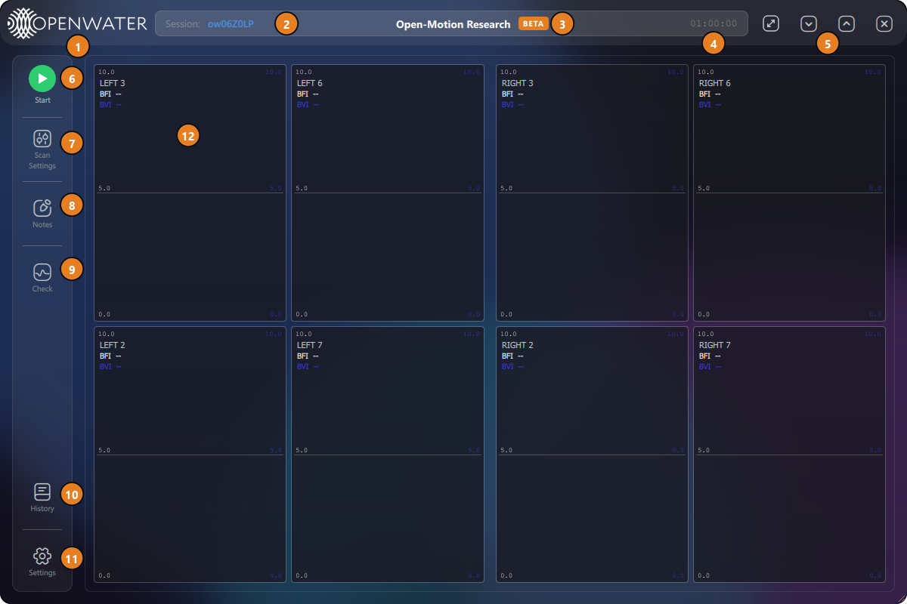

| # | Element | What it does |
|---|---|---|
| 1 | **Openwater logo** | Branding. |
| 2 | **Session** | The session label (e.g. `owH05GL6`). A new label is generated at each launch; set your own in Scan Settings (§4). Stored with every scan. |
| 3 | **Product name and BETA badge** | `Open-Motion Research` and the orange BETA badge identify the Research build. |
| 4 | **Scan clock** | Idle: the configured scan length (e.g. `01:00:00`) or `Continuous`. Scanning: `elapsed / total` in green, or `Continuous` and the elapsed time. |
| 5 | **Window controls** | Fullscreen, minimize, maximize/restore, and close. |
| 6 | **Start / Stop badge** | Starts the scan immediately, or stops the running scan (§2.5). |
| 7 | **Scan Settings** | Session label, camera selection and scan length (§4). Disabled during a scan. |
| 8 | **Notes** | Opens Session Notes (§8). Always available. |
| 9 | **Check** | Runs a contact-quality check (§5). Disabled during a scan. |
| 10 | **History** | Opens Scan History — review, replay, export or delete past scans (§9). Disabled during a scan. |
| 11 | **Settings** | Opens Settings (§10). Disabled during a scan. |
| 12 | **Plot grid** | One plot per recorded camera, labeled `LEFT n` / `RIGHT n`; other views in §7.2. |

Window behavior:

- **Move** the window by dragging the header bar. Drag it to a screen edge or corner to
  snap it there, or use the Windows `Win`+arrow keys.
- **Resize** by dragging any edge or corner of the window, or the diagonal grip in the
  bottom-right corner (minimum 800 × 600).
- **Fullscreen:** the fullscreen button or `F11` fills the whole screen, covering the
  taskbar. Press either again to return to the previous window size. `Esc` does not leave
  fullscreen.
- **Close while busy:** if you press `✕` during a scan or check, the application does not
  exit immediately. A yellow message such as *"Scan in progress. Click X again to cancel
  and exit."* appears. Press `✕` again within 5 seconds to cancel the work and exit.

---

## 4. Scan Settings

Press **Scan Settings** to set up the next scan. Closing the dialog (`✕`, `Esc`, or
clicking outside it) applies the settings.

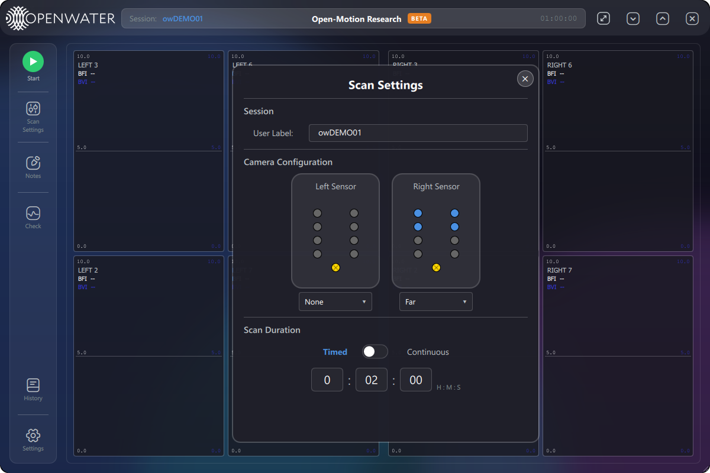
*Scan Settings with the label `DEMO01`, no cameras on the left sensor, the Far pattern on
the right sensor, and a 2-minute timed scan.*

### 4.1 Session

**User Label** names the session. Letters and digits are kept, converted to upper case and
prefixed with `ow` — typing `demo01` gives `owDEMO01`. The label appears in the header, in
Scan History, and in every scan's full label (e.g. `20260925_222432_owDEMO01`, with the
scan's start time in UTC). The label is applied when you close Scan Settings, however you
close it; leaving the field empty keeps the current label. It stays in effect until you
change it or restart the application.

> Use a study or subject code, never a name or other patient-identifiable information.

### 4.2 Camera Configuration

Each sensor diagram shows the module's eight cameras: cameras 1 to 4 down the left column,
8 to 5 down the right column, and the laser aperture (yellow ⊗) at the bottom. **Blue**
cameras will be recorded; **grey** cameras will not. Hover over a camera to see its
number. A disconnected sensor's diagram is dimmed and cannot be changed.

Choose a pattern for each sensor from the list under its diagram:

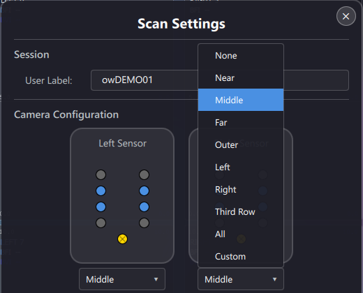

| Pattern | Cameras recorded |
|---|---|
| **None** | none — the sensor is not used |
| **Near** | 3, 4, 5, 6 — the two rows nearest the laser |
| **Middle** | 2, 3, 6, 7 (default) |
| **Far** | 1, 2, 7, 8 |
| **Outer** | 1, 4, 5, 8 |
| **Left** | 1, 2, 3, 4 |
| **Right** | 5, 6, 7, 8 |
| **Third Row** | 2, 7 |
| **All** | all eight |
| **Custom** | any combination — see below |

**Custom:** a ring appears around each camera and clicking a camera turns it on or off.
Custom starts from the cameras currently shown.

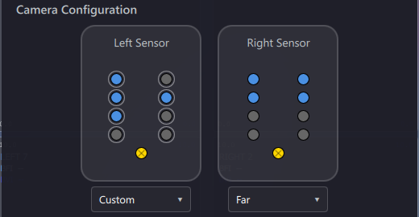
*Custom mode on the left sensor: each camera can be clicked to include or exclude it.*

More cameras give more coverage but denser plots and larger recordings. The selection is
kept if a sensor briefly disconnects and reconnects. The patterns selected when the
application starts come from Settings → Default Camera Configuration (§10).

### 4.3 Scan Duration

| Control | What it does |
|---|---|
| **Timed / Continuous** switch | **Timed**: the scan stops by itself after the set time. **Continuous**: the scan runs until you press Stop (*"Scan will run indefinitely until stopped."*), up to a maximum of 12 hours. |
| **H : M : S** | The timed length (default 1:00:00, up to 99:59:59). A length of 0:00:00 is not allowed; it is reset to 1 minute with the message *"Scan duration cannot be 0 seconds — reset to 1 minute."* |

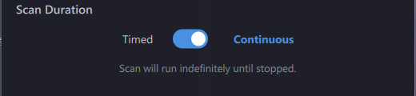

---

## 5. Checking contact quality

Press **Check** (not available during a scan) to check sensor contact without recording.
The laser is on during the check, which takes about 10 seconds. The check tests **all
eight cameras** on each connected sensor, whatever is selected in Scan Settings.

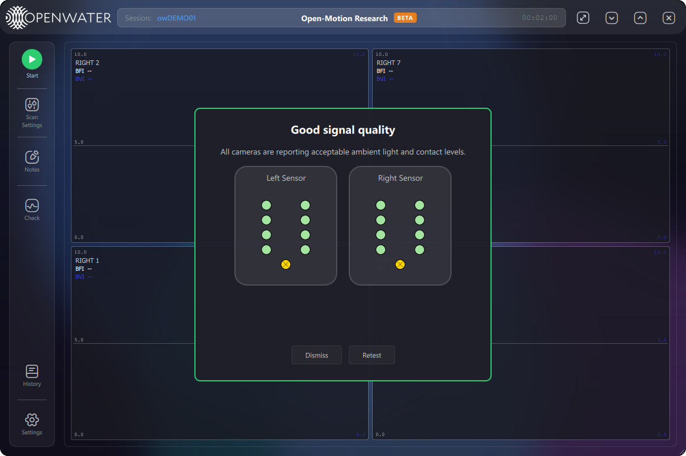
*A check with problems: the left sensor was not in contact, and the right sensor had good
contact on its top four cameras only.*

| Border | Title | Meaning |
|---|---|---|
| **Green** | *Good signal quality* | All cameras report acceptable ambient light and contact levels. |
| **Orange** | *Contact Quality Notification* | One or more cameras have a problem. Hover over an orange camera for the reason. |
| **Red** | *Contact check failed* | The check could not be completed; the reason is shown in red. |

Camera dots: **green** = good contact · **orange** = problem · **grey** = not evaluated.
Hovering over a camera shows its label (L = left, R = right, then the camera number) and
the problem:

| Reason | What to do |
|---|---|
| **Poor sensor contact** | The camera is not receiving enough light back from the skin. Re-seat the module flat against the skin and check for hair or debris. |
| **Ambient light detected** | Room light is reaching the camera. Improve the seal against the skin or shade the sensors. |

**Dismiss** closes the dialog; **Retest** runs the check again after you adjust the
sensors. A scan does not run the check for you — run it before pressing Start when contact
matters.

---

## 6. Running a scan

1. Set up the scan in **Scan Settings** (§4). The defaults (Middle pattern, 1-hour timed
   scan) are a reasonable starting point.
2. Run **Check** (§5) and re-seat the sensors until the cameras you plan to record are
   green.
3. Press **Start**. The scan starts immediately: the badge may turn yellow for a moment,
   then red (**Stop**), and the header clock starts counting. If the data drive has less
   than 1 GB free, the scan does not start and the **E-305** error dialog explains why
   (§12.4).

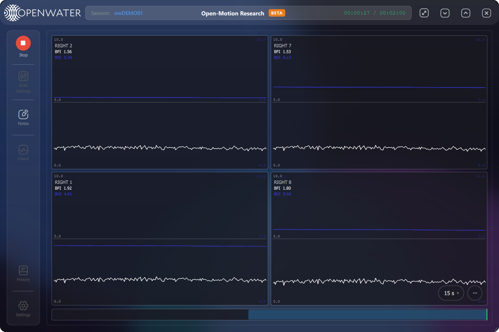
*A 2-minute timed scan on four cameras of the right sensor, 26 seconds in. Bench capture —
the sensors were not on a subject, so the values are not physiological.*

During the scan:

- Each plot shows its BFI (white) and BVI (blue) traces, with the latest values under its
  label (§7).
- **Scan Settings**, **Check**, **History** and **Settings** are disabled. **Notes** stays
  available.
- Press **Space** at any point to open Session Notes with a timestamp already inserted.
  Close the window with `Esc` or ✕ to save, and press Space again for the next note.
  Space does nothing when no scan is running or while another window is open.

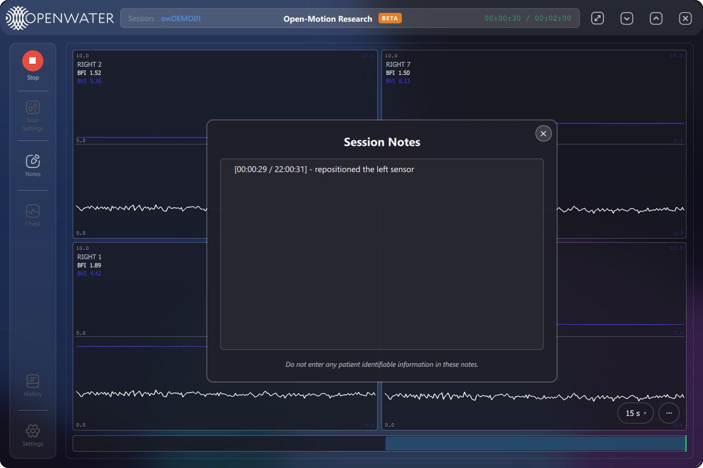
*Space during a scan inserts `[elapsed / clock time] - ` — type the observation and close
the window with ✕ to save it.*

- If the data drive falls below 1 GB free, a yellow message warns you and the scan
  continues. Below 100 MB the scan stops by itself, and the data recorded until then is
  saved (§12.1).

**Contact warnings during a scan.** If contact degrades on a recorded camera, the
contact-quality dialog opens on top of the plots. Only the recorded cameras are evaluated;
the others are grey. The scan keeps recording while the dialog is shown.

| Button | Action |
|---|---|
| **Stop scan** | End the scan now. |
| **Continue** | Return to the plots. Enabled only after every problem has stayed clear for a few seconds — re-seat the sensor and wait for the border to turn green and the message *"All contact quality issues are currently inactive. You may dismiss."* |

**Ending the scan.** A timed scan stops by itself; otherwise press the red **Stop** badge
(or **Stop scan** in a contact warning). After a few seconds, **Session Notes** opens with
a closing line — *"Scan completed — duration: 00:02:00"* for a timed scan that ran to the
end, *"Scan stopped — duration: …"* when stopped early. If Session Notes is already open
when the scan ends, what you typed is kept: the closing line is added after it and you
can carry on typing.

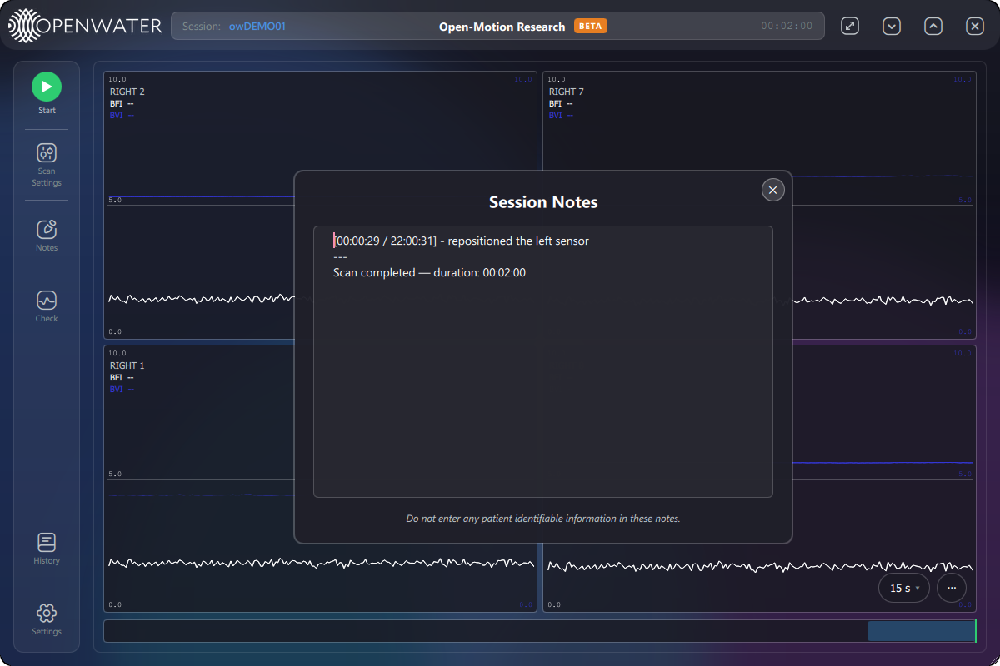

- If gaps longer than 1 second were detected in the data, a *"Data gaps (>1.0s): …"* line
  is added.
- All scan data is saved automatically to the scan database (§11). If enabled in Settings
  (§10), a CSV export of the scan (with its notes file) and raw CSV files are also
  written.
- If a scan ends unexpectedly, a message reports what was kept:
    - *"Scan ended unexpectedly — partial data was saved. The final segment could not be
      dark-corrected and was discarded."* (yellow)
    - *"Scan ended unexpectedly and no data was recorded (the device may have disconnected
      mid-scan). This scan was not saved."* (red; stays on screen until dismissed)

---

## 7. Reading and navigating the plots

### 7.1 The plot grid

In the **Individual** view (the default) there is one plot per recorded camera. The grid
mirrors the sensor modules: the left module's cameras on the left, the right module's on
the right, and each row pairs the cameras that sit opposite each other — 4 and 5, 3 and 6,
2 and 7, 1 and 8 from top to bottom. Rows with no recorded camera are left out. Two other
views combine cameras (§7.3).

Each plot shows:

- the camera label (`LEFT 3`, `RIGHT 7`, …) and its latest values under it (hidden while
  the Statistics pane is on, §7.4);
- the traces: BFI (white; dark grey in Light Mode) and BVI (blue), or Mean (green) and
  Contrast (purple);
- axis labels: the left scale belongs to the first trace (BFI or Mean), the right scale to
  the second (BVI or Contrast).

BFI and BVI values are limited to a 0–10 display range: a value below 0 shows as `0.00`
and a value above 10 as `10.00`. `--` means there is no valid reading.

### 7.2 Display options — the `⋯` menu

The `⋯` button at the bottom-right of the plots opens the display options. It appears,
with the window-length pill (§7.5), once a scan is running or a recorded scan is loaded.
Each row is a switch with two or three choices; the selected one is highlighted.

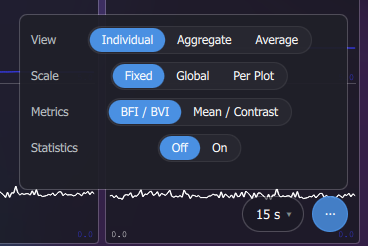

| Row | Choices | What it does |
|---|---|---|
| **View** | Individual · Aggregate · Average | **Individual** (default): one plot per recorded camera (§7.1). **Aggregate**: one plot per mirrored camera pair on each module. **Average**: one plot per module (§7.3). |
| **Scale** | Fixed · Global · Per Plot | **Fixed** (default): the Manual Plot Bounds from Settings (§10). **Global**: fitted to the whole scan, one range shared by all plots. **Per Plot**: each plot fits the part of its own trace that is on screen, adjusts smoothly as the scan runs, and refits immediately when you pan, zoom or change the window length. |
| **Metrics** | BFI / BVI · Mean / Contrast | Switches every plot between BFI/BVI and the raw Mean/Contrast statistics. |
| **Statistics** | Off · On | Shows the Statistics pane beside the plots (§7.4). |

Choices take effect immediately, including during a scan and on a replay, and stay set
across restarts. Metrics and Scale can also be set in Settings → Realtime Plot Display
(§10). The views and the Statistics pane change only the display: the scan database and
exported files always hold every camera separately.

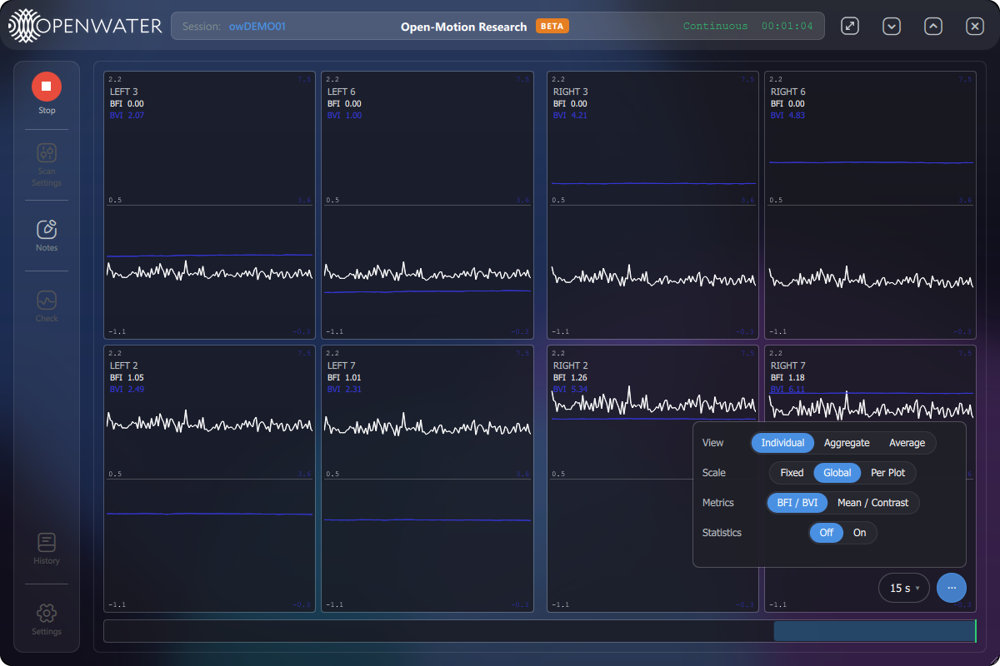
*Scale set to Global: each axis fits the data, so small changes become visible.*

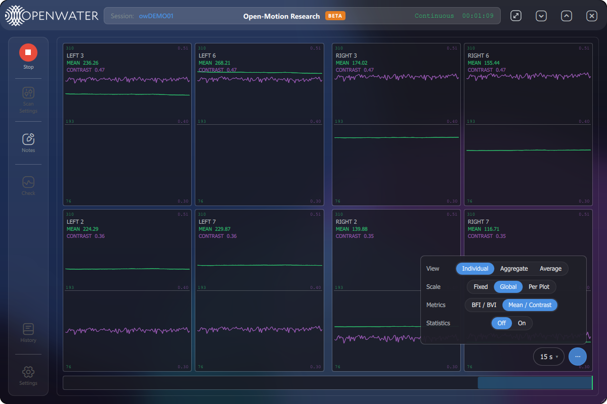
*Mean / Contrast display: Mean (green) and speckle Contrast (purple) for each camera.*

### 7.3 Aggregate and Average views

**Aggregate** combines each module's mirrored camera pairs — 1+8, 2+7, 3+6 and 4+5 —
into one plot per pair, labeled `LEFT 1+8`, `RIGHT 2+7` and so on. Each module has its own
column, with the pairs in the same top-to-bottom order as the Individual grid (4+5 at the
top). A pair plot shows the average of its two cameras at each moment; if only one of the
two is recorded or has a valid reading, the plot shows that camera alone. Only pairs with
at least one recorded camera are shown — for example, the Middle pattern gives the 2+7
and 3+6 plots on each module.

**Average** shows one plot per module, left above right, each averaging all of that
module's recorded cameras. A panel beside each plot shows `LEFT` or `RIGHT` and the
current values in large type.

### 7.4 Statistics pane

Set **Statistics** to **On** in the `⋯` menu to show the Statistics pane to the right of
the plots. It lists every plot shown, in three sections:

- **LEFT** and **RIGHT**: one row per plot (`L1` … `L8`, `L1+8` …, or `AVG`, depending on
  the view).
- **LEFT − RIGHT**: the difference between mirrored plots on the two modules — for example
  `L2 − R7` (camera N faces camera 9 − N on the other module), `L1+8 − R1+8`, or `L − R`.
  A difference is listed only when both plots are shown, so a scan on one module has no
  difference section.

For each metric (BFI and BVI, or MEAN and CONTRAST) the pane has three columns:

| Column | Meaning |
|---|---|
| **Live** | The latest value. |
| **5 s avg** | The average of the valid values over the last 5 seconds. |
| **Peak-to-peak** | The size of the swing (maximum − minimum) within 5 seconds, averaged over the last 5 seconds. |

The statistics always describe the latest data — on a replay, the end of the recording —
not the part of the scan you have panned to. They refresh ten times a second. Live and
5 s avg values follow the same 0–10 limits as the plots; differences carry a sign
(`+0.42`); `--` means there is no valid value. While the pane is on, the values under the
plot labels and the large panels of the Average view are hidden.

### 7.5 Navigation

The plot area works like a video recorder: you can rewind during or after a scan without
losing the live recording.

| Control | Where | What it does |
|---|---|---|
| **Window-length pill** (e.g. `15 s ▾`) | Bottom-right of the plots | Chooses how much time is visible: 5 s, 15 s, 30 s, 1 min or 5 min. The plots open at 15 s. |
| **Timeline bar** | Under the plots | Shows the whole scan. Drag the highlighted window to move through time, or click the bar to jump. Blue = following the live edge; orange = paused in the past. |
| **Drag on a plot** | Plot area | Pans back or forward in time (stops following live). |
| **Mouse wheel on a plot** | Plot area | Zooms the time window in or out around the pointer. |
| **Hover** | Plot area | Shows a readout box (top-right) with the time and every plot's values under the pointer (`L3`, `L1+8`, `L AVG`, …). |
| **`● Back to live`** | Top-right of the plots | Appears when you have moved into the past during a scan. Click to return to the live edge. |

Keyboard shortcuts work while the plot area has keyboard focus, which it has at launch
and again whenever a window closes. After `Esc`, click a plot to use them again. `Space`
and `F11` work anywhere in the main window.

| Key | Action |
|---|---|
| `←` / `→` | Pan 1 second back / forward (hold `Shift` to pan a full window) |
| `+` or `↑` | Zoom in |
| `-` or `↓` | Zoom out |
| `0` | Reset the zoom and return to live |
| `Home` / `End` | Jump to the start of the scan / return to the live edge |
| `Esc` | Release keyboard focus from the plots |
| `Space` | Open Session Notes with a timestamp (during a scan, when no other window is open) |
| `F11` | Enter or leave fullscreen (§3) |

---

## 8. Session Notes

- Open the notes with the **Notes** button at any time. They open automatically after
  every scan, and every press of **Space** during a scan opens them with a new timestamp
  line (`[elapsed / clock time] - `) ready for you to type after (§6).
- Notes are attached to a scan. During a scan they belong to that scan; after a scan they
  edit the scan just recorded. Each new scan starts with empty notes, so text typed before
  a session's first scan is cleared when that scan starts.
- Notes are saved when the window closes — with `✕`, `Esc`, or by clicking outside the
  window. *"Note saved."* confirms it. **Always close the Notes window after typing** so
  the text is saved.
- Saved notes appear, read-only, in Scan History (§9). They are kept in the scan
  database, and every CSV export also writes them to a text file beside the CSV (§9.1).

> **Do not enter patient-identifiable information in the notes.** The same reminder is
> shown at the bottom of the Notes window.

---

## 9. Scan History

Press **History** (available when no scan is running) to review past scans.

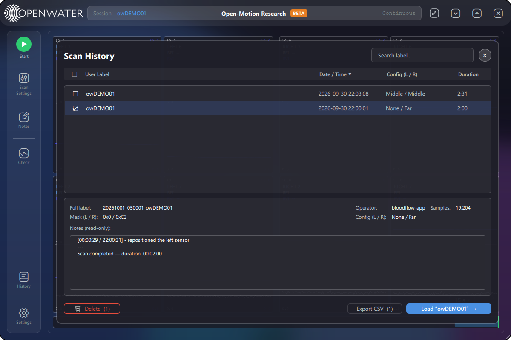

| Column / control | What it shows or does |
|---|---|
| **User Label** | The session label the scan was recorded under. Scans from one session share a label; use the date and time to tell them apart. |
| **Date / Time** | When the scan started, in the computer's local time. |
| **Config (L / R)** | The camera pattern used on each side (`None`, `Middle`, `Far`, …). A Custom selection shows as its camera mask in hexadecimal, e.g. `0x5B`. Scans recorded with the Near pattern of version 1.5.3 or earlier (cameras 2, 4, 5, 7) show as `0x5A`. |
| **Duration** | Scan length in minutes:seconds, in whole seconds, matching the duration line in the scan's notes. `—` means the scan was interrupted and has no recorded end. |
| **Search label…** | Filters the list by label. |
| **Column headers** | Click to sort; click again to reverse (▲ / ▼). |
| **Row click** | Selects the scan and shows its details: full label, operator, number of samples, camera masks (hexadecimal, left / right), configuration and notes (read-only). |
| **Checkboxes** | Mark several scans for Delete or Export. The header checkbox selects all. |
| **Export CSV (N)** | Exports the checked scans to CSV (§9.1). |
| **Load "label" →** | Opens the selected scan in the plot viewer for replay (§9.3). |
| **🗑 Delete (N)** | Permanently deletes the checked scans (§9.2). |
| **✕** | Closes History. |

### 9.1 Exporting

One checked scan opens a Save dialog (default name `<full label>_export.csv`); several ask
for a destination folder and write one file per scan. Each file has one row per frame:
the frame number, the time in seconds, and BFI, BVI, Mean and Contrast for every recorded
camera, plus a quality flag per camera. Interrupted scans cannot be exported
(*"Interrupted scans can't be exported."*). A message confirms the export (*"Exported to
…"* or *"Exported N scan(s) to …"*).

The scan's notes are written beside each CSV as a text file with the same name ending in
`_notes.txt` (for example `<full label>_export_notes.txt`), even when the scan has no
notes.

To export every scan automatically when it ends, turn on *Auto-export CSV* in Settings →
Data Output (§10).

### 9.2 Deleting

Deleting is permanent. **Delete** opens a *Confirm Delete* dialog: *"Permanently delete
the selected scan(s) from the database. This cannot be undone."* Press **Delete** to remove
the scans, or **Cancel** (or `Esc`) to keep them.

### 9.3 Replay

After **Load**, the plots show the recorded scan with a **Viewing** badge naming it
(label · date and time to the second, as in Scan History). All plot features (§7) work
the same way on a replay. When it is
shown, the red **← Back to live scan** pill returns to the live view.

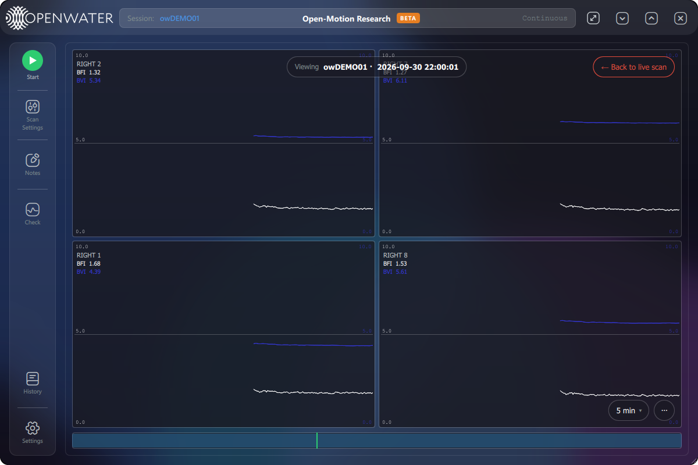
*The 2-minute scan loaded from History, with the window set to 5 minutes so the whole scan
fits.*

---

## 10. Settings

Press **Settings** (available when no scan is running). Changes apply immediately and are
saved when you close Settings with `✕`, `Esc`, or by clicking outside it. A notice at the
top reads *"This software is intended for research use only."* Scrolling the page closes
an open dropdown list.

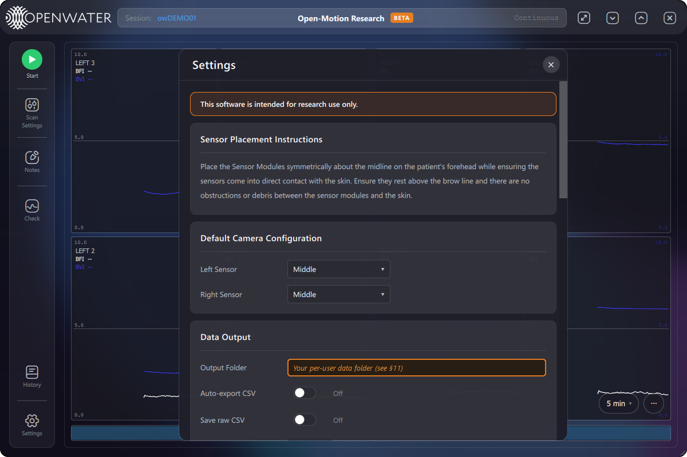
*Settings, top. The Output Folder shows your data folder (§11).*

| Card | Contents |
|---|---|
| **Sensor Placement Instructions** | Place the sensor modules symmetrically about the midline on the forehead, in direct contact with the skin, above the brow line, with no obstructions or debris. |
| **Default Camera Configuration** | The Left Sensor / Right Sensor patterns (§4.2) selected when the application starts. Changes take effect at the next launch; Scan Settings changes the current session. |
| **Data Output** | *Output Folder*: this Windows account's data folder, for reference (it cannot be changed). *Auto-export CSV* (off by default): when each scan ends, export it to `data\` in the output folder, as History → Export CSV would, with its notes file (§9.1, §11). *Save raw CSV*: also write the raw camera histograms of each scan to CSV files (§11). *Raw CSV duration*: limit raw output to the first N seconds of each scan; leave blank for the whole scan. |

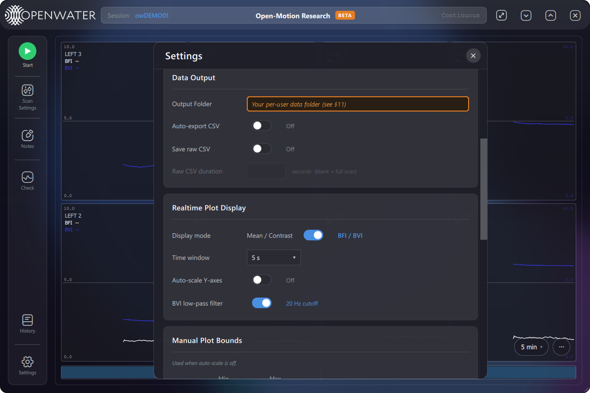

| Card | Contents |
|---|---|
| **Realtime Plot Display** | *Display mode* (Mean / Contrast ↔ BFI / BVI): the `⋯` menu's Metrics row (§7.2). *Auto-scale Y-axes*: off is the `⋯` menu's Fixed scale; on uses the Global or Per Plot scale last chosen in that menu. *Time window*: 3, 5, 15 or 30 s; to change how much time the plots show, use the window-length pill (§7.5). *BVI low-pass filter*: smooths the BVI trace (20 Hz cutoff, on by default); takes effect immediately, including during a scan. |

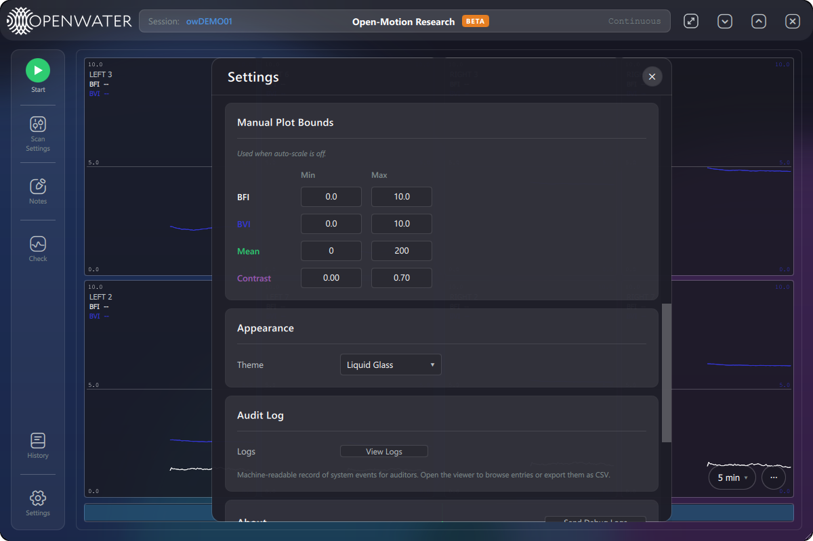

| Card | Contents |
|---|---|
| **Manual Plot Bounds** | Fixed vertical ranges used with the Fixed scale (autoscale off): Min and Max for BFI and BVI (0–10), Mean (0–1024) and Contrast (0–1). Min always stays below Max; out-of-range entries are corrected automatically. |
| **Appearance** | *Theme*: **Dark Mode**, **Light Mode**, or **Liquid Glass** (default). The interface re-themes immediately. After updating from 1.5.3 the application uses Liquid Glass; choose your theme again here if you prefer another. |
| **Audit Log** | **View Logs** opens the audit log — a machine-readable record of system events for auditors. The viewer filters by event type, date range and text and exports CSV. |

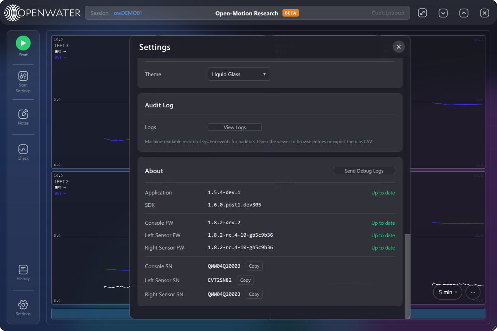

The **About** card lists:

| Row | Meaning |
|---|---|
| **Application** | The application version, with *Up to date*, *Check failed* (no internet access or GitHub unreachable), or an **Update** button (§2.2). |
| **SDK** | The version of the Open-Motion software library. |
| **Console FW**, **Left Sensor FW**, **Right Sensor FW** | Firmware version of each connected device (or *Not connected*), with *Up to date* or an **Update** button (§2.3). |
| **Console SN**, **Left Sensor SN**, **Right Sensor SN** | Hardware serial numbers. **Copy** puts a serial number on the clipboard — include them when contacting support. |
| **Send Debug Logs** | Packages recent application logs for support (§13). |

---

## 11. Data storage

Each Windows account keeps its own data in a private folder:

`C:\Users\<Windows user>\AppData\Local\Openwater`

| Location | Contents |
|---|---|
| `logs\` | One application log file per launch (`open-motion-<date>_<time>.log`). |
| `data\scans.db` | The scan database: all scans, their notes, and your display preferences. |
| `data\<full label>_export.csv`, `data\<full label>_export_notes.txt` | The scan's CSV export and its notes (§9.1), written when the scan ends, only when *Auto-export CSV* is on. The notes file holds the notes as they were at the end of the scan; export again from Scan History to include notes added later. |
| `data\<full label>_left_mask<xx>_raw.csv`, `…_right_mask<xx>_raw.csv` | Raw camera histograms, one file per sensor, only when *Save raw CSV* is on. These are large — several hundred megabytes per camera per hour. |
| `data\debug-bundles\` | Zip files created by *Send Debug Logs*. |
| `data\updates\` | Installers downloaded by the in-app updater. |

- Scan data is kept automatically in the database. Processed CSV files are created only
  when you export from Scan History (§9.1), or at the end of each scan when *Auto-export
  CSV* is on (§10).
- Keep at least 1 GB free on the drive that holds the data folder. Below that, scans
  cannot start (E-305), and a running scan stops by itself below 100 MB (§6).
- In the Research build the database is not encrypted. Protect the computer and any
  exported files according to your study's data-handling rules.
- Scans recorded by version 1.5.2 or earlier remain in `C:\ProgramData\Openwater\data`
  and are not shown by this version (§2.1).
- On macOS, the data folder is `~/Library/Application Support/Openwater`.

---

## 12. Messages and errors

### 12.1 Messages (toasts)

Short messages appear in the bottom-right corner, color-coded: **green** = success,
**yellow** = warning, **red** = error, **blue** = information. Most dismiss themselves after
a few seconds (hovering over one pauses its countdown); those with an `✕` can be closed by
hand. Up to five are shown at a time.

| Message | Meaning / action |
|---|---|
| *"Note saved."* | Session notes were stored. |
| *"Console not detected…"*, *"Sensor not detected…"*, *"System not found…"* | A device was not found at startup (§2.4). Check cables and power. |
| *"Left sensor disconnected"* (or *Right sensor*, *Console*) | A device was unplugged or powered off while no scan was using it. Reconnect it. |
| *"Could not start scan — the previous step is still finishing. Please press Start again."* | The system was still busy. Wait a few seconds and press Start again. |
| *"Scan failed: …"* | The scan could not start or run; the reason follows. |
| *"Scan duration cannot be 0 seconds — reset to 1 minute."* | See §4.3. |
| *"Scan ended unexpectedly …"* | See §6. |
| *"Laser safety warning detected. Please restart your console. If this error persists, please contact support."* (red, stays on screen) | The console's hardware laser-safety monitor tripped and the laser was shut off. An error dialog also appears: E-202 during a scan, E-203 otherwise (§12.4). Power-cycle the console before scanning. Contact support if it recurs. |
| *"A sensor camera is running hot (N °C). Check that the sensor's airflow is not blocked …"* (yellow) | A camera is running hotter than normal. Make sure nothing blocks the airflow around the sensor modules. Shown at most once per scan. |
| *"Storage is running low: N MB free on the data drive. The scan will stop automatically at 100 MB."* (yellow, stays until closed) | The data drive has less than 1 GB free during a scan. The scan continues; free up space before the next one. |
| *"Scan stopped: the data drive is almost full (N MB free). Data captured so far was saved. Free up space before the next scan."* (yellow, stays until closed) | The data drive fell below 100 MB free, so the scan was stopped. |
| *"Exported to …"*, *"Exported N scan(s) to …"* | A CSV export finished. |
| *"Scan CSV exported to …"* | *Auto-export CSV* wrote the finished scan's CSV (§10). |
| *"Automatic CSV export failed: …"* (yellow, stays until closed) | The automatic export could not be written; the reason follows. The scan itself is saved in the database — export it from Scan History (§9.1). |
| *"Interrupted scans can't be exported."* | The selected scan was interrupted and has no exportable data. |
| *"Console SN copied to clipboard."* (or *Left / Right Sensor SN*) | A serial number was copied from Settings → About. |
| *"Preparing debug logs…"*, *"Debug logs saved to … Please email this file to support@openwater.health."* | See §13. |
| *"Bug report copied to clipboard. Attach the highlighted log file and send the email to Openwater."* | **Contact Support** was pressed in an error dialog (§12.3). |

### 12.2 Closing while busy

Pressing `✕` during a scan or check shows *"… in progress. Click X again to cancel and
exit."* Press `✕` again within 5 seconds only if you intend to abandon the work.

### 12.3 Error dialog

Serious conditions raise a blocking **ERROR** dialog. It shows the error code (for example
`E-202`), a title, an explanation, and a suggested action (→). While it is shown, the
console light blinks blue.

| Control | What it does |
|---|---|
| **▶ Details** | Expands technical detail, when available. |
| **N more** | Several errors are queued; they are shown one after another. |
| **Copy details** | Copies the error report to the clipboard. |
| **Contact Support** | Opens your email program with a pre-filled message to Openwater support, copies the report to the clipboard, and opens the folder containing the application log with the file selected — attach it to the email before sending. |
| **Dismiss** | Closes the dialog (or shows the next queued error). Clicking outside the dialog or pressing `Esc` does the same. |

Quote the error code when contacting support.

### 12.4 Error code reference

| Code | Title | Meaning | What to do |
|---|---|---|---|
| `E-101` | Sensor self-check failed | One or more of a sensor module's internal devices did not respond to its power-on self-check. The system cannot scan reliably. | Power-cycle the sensor module and reconnect. If it persists, the module needs service — contact support. |
| `E-102` | Sensor self-check unreadable | The sensor module connected but did not report its self-check result. | Power-cycle and reconnect. If it persists, update the sensor firmware or contact support. |
| `E-103` | Console initialization failed | The console's laser-power configuration could not be applied. | Power-cycle the console and reconnect. If it persists, contact support. |
| `E-104` | Console not detected | Startup check: no console found (yellow message, not a dialog). | Check the console USB cable and power. |
| `E-105` | Camera power failed | The sensor module could not power its cameras, so they cannot capture. This can happen while the module starts up or when a scan or check starts. | Power-cycle the sensor module and reconnect. If it persists, or only some cameras are affected, the module may need service — contact support. |
| `E-106` | Sensor not detected | Startup check: no sensor module found (yellow message, not a dialog). | Check the sensor USB cable and power. |
| `E-107` | Storage almost full | Startup check: the drive that holds the data folder has less than 1 GB free. Scans cannot start until space is freed. | Free up space on the data drive (or export and remove old scans) before starting a scan. Contact support if the drive should not be full. |
| `E-201` | Laser safety monitor unresponsive | Laser safety could not be confirmed, so the laser was shut off as a precaution. | Power-cycle the system and reconnect. **Do not scan until this clears.** Contact support if it persists. |
| `E-202` | Laser safety trip | The laser-safety monitor tripped during a scan. The laser was shut off and the scan stops about 5 seconds later. | Remove any obstruction, let the system settle, and start a new scan. If it trips repeatedly, stop and contact support. |
| `E-203` | Laser safety trip | The laser-safety monitor tripped while no scan was running (for example during a check), and the laser was shut off. The safety interlock stays latched until the console is power-cycled. | Power-cycle the console and reconnect before starting a scan. If it trips again, stop and contact support. |
| `E-301` | Scan aborted before start | A check before the laser fired failed, so the scan did not start. | Resolve the reported problem (connection, safety or configuration) and start again. |
| `E-302` | Scan could not start | The system refused a new scan, usually because the previous one is still finishing. | Wait a few seconds and try again. Reconnect if it stays busy. |
| `E-303` | Camera data lost during scan | Every camera stopped delivering data for about 3 seconds, so the scan was stopped. Data captured before the loss was saved. | Check the sensor cables and power, reconnect, and start a new scan. |
| `E-304` | Device disconnected during scan | The console or a sensor module in use was disconnected during the scan, so the scan was stopped. Data captured before the disconnection may not have been saved. | Check the USB cables and power, reconnect, and start a new scan. |
| `E-305` | Not enough storage to start scan | The drive that holds the data folder has less than 1 GB free, so the scan was not started and the laser did not fire. | Free up space on the data drive (or export and remove old scans), then start the scan again. Contact support if the drive should not be full. |

---

## 13. Getting help

1. Open **Settings → About** and press **Send Debug Logs**. The application packages the
   last 48 hours of application logs into a zip file under `data\debug-bundles\`, opens
   the folder with the file selected, and shows the file's location. The package contains
   application logs only — no scan data.
2. Email the zip file to Openwater support at **support@openwater.health** with a
   description of the problem, the error code if there was one, and the serial numbers from
   Settings → About.
3. From an error dialog, **Contact Support** prepares the email for you (§12.3).

---

## 14. Known issues in 1.5.4

| Issue | Workaround |
|---|---|
| Updating from 1.5.3 with the in-app **Update** button installs the new version but does not start it. | Open **Open-Motion Research** from the Start menu or the desktop shortcut. |
| Plot data loads slowly when zooming out to the beginning of a long scan. | Allow a moment for the plot to fill in. |

---|---|
| After changing the User Label between scans, the data file name of the next scan can still carry the previous label; it is correct from the scan after that. | Check the file names after changing the label. |
| The *"Debug logs saved…"* message names `support@openwater.cc`. | Send debug logs to the support address in §13. |
| Plot data loads slowly when zooming out to the beginning of a long scan. | Allow a moment for the plot to fill in. |
| A scan just under a whole minute can show a duration such as `0:60` in Scan History. | Read it as `1:00`. The duration line in the scan's notes is correct. |
| When the window is maximized, the restore button shows an incorrect icon. | The button still restores the window. |

---

*Open-Motion Research User Manual · App 1.5.4 · September 2026 draft*
