

{.cover-logo}

# Open-Motion

## Engineering Mode Manual

| | |
|---|---|
| **Product** | Open-Motion blood-flow monitor — engineering / diagnostic features |
| **Application version** | 1.4.0 |
| **Document revision** | July 2026 — draft |
| **Audience** | Openwater engineering, manufacturing & support staff |

> **DRAFT — not a controlled document.** Engineering mode exposes diagnostics and
> maintenance actions that can alter device configuration and data output. It is
> intended for Openwater personnel only and must be disabled on systems handed to
> operators.

---

## 1. What engineering mode is

Engineering mode is a hidden, password-protected feature level that overlays extra
diagnostics on both applications (Open-Motion and Open-Motion Research): hardware
maintenance controls, calibration and factory-test workflows, raw-data outputs,
firmware update tooling, and plot/contact-quality diagnostics.

Everything documented in the Open-Motion and Open-Motion Research user manuals
continues to work unchanged; this manual covers only what engineering mode **adds**.

### Feature map

| Area | What engineering mode adds | § |
|---|---|---|
| Settings | **Engineering** card: console soft-reset, fans, debug logging, raw CSV, calibration & test | 3 |
| Settings | **Trace colors** row, **Beta Updates** switch | 3.3, 6 |
| Test / calibration | **Test Results** window with per-camera pass/fail table | 4 |
| Contact quality | **Force Dismiss** button, cause legend, split dot colors, detailed tooltips | 5 |
| Firmware | Firmware-update banner, per-device Update chips | 6 |
| Plots | Per-camera die temperature, **Profiler** HUD | 7 |
| Audit | Password-gated audit-log viewer | 8 |
| Scan Settings | Per-sensor fan toggles | 9 |
| Data output | Per-scan telemetry CSV; optional raw histogram CSVs | 10 |

---

## 2. Enabling and disabling

### Enable

1. **Double-click the Openwater logo** in the window header (no visible affordance —
   it is a hidden gesture).
2. The **Engineering Access** prompt opens:

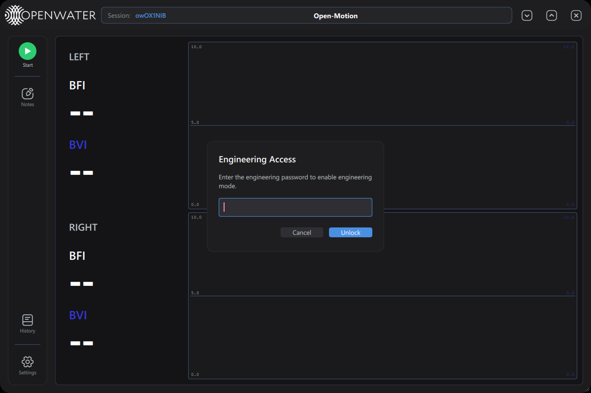

3. Enter the engineering password (available from Openwater engineering — it is
   deliberately not printed in documentation) and press **Unlock** (or `Enter`).
   **Cancel**, `Esc`, or clicking outside closes without unlocking; a wrong entry
   shows *"Incorrect password"* and clears the field.

On success a toast confirms *"Engineering mode enabled."* The setting **persists
across restarts** (it is written to the local configuration overrides) and the unlock
is recorded in the audit log as a `settings_changed` event.

### Disable

Settings → Engineering card → **Disable engineering mode** (toast: *"Engineering mode
disabled."*). Always disable before handing a system back to operators.

The same engineering password also gates three flows that are visible outside
engineering mode: audit-log viewing (§8), scan deletion in History, and Calibrate
(§3.2).

---

## 3. Settings → Engineering card

With engineering mode on, two new pieces appear in Settings: the **Engineering** card
and extra rows elsewhere. The Engineering card:

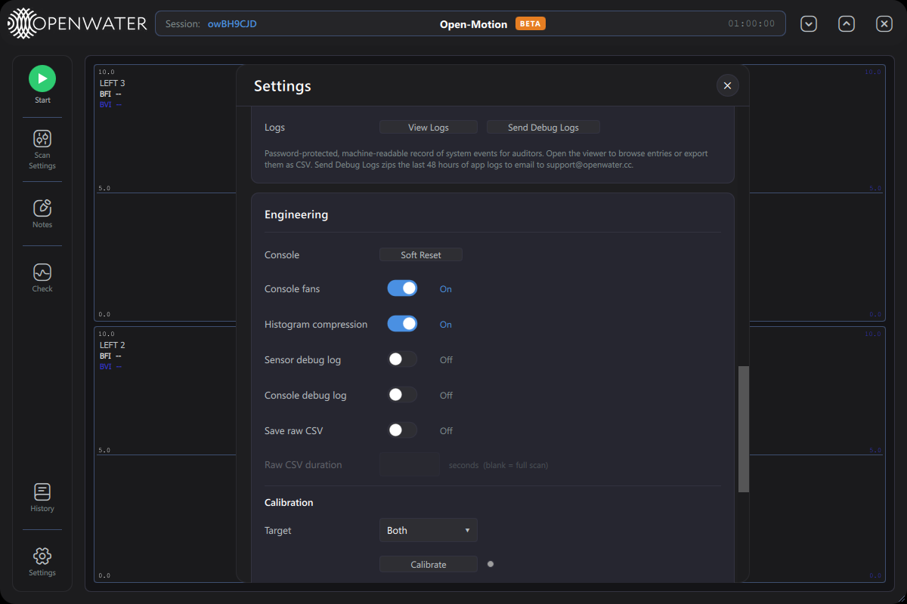

| Row | Control | What it does |
|---|---|---|
| **Console** | `Soft Reset` button | Reboots the console MCU (it drops off USB and reconnects a few seconds later). |
| **Console fans** | switch | Console cooling fans at full speed (On) or off. Only enabled while a console is connected. |
| **Histogram compression** | switch | Toggles the sensors' histogram-compression debug flag live (also persisted). Reduces USB bandwidth per frame; normally On. |
| **Sensor debug log** | switch | Streams sensor-firmware printf output into the app log (verbose; for diagnosing firmware issues). |
| **Console debug log** | switch | Same for the console firmware. |
| **Save raw CSV** | switch | Writes raw per-frame histogram CSVs during scans (see §10). Off by default — files are large. |
| **Raw CSV duration** | number field | Caps how many seconds of raw CSV are written per scan; blank = the whole scan. Enabled only when *Save raw CSV* is on. |

### 3.1 Calibration & Test

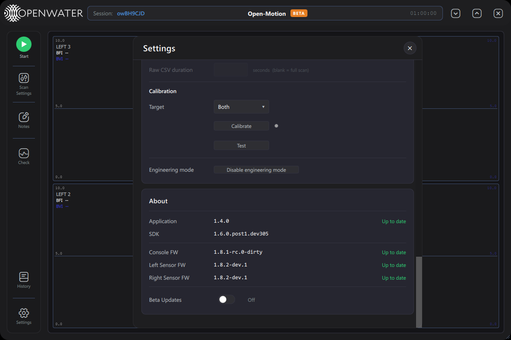

| Control | What it does |
|---|---|
| **Target** dropdown | Which side the workflow runs on: `Both`, `Left`, or `Right`. |
| **Calibrate** button | Runs the full calibration workflow (~15 s scan per side) and **writes the resulting calibration into the console EEPROM**. Password-protected. **Caution: this permanently alters the device's stored calibration** — run only per manufacturing/service procedure. |
| status dot + text | Next to Calibrate: blue = running, green = passed, red = failed, orange = aborted, with a status line ("Calibrating… (Ns / Ns)", "Calibration Passed/Failed/Aborted"). |
| **Test** button | Runs the same measurement as a ~5 s **diagnostic only** — nothing is written to the device. Results appear in the Test Results window (§4). |
| **Engineering mode** | `Disable engineering mode` button (§2). |

Both workflows briefly configure **all** cameras regardless of the scan pattern.
While one runs, the app treats it like a scan for exit protection (closing the window
warns first).

### 3.2 Password-gated actions elsewhere

- **History → Delete** — permanent scan deletion asks for the engineering password.
- **Settings → Audit Log → View Logs** — §8.

### 3.3 Trace colors (Realtime Plot Display)

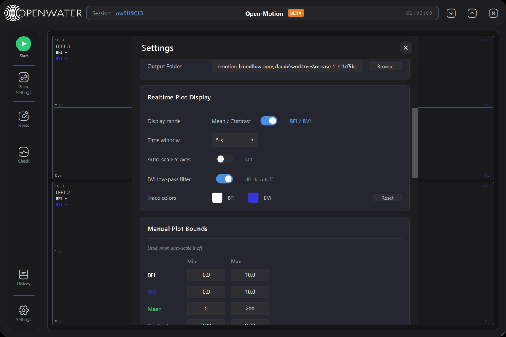

An extra row in *Realtime Plot Display*: click the **BFI** or **BVI** swatch to pick a
custom trace color (system color picker), **Reset** restores the defaults. Colors are
kept legible against the current theme automatically.

---

## 4. Test Results window

Launched automatically whenever a **Test** or **Calibrate** run starts (it is a
separate window — it may sit on top of the main one):

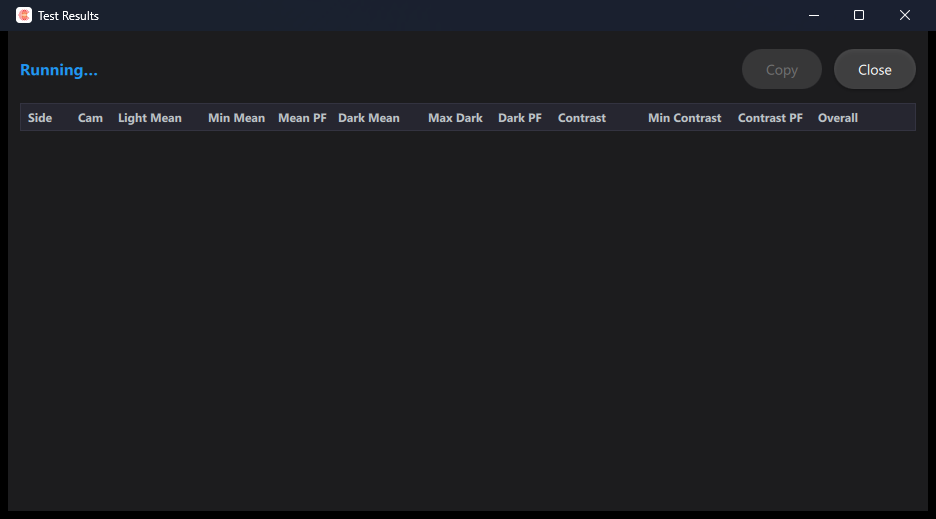

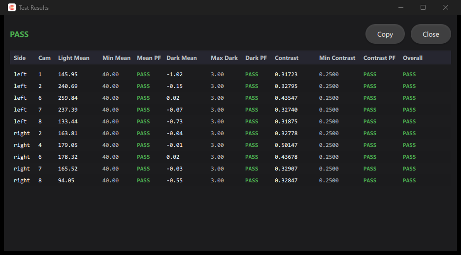

| Element | Meaning |
|---|---|
| Header | `Running…` (blue) → `PASS` (green) / `FAIL — reason` (red) / `Aborted` (orange). |
| **Copy** | Copies the whole table as tab-separated text (for pasting into a report/sheet). Enabled once rows exist. |
| **Close** | Closes the window (it reopens on the next run). |
| Table | One row per tested camera: `Side, Cam, Light Mean, Min Mean, Mean PF, Dark Mean, Max Dark, Dark PF, Contrast, Min Contrast, Contrast PF, Overall`. Each `PF` cell is the pass/fail verdict of that metric against its configured threshold; `Overall` combines them. |

Metrics: *Light Mean* = mean pixel level with the laser on (must exceed *Min Mean*);
*Dark Mean* = residual level in laser-off frames (must stay below *Max Dark* — checks
ambient-light leakage); *Contrast* = speckle contrast (must exceed *Min Contrast* —
checks the optical path). Thresholds come from the application configuration
(`ft_*` keys).

Each run also writes a CSV report and a JSON manifest under
`data/calibrations/` (`test-〈timestamp〉.csv` / `.json`, `calibration-〈timestamp〉.csv`).

---

## 5. Contact-quality diagnostics

Engineering mode upgrades the contact-quality dialog (both the standalone Check and
Open-Motion's pre-scan gate):

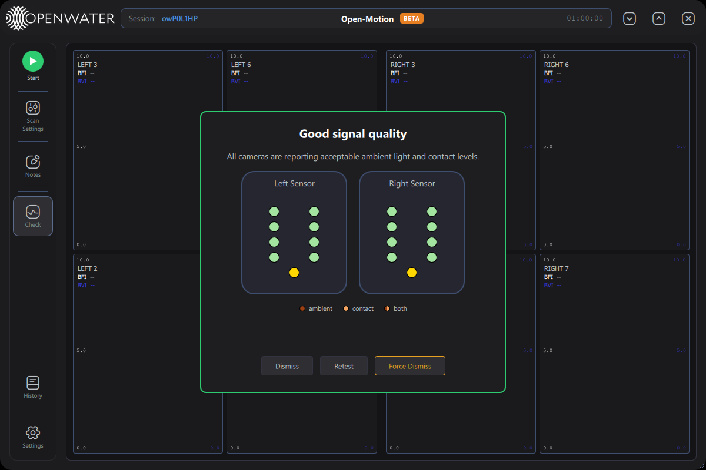

- **Force Dismiss** (amber) — closes the dialog unconditionally, bypassing every
  contact-quality gate, **including while a check is still running** and during
  Open-Motion's pre-scan flow. Diagnostic escape hatch only.
- **Cause legend** — `ambient` / `contact` / `both` swatches. Failing dots are colored
  by cause: dark orange = too much ambient light, sandy orange = poor skin contact; a
  dot split vertically shows both causes at once.
- **Tooltips with values** — hovering a dot shows the camera ID chip and, for failing
  cameras, the reason with the measured value in DN (digital numbers), e.g.
  *"Too much ambient light (12.4 DN)"*:

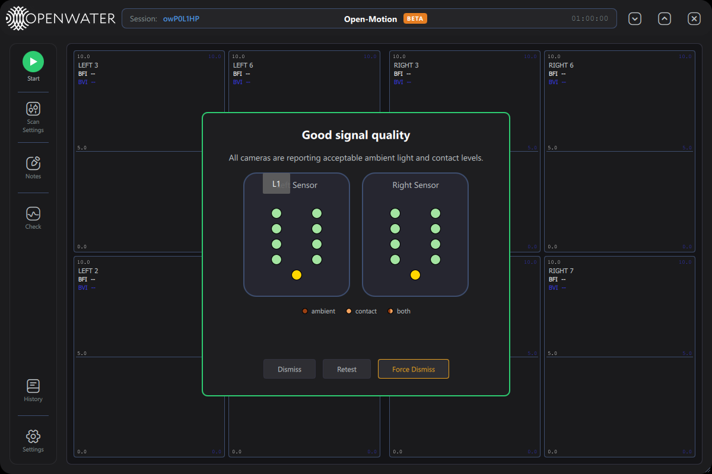

- The footer row is visible even during the "checking" phase (so Force Dismiss is
  always reachable):

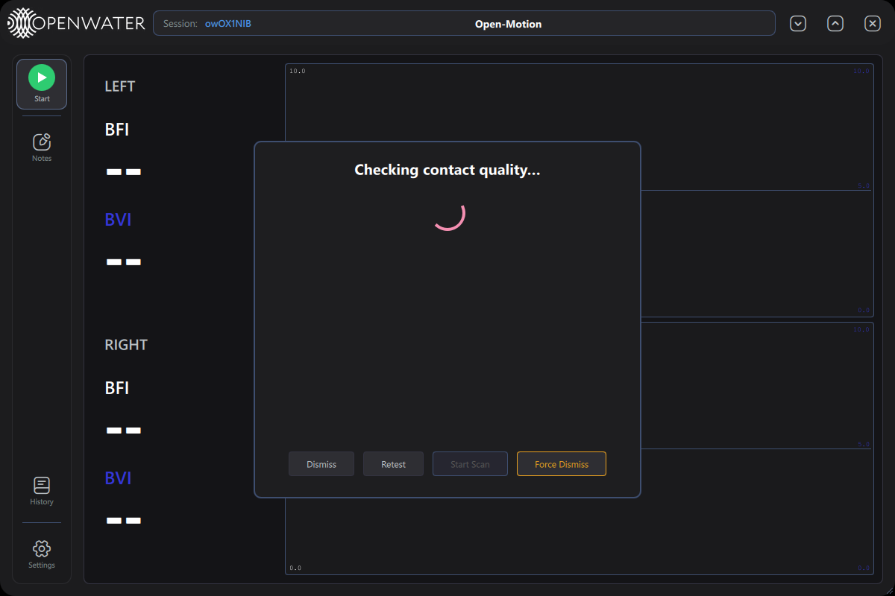
*Open-Motion pre-scan check still running, with the engineering footer present — Start
Scan stays disabled until the check finishes, but Force Dismiss works immediately.*

---

## 6. Firmware & beta updates

Engineering mode owns device-firmware maintenance:

- **Firmware-update banner** — when any connected device's firmware is older than the
  latest release, a banner appears under the header: *"Device firmware update
  available"* with **View** (opens Settings at the firmware card) and **✕** (dismiss
  until the next detection).
- **About card chips** — each device row (Console FW, Left/Right Sensor FW) shows
  *Up to date* or an **Update** chip. Clicking a chip opens a **Confirm Firmware
  Update** dialog (Cancel / Update); during the update a progress line and bar track
  download → flash. Updates are refused while a scan is running.
- **Beta Updates** switch (About card, engineering-only):

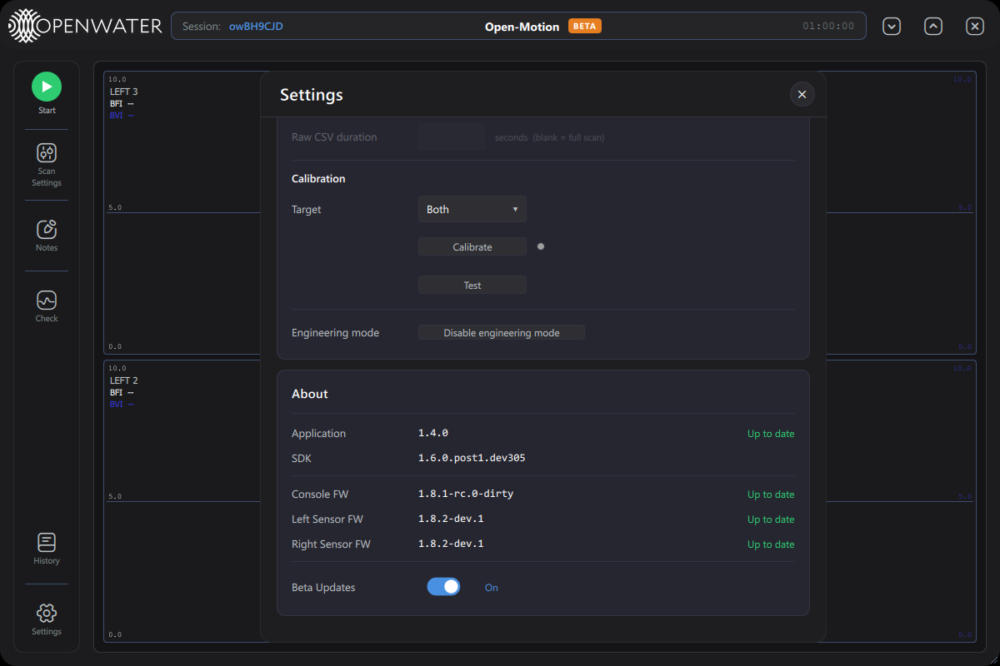
*On = update checks include dev/rc pre-releases instead of production releases only.
The bench system above is already on the newest builds, so everything reads
"Up to date".*

After a firmware update, the device power-cycles/reconnects; wait for the About card
to show the new version before scanning.

---

## 7. Plot diagnostics

### 7.1 Per-camera temperature

During a scan each plot cell gains an orange **die temperature** readout (top-right):

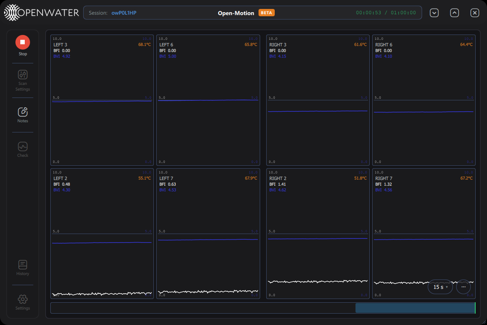
*Typical steady-state camera temperatures run 50–75 °C depending on position.*

### 7.2 Profiler HUD

The plot `⋯` menu gains a fourth switch, **Profiler**:

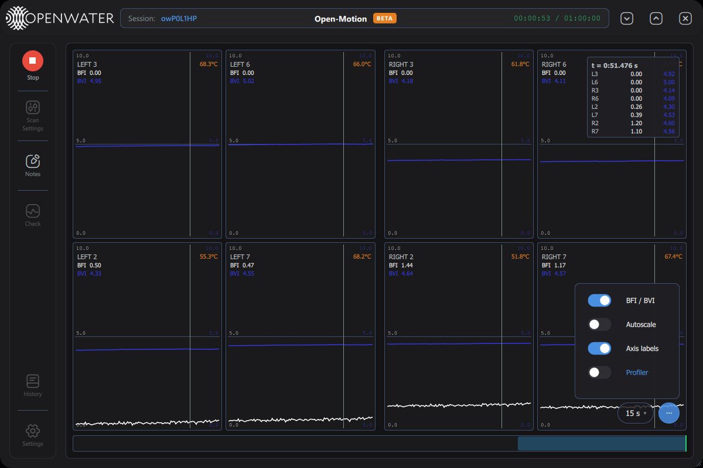

Turning it on shows a rendering-performance HUD in the bottom-left of the plot area:

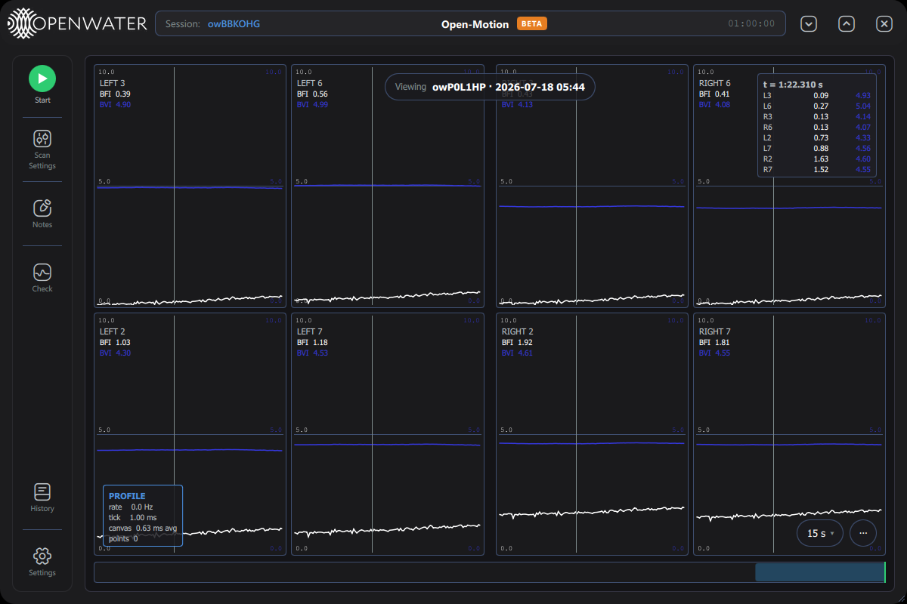

| Field | Meaning |
|---|---|
| `rate` | Incoming sample rate being plotted (Hz). |
| `tick` | Plot update interval (ms). |
| `canvas` | Average canvas repaint cost (ms). |
| `points` | Points currently drawn per repaint. |

Use it to diagnose UI sluggishness on low-end hosts (e.g. with All-cameras patterns
or long windows).

---

## 8. Audit-log viewer

Settings → Audit Log → **View Logs** asks for the engineering password:

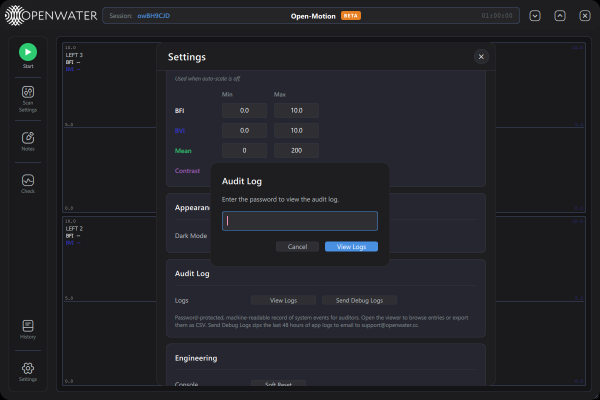

and opens the viewer:

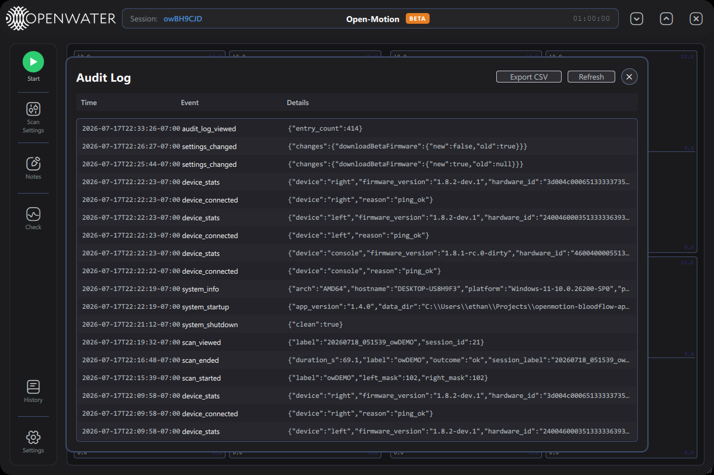

| Control | What it does |
|---|---|
| **Export CSV** | Saves the audit log to a CSV file (save dialog, success toast). |
| **Refresh** | Reloads the newest entries (the viewer shows the latest 500). |
| **✕** | Closes the viewer. |

Recorded events include: `system_startup` / `system_shutdown` / `system_info`,
`device_connected` / `device_disconnected` / `device_stats` (with firmware versions
and hardware IDs), `settings_changed` (with old→new value diffs — including
engineering-mode changes), `scan_started` / `scan_ended` / `scan_viewed`,
`scan_deleted`, and `audit_log_viewed` (viewing the log is itself audited).

---

## 9. Sensor fan toggles

In **Scan Settings**, each sensor card gains a small fan icon next to its title:

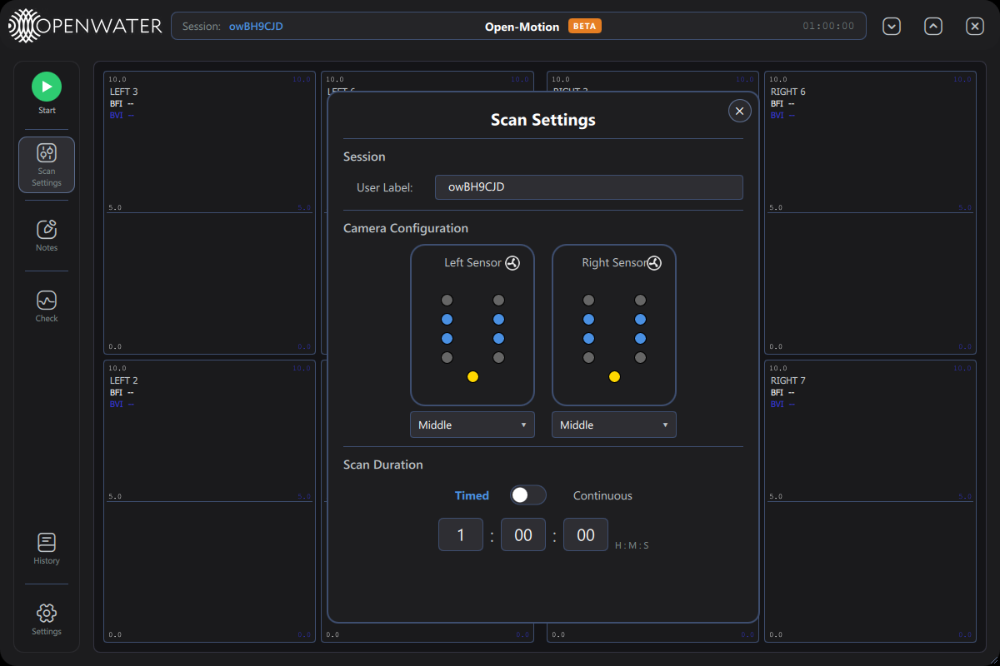

Clicking it toggles that sensor module's cooling fan on/off (state is read back from
the device when the dialog opens). The console's fans are controlled separately from
the Engineering card (§3). Fans default to on; leave them on for normal operation —
camera noise performance is temperature-dependent.

---

## 10. Engineering data outputs

With engineering mode enabled, scans can produce additional files next to the scan
database (all under the Output Folder's `data/` directory):

| Output | When it is written | File |
|---|---|---|
| **Telemetry CSV** | Every scan while engineering mode is on | `〈scan_id〉_〈label〉_telemetry.csv` — per-frame temperatures and system telemetry. |
| **Raw histogram CSVs** | Only when *Save raw CSV* is also on (§3) | `〈scan_id〉_left/right_mask〈mask〉_raw.csv` — raw per-frame histograms; capped by *Raw CSV duration*. Large files. |
| **Calibration / test reports** | Each Calibrate/Test run | `data/calibrations/…` (§4). |
| **Debug bundles** | Send Debug Logs button | `data/debug-bundles/〈timestamp〉.zip`. |

Turning engineering mode off stops the telemetry and raw CSVs even if their switches
are left on — systems without engineering mode never produce them.

---

## 11. Configuration reference (advanced)

The app ships defaults in `config/app_config.json` and persists changes to a local
overrides file (`app_config.local.json` in the writable data root). UI settings cover
the common keys; a few engineering-relevant keys are config-file-only:

| Key | Default | Meaning |
|---|---|---|
| `histoThrottle` | false | Drop histogram frames to reduce log spam during bench debugging. |
| `deferHistoSend` | true | Firmware-side deferral of histogram sends out of the frame ISR. |
| `commVerbose` / `verboseCommandHandling` | false | Log every UART/USB packet and MCU printf — extremely verbose. |
| `scanDataStallTimeoutSec` | 3 | Whole-scan watchdog: abort with E-303 if **no** camera delivers frames for this long (≤0 disables). |
| `cameraTempAlertThresholdC` | 110 | Camera over-temperature alert threshold. |
| `tecTripTempC` | 40 | Console over-temperature trip pushed to the console at connect. |
| `forceLaserFail` | false | **Debug only:** simulates a laser-safety trip; it latches a real interlock that blocks scanning until the console is power-cycled. |
| `writeCorrectedCsv` | false | Legacy corrected per-camera CSV per scan (redundant with the database). |
| `cq_*`, `ft_*` | — | Contact-quality and factory-test thresholds (per camera). |

> **Never hand-edit `config/laser_params.json`.** It holds the laser-driver register
> baseline; incorrect values can produce wrong pulse widths or safety failures. It is
> locked baseline data owned by the laser/firmware teams.

---

## 12. Operational cautions

- **Calibrate writes to the console EEPROM** — run it only as part of a documented
  manufacturing/service procedure, with the correct target selected.
- **Force Dismiss** bypasses the contact-quality gate; data captured afterwards may be
  unusable. Never use it on subject scans.
- **Leave engineering mode disabled** on systems used by operators: it changes data
  output (telemetry CSVs), exposes destructive actions, and relaxes safety-adjacent
  gates.
- The engineering password is shared by the unlock, audit-log, delete and calibrate
  gates — treat it as controlled information.

---

*Open-Motion User Manual — Engineering Mode · App 1.4.0 · July 2026 draft*
