

{.cover-logo}

# Open-Motion User Manual

## Research Mode

| | |
|---|---|
| **Product** | Open-Motion blood-flow monitor (Research distribution) |
| **Application version** | 1.4.0 |
| **Document revision** | July 2026 — draft |
| **Audience** | Research / study operators |

> **DRAFT — not a controlled document.** This manual is a documentation preview generated
> from Open-Motion 1.4.0 running on live hardware. The Research distribution is intended
> for investigational use; it is not cleared for clinical decision-making.

---

## 1. About the system

Open-Motion is Openwater's optical blood-flow monitor. Two forehead **sensor modules**
(up to 8 cameras each) and a **console** containing a near-infrared laser measure
laser-speckle images through the skin and compute, at 40 samples per second per camera:

- **BFI — Blood Flow Index**: relative index of blood flow (white trace).
- **BVI — Blood Volume Index**: relative index of blood volume (blue trace).

The Research distribution (window title **"Open-Motion Research"**, orange **BETA**
badge in the header) exposes the full acquisition controls: per-camera plots,
selectable camera patterns, timed or continuous scans, a standalone contact-quality
check, plot display options, and software-update notifications. Laser safety is
enforced by a hardware interlock inside the console independently of this software.

**Differences from Clinical mode at a glance**

| Area | Research | Clinical |
|---|---|---|
| Window title | Open-Motion Research (+ BETA badge) | Open-Motion |
| Plots | One cell per active camera | Two side-average plots + large numeric panels |
| Camera pattern | Selectable (default *Middle*) | Fixed *Far* |
| Scan length | Timed (default 1 h) or Continuous | Continuous until stopped |
| Start button | Starts the scan directly | Runs a contact-quality preflight first |
| Check button | Yes — on-demand contact-quality check | Hidden (built into Start) |
| Scan Settings | Yes | Hidden |
| Software updates | Update banner + About statuses | Disabled |

---

## 2. Starting the application

Launch **Open-Motion Research**. Only one copy can run at a time (a dialog appears if
another instance already holds the hardware). The app connects to the console and both
sensors **automatically**; after connecting it initializes the sensors for a few
seconds. Allow the system to settle for about two minutes after connecting before
starting a scan — starting too early can fail with a "camera not ready" condition.

If a newer application release is available, an update banner slides in under the
header: *"A new version is available: vX.Y.Z"* with an **Update** button (downloads and
installs in place) and an **✕** to dismiss.

---

## 3. The main screen

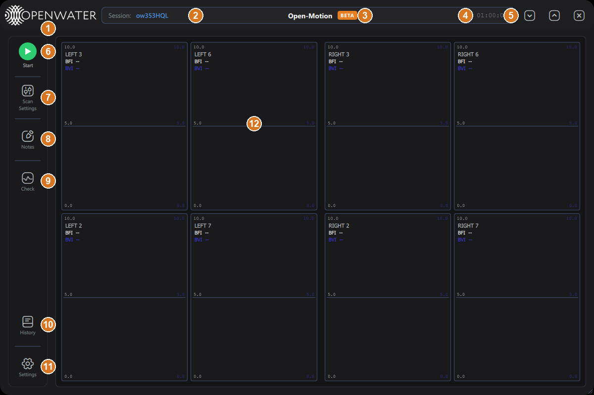

| # | Element | What it does |
|---|---|---|
| 1 | **Openwater logo** | Branding. Double-click opens the password-protected Engineering Access prompt (covered in the Engineering manual). |
| 2 | **Session:** | Current session identifier — regenerated per launch, or derived from the User Label you set in Scan Settings. Stamped into every scan record. |
| 3 | **BETA badge** | Marks the Research distribution. |
| 4 | **Scan clock** | Idle: the configured scan duration (e.g. `01:00:00`), or "Continuous". Scanning: elapsed / total, in green. |
| 5 | **Window controls** | Minimize `⌄`, maximize/restore `^`, close `✕`. |
| 6 | **Start / Stop badge** | Starts or stops the scan. Grey = disconnected, green = ready, yellow = start pending, red = scanning. |
| 7 | **Scan Settings** | Session label, camera patterns, and scan duration (§4). Disabled during a scan. |
| 8 | **Notes** | Session Notes editor (§7). |
| 9 | **Check** | Runs an on-demand contact-quality check (§5). |
| 10 | **History** | Scan History: review, replay, export, delete (§8). |
| 11 | **Settings** | Application settings (§9). |
| 12 | **Plot grid** | One live cell per active camera, labeled `LEFT n` / `RIGHT n`. |

Window behaviors: drag the header to move; resize with the bottom-right grip
(min 800 × 600); pressing `✕` during a scan warns first — press it again within 5 s to
cancel the work and exit.

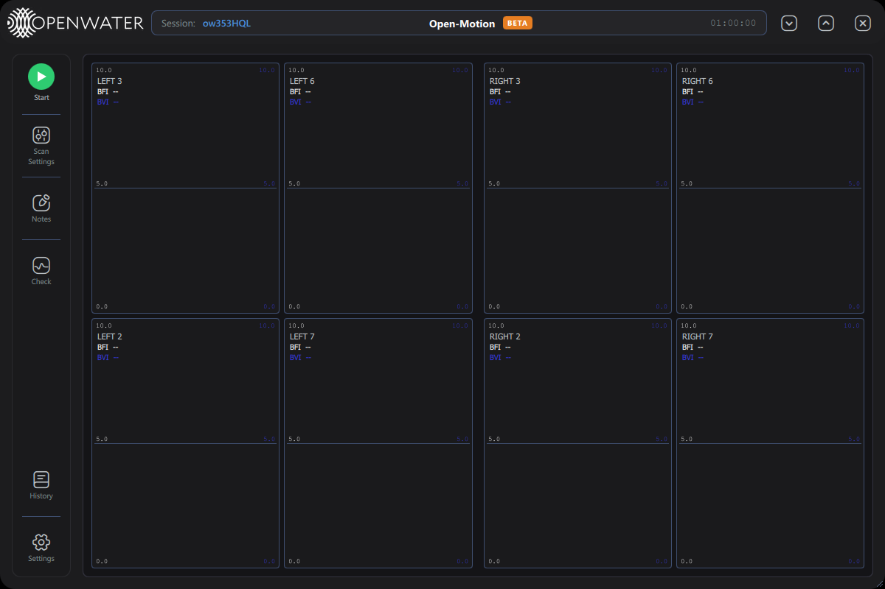
*Ready with the default Middle pattern: cameras 2, 3, 6, 7 on each sensor, one plot
cell each.*

---

## 4. Scan Settings

Press **Scan Settings** to configure the next scan:

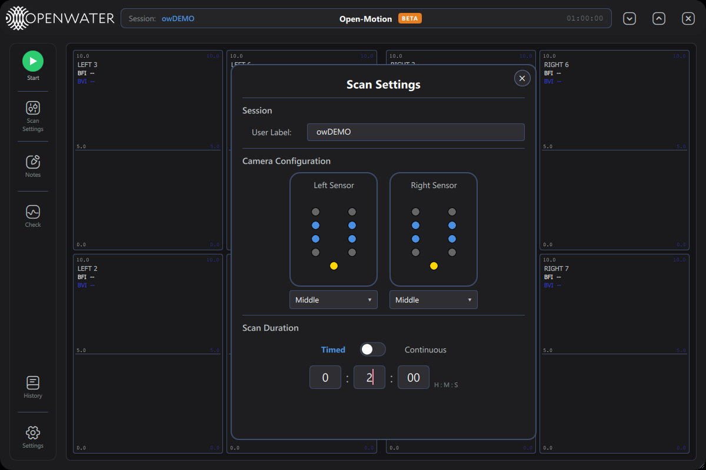

### Session

| Control | What it does |
|---|---|
| **User Label** | Free-text label for the session (committed when you leave the field). It becomes part of the scan's full label — e.g. label `DEMO` produces scans labeled `owDEMO` with full names like `20260718_051539_owDEMO`. |

### Camera Configuration

Each sensor card shows its 8 cameras (blue = active in the selected pattern,
grey = inactive; the gold dot is the laser aperture). Hovering a dot shows the camera
number. A disconnected sensor's card dims and its picker disables.

The dropdown under each card selects the camera pattern:

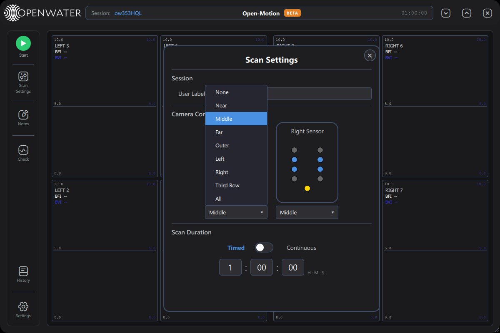

| Pattern | Cameras enabled |
|---|---|
| **None** | none (side disabled) |
| **Near** | 2, 4, 5, 7 — closest to the laser |
| **Middle** | 2, 3, 6, 7 (default) |
| **Far** | 1, 2, 7, 8 — farthest ring |
| **Outer** | 1, 4, 5, 8 |
| **Left** | 1–4 |
| **Right** | 5–8 |
| **Third Row** | 2, 7 |
| **All** | all 8 cameras |

More active cameras = more coverage but denser plots and larger scan records.

### Scan Duration

| Control | What it does |
|---|---|
| **Timed / Continuous switch** | *Timed*: the scan stops itself after the set duration. *Continuous*: runs until you press Stop ("Scan will run indefinitely until stopped."). |
| **H : M : S fields** | The timed duration (default 1:00:00). A duration of 0:00:00 is rejected — it resets to 1 minute with a warning toast. |

Closing the dialog (`✕`) applies the selection. Your camera selection is kept even if
a sensor briefly disconnects and reconnects.

---

## 5. Contact-quality Check

Press **Check** at any time (not during a scan) to measure ambient light and skin
contact on every camera without recording data. The check briefly configures the
cameras, samples for a moment, then reports:

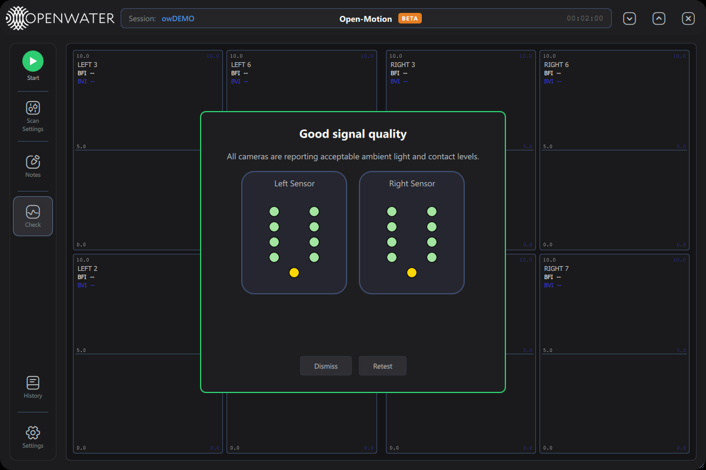

- Panel border and title summarize the outcome — green *"Good signal quality"*, orange
  *"Contact check failed"* (hover the orange dots for the specific reason), or red if
  the check could not run.
- Dot colors: **green** good · **grey** not evaluated · **orange** problem.
- **Dismiss** closes; **Retest** runs it again after you adjust the sensors.

During a live scan the same dialog appears automatically if contact quality degrades,
with **Stop scan** and **Continue** buttons (Continue unlocks once the problem has
stayed clear for a couple of seconds).

---

## 6. Running a scan

1. Configure Scan Settings (optional — defaults are sensible).
2. Optionally run **Check** and re-seat sensors until green.
3. Press **Start**. The badge turns yellow while the cameras are configured
   (typically a few seconds; up to ~1 min after a cold connect), then red as data
   starts flowing.
4. Watch the live grid:

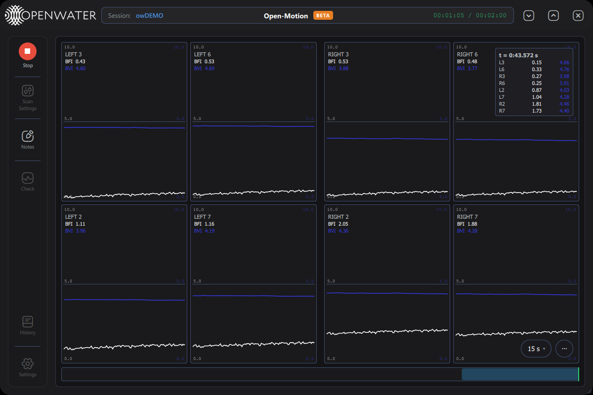

Each cell shows one camera: `SIDE n`, live **BFI** and **BVI** numbers, the BFI trace
(white) and BVI trace (blue). The header clock counts `elapsed / total`. The hover
readout (top-right in the screenshot) lists every camera's values at the cursor time.

5. Press **Stop** (or let a timed scan complete). After teardown, **Session Notes**
   opens automatically with the stop event and duration pre-filled; add observations
   and close.

Scan data is stored in the local database automatically; no export is needed for
retention.

### Mid-scan annotations

Press **Space** during a scan to open Notes with a timestamp line pre-inserted:

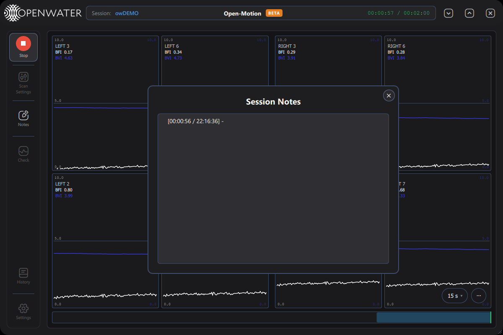
*The `[elapsed / wall-clock]` prefix is inserted for you — just type the observation.*

---

## 7. Session Notes

- Open via **Notes**, automatically after each scan, or with **Space** mid-scan.
- Text is saved to the current session's scan record when the window closes
  ("Note saved." toast).
- Notes appear read-only in the History detail pane.

---

## 8. Scan History

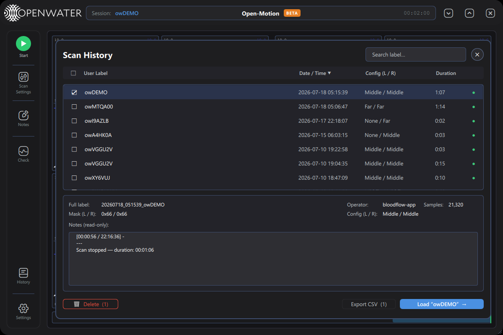

Research mode lists **all** scans in the database (clinical and research). Times in
the **Date / Time** column are shown in UTC.

| Control | What it does |
|---|---|
| **Search label…** | Filter by label text. |
| **Column headers** | Sort by User Label / Date / Config / Duration (▲/▼ toggles direction). |
| **Row click** | Select and show the detail pane: full label, operator, sample count, camera masks (hex), configuration names, and read-only notes. |
| **Checkboxes** | Mark rows for Delete / Export; the header checkbox selects all. |
| **Status dot** | Green ● complete · amber ⚠ interrupted (cannot be replayed or exported). |
| **🗑 Delete (N)** | Permanently deletes the checked scans — password-protected: |

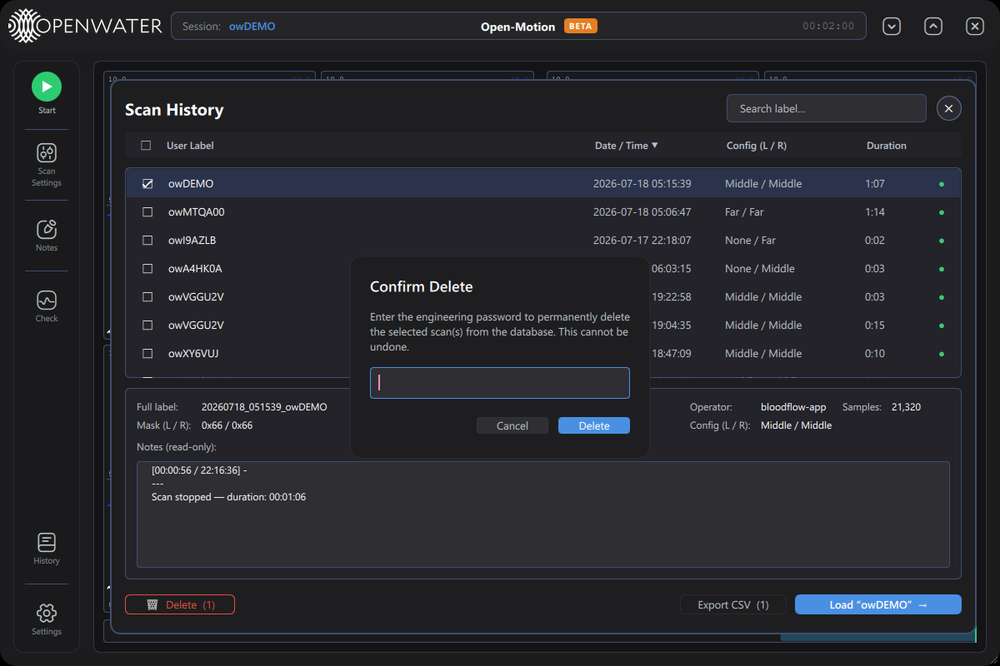
*"Confirm Delete" — enter the engineering password to permanently delete. This cannot
be undone.*

| Control | What it does |
|---|---|
| **Export CSV (N)** | One checked scan → a save-file dialog (pre-named `〈full label〉_export.csv`). Several → a folder picker, one CSV per scan. Interrupted scans are skipped with a warning. |

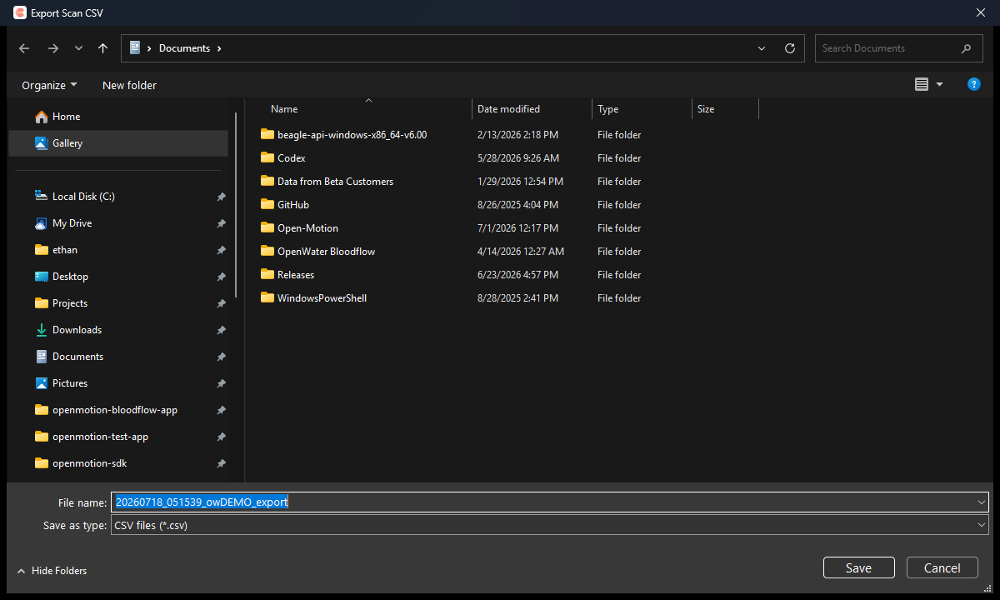

| Control | What it does |
|---|---|
| **Load "label" →** | Loads the selected scan into the viewer for replay (a "Loading scan…" overlay appears for large scans). |

### Replay

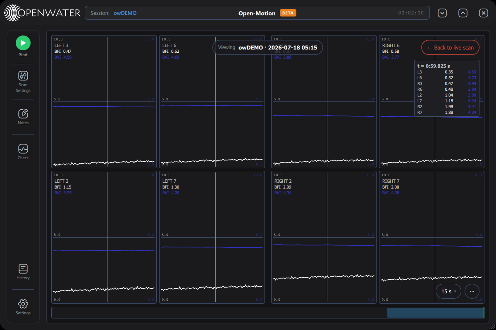

While replaying: the *"Viewing 〈label · date〉"* badge names the scan, the red
**"← Back to live scan"** pill returns to the live view, and every navigation feature
(timeline, zoom, hover, keyboard) works as in live view.

---

## 9. Plot viewer reference

### 9.1 Time navigation (DVR)

| Control | What it does |
|---|---|
| **`15 s ▾` pill** (bottom-right) | Visible time window: 5 s / 15 s / 30 s / 1 min / 5 min. |
| **Timeline bar** (bottom) | The whole scan; drag the inset window to pan, click to jump. Blue inset = following live, orange = paused; a green tick marks the live edge. |
| **Drag on a plot** | Pan in time (pauses live-follow). |
| **Wheel on a plot** | Zoom the time window around the cursor (pinch works on touch screens). |
| **Hover** | Synchronized crosshair on all cells + per-camera values at the cursor time. |
| **`● Back to live`** | Return to the live edge after panning into the past. |

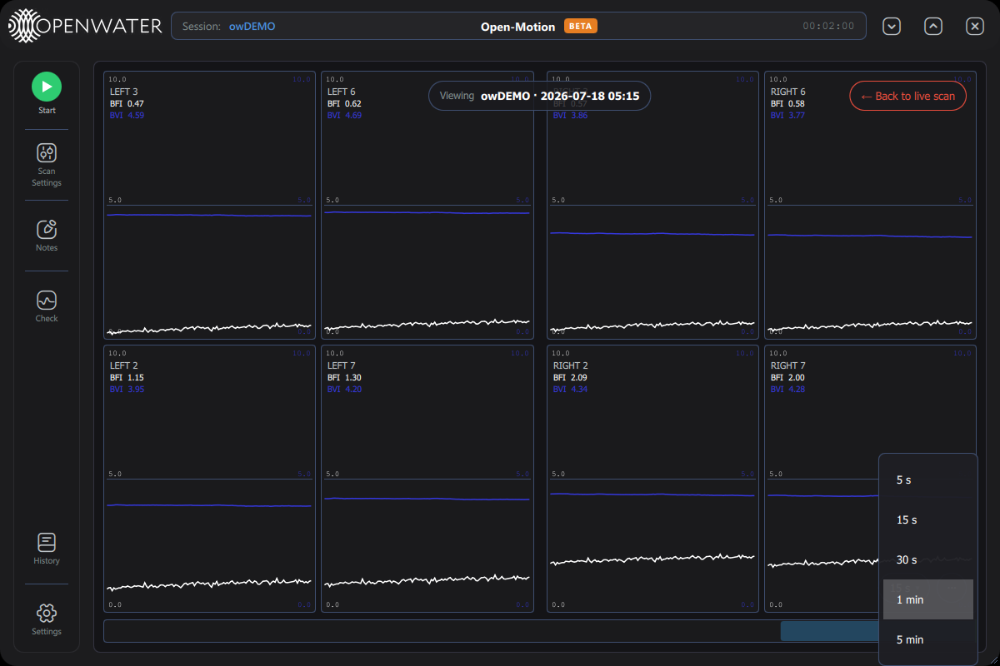

### 9.2 Display options — the `⋯` menu

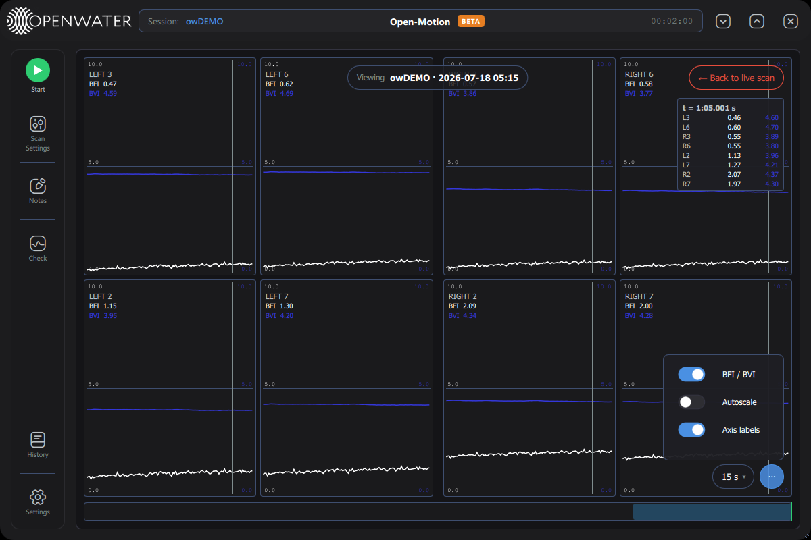

| Toggle | What it does |
|---|---|
| **BFI / BVI** | Switches every cell between BFI/BVI and Mean/Contrast (the raw speckle statistics BFI/BVI are derived from). |
| **Autoscale** | Automatic Y-axis ranging per metric (recomputed every few seconds). Off = the fixed Manual Plot Bounds from Settings. |
| **Axis labels** | Shows/hides the numeric Y-axis tick labels on each cell. |

### 9.3 Keyboard shortcuts

| Key | Action |
|---|---|
| `←` / `→` | Pan 1 s (`Shift` = one full window) |
| `+` / `↑` | Zoom in |
| `-` / `↓` | Zoom out |
| `0` | Reset window and return to live |
| `Home` / `End` | Scan start / live edge |
| `Space` | Timestamped note (during a scan) |
| `Esc` | Close the current dialog |
| `Enter` | Confirm in password prompts |

---

## 10. Settings

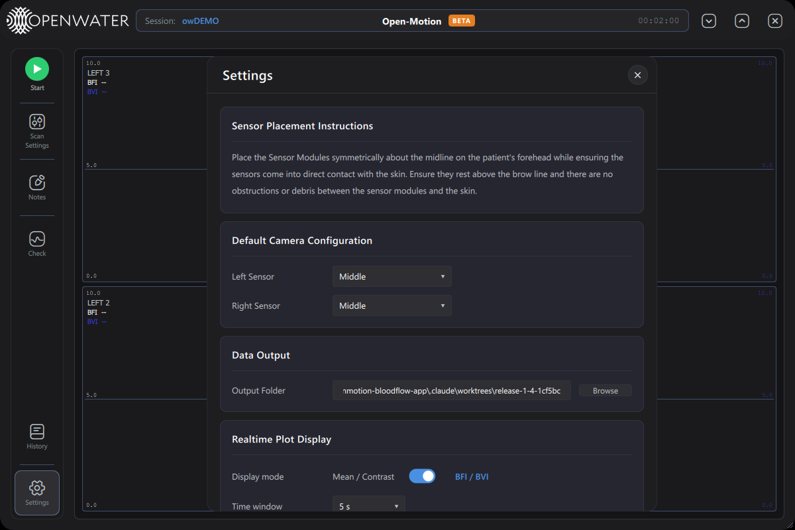

**Sensor Placement Instructions** — placement reference text.

**Default Camera Configuration** — the default *Left Sensor* / *Right Sensor* patterns
pre-selected at launch (same nine patterns as Scan Settings). Scan Settings overrides
them for the current session.

**Data Output** — *Output Folder* (where the database, logs and exports live) with
**Browse**.

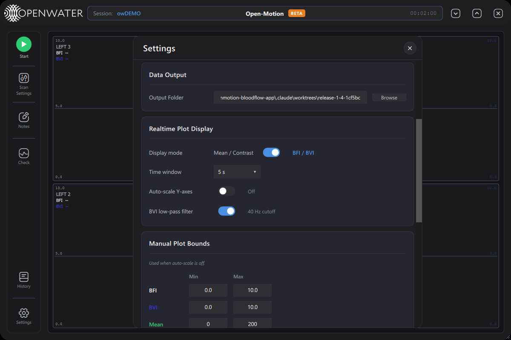

**Realtime Plot Display**

| Setting | What it does |
|---|---|
| **Display mode** | Mean / Contrast ↔ BFI / BVI (same as the plot `⋯` menu). |
| **Time window** | Default visible window length. |
| **Auto-scale Y-axes** | Same as the plot `⋯` menu's Autoscale. |
| **BVI low-pass filter** | Smooths the BVI trace (40 Hz cutoff). |

**Manual Plot Bounds** — fixed Y ranges used when auto-scale is off: Min/Max for BFI,
BVI, Mean and Contrast.

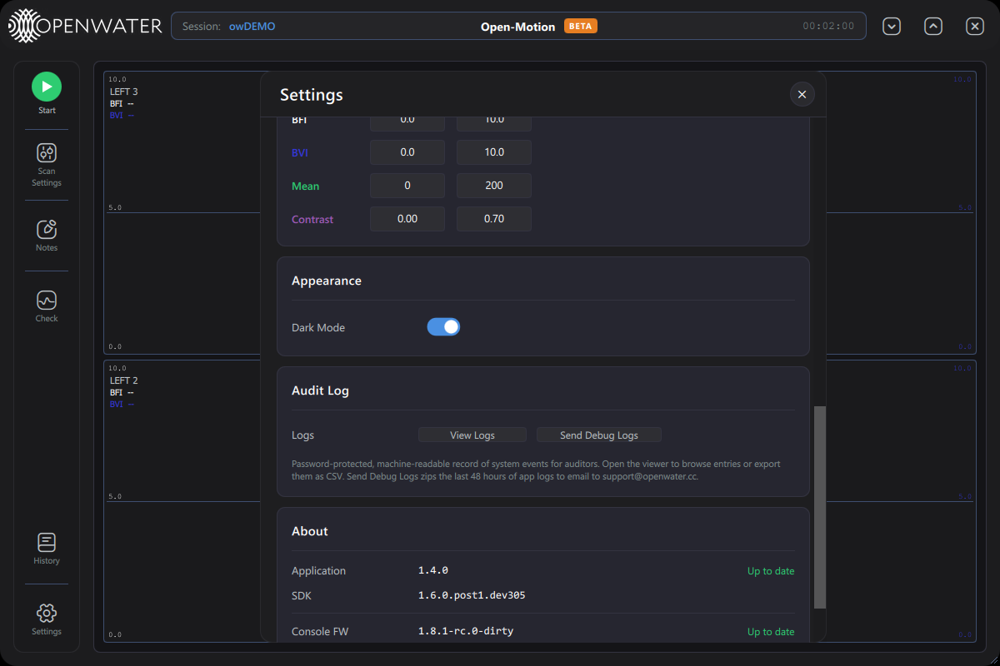

**Appearance** — *Dark Mode* switch; the theme flips immediately:

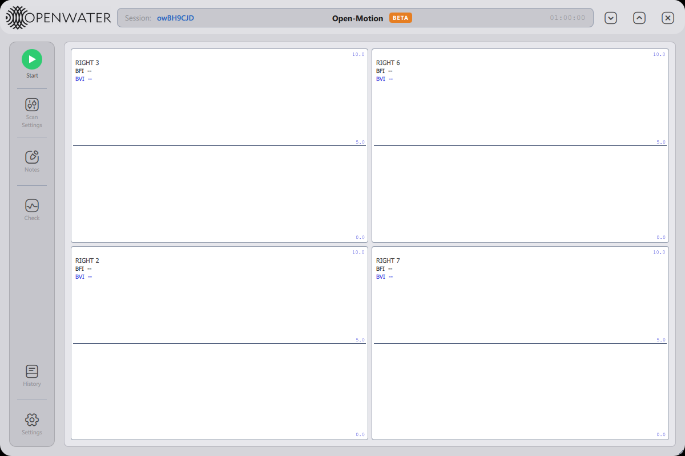
*The light theme. (Shown here with only the right sensor connected — the grid always
shows exactly the connected, active cameras.)*

**Audit Log** — **View Logs** (password-protected audit-log viewer) and
**Send Debug Logs** (zips the last 48 h of logs for emailing to
**support@openwater.cc**).

**About** — Application / SDK / Console FW / Left & Right Sensor FW versions with
up-to-date status. When a newer release exists, an **Update** chip appears next to the
outdated component (application updates install in place; firmware updates are an
engineering function).

Closing Settings saves any changes.

---

## 11. Alerts and errors

Toasts appear bottom-right (green success, yellow warning, red error, blue info;
hover pauses auto-dismiss; safety-critical ones persist). Blocking failures raise the
**Critical Error** dialog with an error code, suggested action, **Copy details**,
**Send Bug Report to Openwater**, an expandable **Details** block, and **Dismiss**.

| Code | Title | Suggested action (summary) |
|---|---|---|
| E-101 | Sensor self-check failed | Power-cycle the sensor; service if persistent. |
| E-102 | Sensor self-check unreadable | Power-cycle; update firmware or report. |
| E-103 | Console initialization failed | Power-cycle the console; report if persistent. |
| E-105 | Camera power-on failed | Power-cycle the sensor; possible service. |
| E-201 | Laser safety monitor unresponsive | Power-cycle; do not scan until clear. |
| E-202 | Laser safety trip | Clear obstruction, settle, rescan. |
| E-301 | Scan aborted before start | Resolve the precondition and retry. |
| E-302 | Scan could not start | Wait for the previous scan to finish. |
| E-303 | Camera data lost during scan | Check cables/power; data before the loss was saved. |

(Full error wording is listed in the Clinical manual, §10.3; it is identical in both
distributions.)

---

## 12. Data storage

| Location (under the Output Folder) | Contents |
|---|---|
| `logs/` | One application log per launch — first stop when troubleshooting. |
| `data/scans.db` | Scan database: all sessions, per-camera data, notes. |
| `data/calibrations/` | Calibration/test reports (engineering workflows). |
| `data/debug-bundles/` | Send-Debug-Logs zips. |

CSVs are export-time artifacts only (History → Export CSV).

---

*Open-Motion User Manual — Research Mode · App 1.4.0 · July 2026 draft*
