

{.cover-logo}

# Open-Motion

## User Manual

| | |
|---|---|
| **Product** | Open-Motion blood-flow monitor |
| **Application version** | 1.4.0 |
| **Document revision** | July 2026 — draft |
| **Audience** | Operators |

> **DRAFT — not a controlled document.** This manual is a documentation preview generated
> from Open-Motion 1.4.0 running on live hardware. It is not a validated
> Instructions-For-Use document — always defer to official Openwater labeling and
> training.

---

## 1. About the system

Open-Motion is Openwater's optical blood-flow monitor. Two forehead **sensor modules**
(up to 8 cameras each) and a **console** containing a near-infrared laser measure
laser-speckle images through the skin and compute, in real time:

- **BFI — Blood Flow Index**: relative index of blood flow (white trace).
- **BVI — Blood Volume Index**: relative index of blood volume (blue trace).

The **Open-Motion** application presents a simple, guided workflow: connect, check
sensor contact, scan, review. The display shows large LEFT / RIGHT BFI and BVI
readouts backed by one live plot per side, and every scan is checked for sensor
contact quality before it starts. Laser safety is enforced by a hardware interlock
inside the console, independently of this software.

---

## 2. Starting the application

Launch **Open-Motion** from the Start menu or desktop shortcut.

- Only one copy can run at a time. If a second copy is launched, a dialog appears:
  *"Another instance of the application is already running. Please close the existing
  instance…"* — close the other copy first.
- The app connects to the console and sensors **automatically** whenever they are
  plugged in and powered; there is no Connect button.
- After the devices connect, the system performs a brief sensor initialization.
  Allow the system to settle for about two minutes after connecting before starting
  a scan.

### 2.1 Connection states

The round badge at the top of the left toolbar tells you the system state at a glance:

| Badge | Label | Meaning |
|---|---|---|
| Grey circle, chain-link icon | `Disconnected` | Console and/or sensors not detected. Scanning is disabled. |
| Green circle, play icon | `Start` | Everything connected and initialized — ready to scan. |
| Yellow circle | `Start` | Start pressed; the system is finishing the previous operation before the scan begins (normally a few seconds). |
| Red circle, stop icon | `Stop` | A scan is running. Press to stop. |

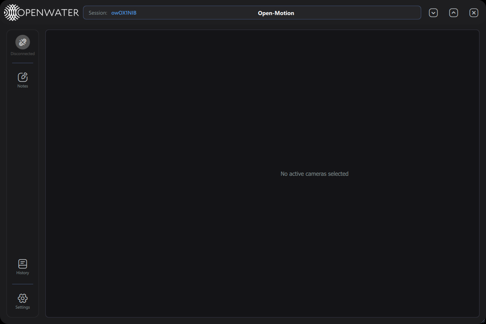
*Disconnected: the plot area reads "No active cameras selected" and the badge is grey.*

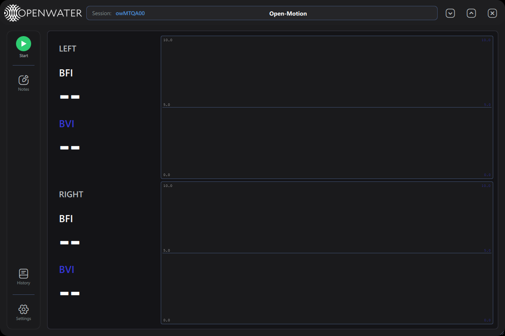
*Ready: green Start badge, LEFT/RIGHT panels showing `--` (no data yet).*

---

## 3. The main screen

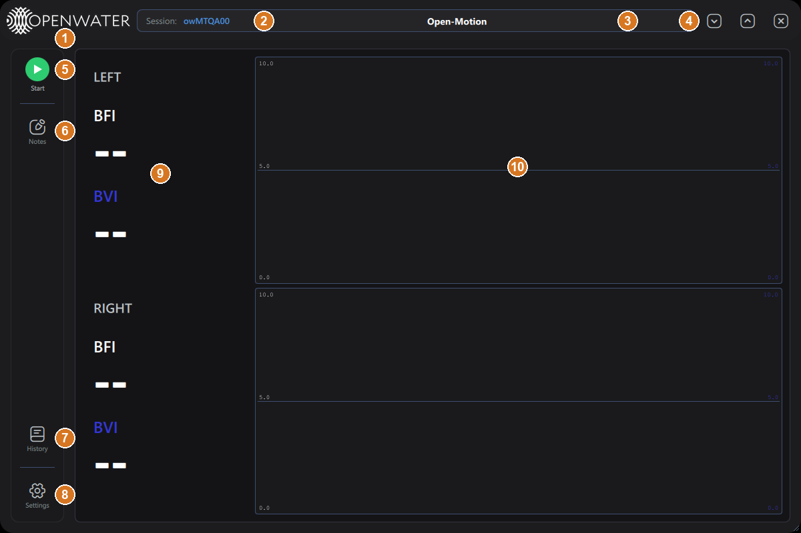

| # | Element | What it does |
|---|---|---|
| 1 | **Openwater logo** | Branding. |
| 2 | **Session:** | The current session identifier. A new identifier is generated per app launch and stamped into every scan record. |
| 3 | **Scan clock** | Blank while idle. During a scan it shows the elapsed time `HH:MM:SS` in green. |
| 4 | **Window controls** | Minimize `⌄`, maximize/restore `^`, and close `✕`. |
| 5 | **Start / Stop badge** | Starts the scan workflow (contact-quality check, then scan) or stops the running scan. Disabled until the system is ready. |
| 6 | **Notes** | Opens the Session Notes editor (§6). Always available. |
| 7 | **History** | Opens Scan History — review, replay, export or delete past scans (§7). Disabled during a scan. |
| 8 | **Settings** | Opens the Settings panel (§8). Disabled during a scan. |
| 9 | **LEFT / RIGHT panels** | Large live readouts of BFI and BVI per side. `--` means no valid value (no data yet, or the value is outside the displayable 0–10 range). |
| 10 | **Plots** | One plot per side showing the side-average BFI (white) and BVI (blue) traces. |

Additional window behaviors:

- **Move** the window by dragging anywhere on the dark header bar.
- **Resize** using the diagonal grip in the bottom-right corner (minimum size 800 × 600).
- **Close while busy:** if you press `✕` while a scan or check is running, the app does
  not exit immediately — a yellow toast warns e.g. *"Scan in progress. Click X again to
  cancel and exit."* Pressing `✕` again within 5 seconds cancels the work and exits.

---

## 4. Running a scan

### Step 1 — Press Start

Press the green **Start** badge. Every scan begins with an automatic
**contact-quality check** of the sensors against the skin:

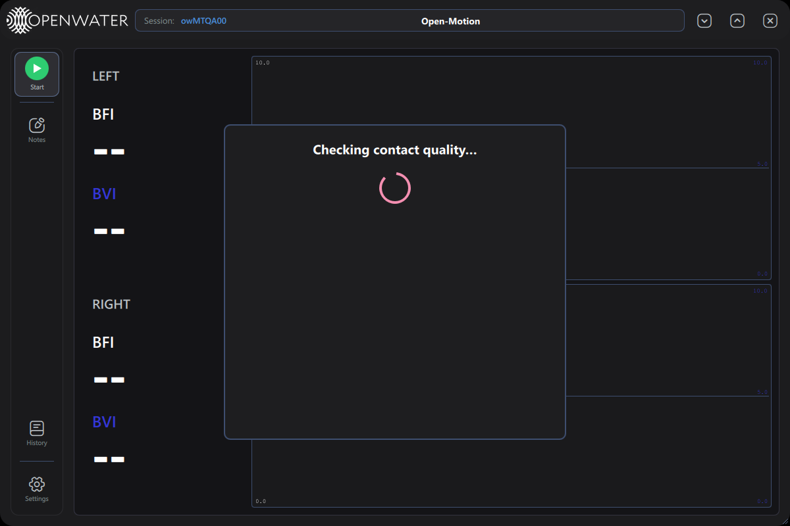
*"Checking contact quality…" — the system briefly configures all cameras and samples
ambient light and skin contact. This typically takes well under a minute.*

### Step 2 — Review the contact-quality result

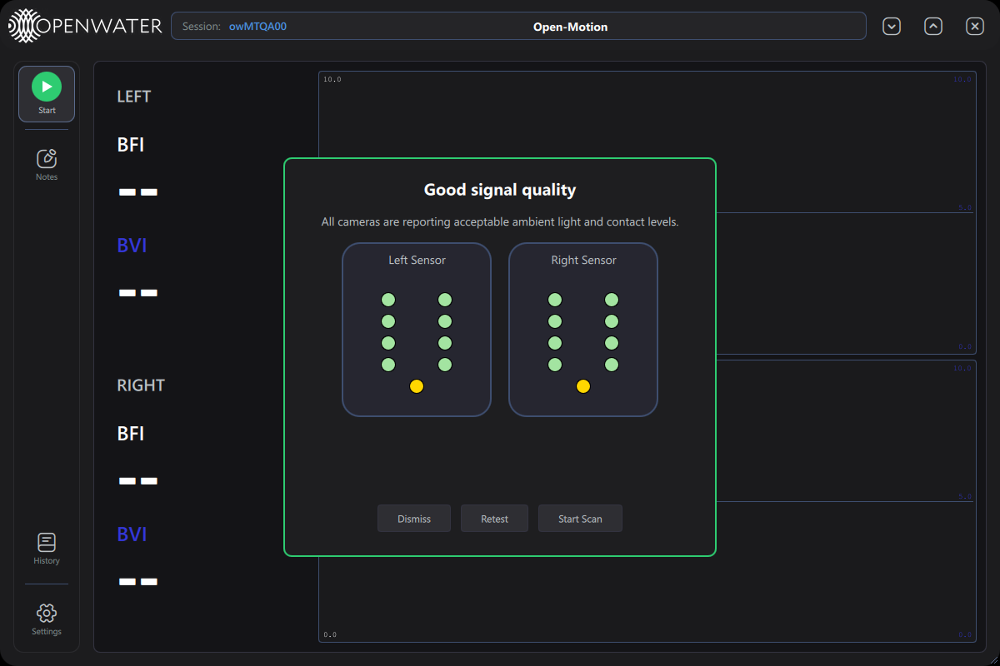

Each circle is one camera on that sensor (the gold dot marks the laser aperture).
The border color of the panel summarizes the outcome:

| Color | Meaning |
|---|---|
| **Green** border, *"Good signal quality"* | All cameras report acceptable ambient light and contact. |
| **Orange** border, *"Contact check failed"* | One or more cameras have a problem — hover over an orange dot for the reason (too much ambient light, or poor skin contact). Re-seat the sensor and retest. |
| **Red** border, *"Contact Quality Notification"* | The check itself could not run (e.g. a sensor dropped out). |

Camera dot colors: **green** = good · **grey** = not evaluated / still checking ·
**orange** = problem detected.

Footer buttons:

| Button | Action |
|---|---|
| **Dismiss** | Close the dialog without scanning. |
| **Retest** | Run the contact-quality check again (after adjusting the sensors). |
| **Start Scan** | Proceed to the scan. Available as soon as the check has finished — the operator may proceed even past warnings, but for best data quality resolve orange cameras first. |

### Step 3 — The scan

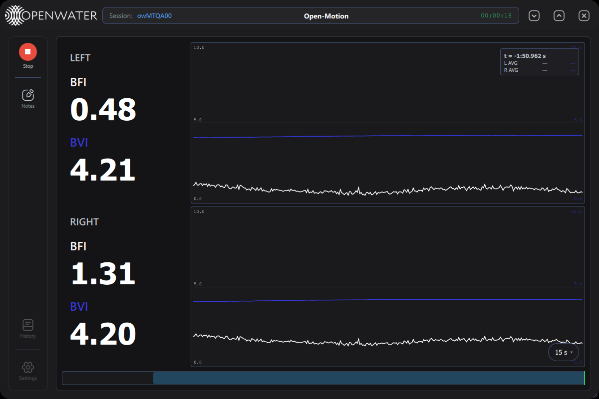
*A scan a few seconds in: the badge is now a red **Stop**, and the header clock counts up.*

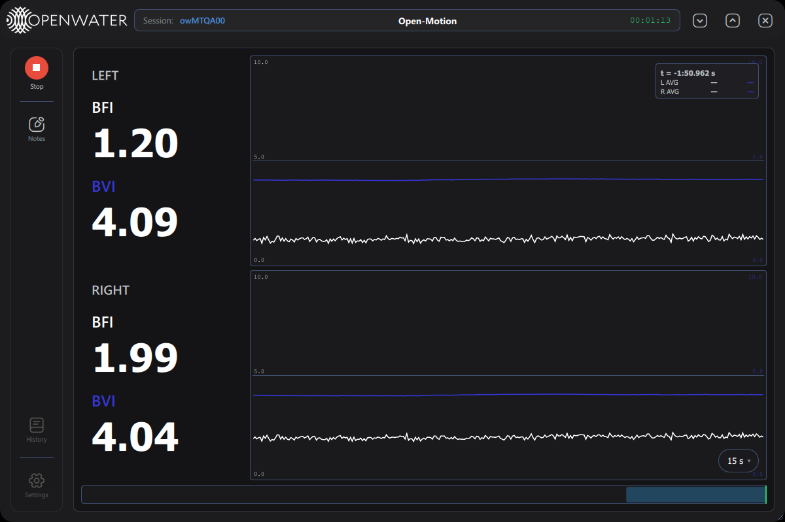
*The LEFT/RIGHT panels show live BFI/BVI values; each side's plot draws the BFI (white)
and BVI (blue) traces. The floating box in the plot corner is the hover readout — it
appears whenever the mouse rests over a plot and shows the values under the cursor.*

During the scan:

- The scan is **open-ended**: it runs until you press **Stop** (with a 12-hour
  ceiling).
- The bottom **timeline bar** (scrubber) and the **`15 s ▾` pill** control how much
  history is visible; see §5.
- Press **Space** to open Session Notes with an automatically inserted
  `[elapsed / wall-clock]` timestamp — type the observation and close (§6).
- If contact quality degrades mid-scan, the contact-quality dialog reappears with a
  **Stop scan** button (end the scan now) and a **Continue** button. Continue unlocks
  only after the issue has stayed clear for a couple of seconds.

### Step 4 — Stop and annotate

Press the red **Stop** badge. After a few seconds of shutdown the **Session Notes**
window opens automatically with a record of the scan:

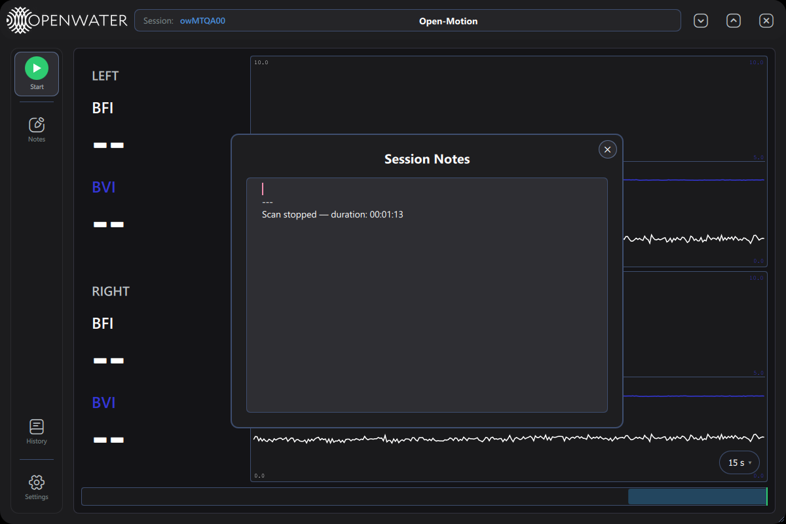
*The stop event and duration are pre-filled (e.g. "Scan stopped — duration: 00:01:13").
Add any observations above the line, then close with `✕` — notes are saved to the scan
record ("Note saved." appears in the corner).*

All scan data is stored automatically in the application's local database — nothing
needs to be exported for the data to be retained.

---

## 5. Reading and navigating the plots

The plot area is a DVR: you can rewind during or after a scan without losing the live view.

| Control | Where | What it does |
|---|---|---|
| **`15 s ▾` pill** | bottom-right of the plots | Chooses how many seconds of history are visible: 5 s, 15 s, 30 s, 1 min, 5 min. |
| **Timeline bar** | very bottom | Shows the whole scan. Drag the highlighted window to rewind/fast-forward; click anywhere on the bar to jump. Blue window = following live; orange = paused in the past. |
| **Drag on a plot** | plot area | Pans back/forward in time (pauses live-follow). |
| **Mouse wheel on a plot** | plot area | Zooms the time window in/out around the cursor. |
| **Hover** | plot area | Shows the crosshair and the values at the hovered time. |
| **`● Back to live` pill** | top-right of plots | Appears when you have panned into the past during a live scan — click to snap back to the live edge. |

Keyboard shortcuts (active when the plot area has focus):

| Key | Action |
|---|---|
| `←` / `→` | Pan 1 s back / forward (`Shift` pans a full window) |
| `+` / `↑` | Zoom in |
| `-` / `↓` | Zoom out |
| `0` | Reset the window and return to live |
| `Home` / `End` | Jump to scan start / return to live edge |
| `Space` | Open Session Notes with a timestamp (during a scan) |
| `Esc` | Close the current dialog |

The vertical axis is fixed at the configured bounds (default 0–10 for BFI and BVI;
see Settings → Manual Plot Bounds). Values outside the displayable range show as `--`
in the numeric panels.

---

## 6. Session Notes

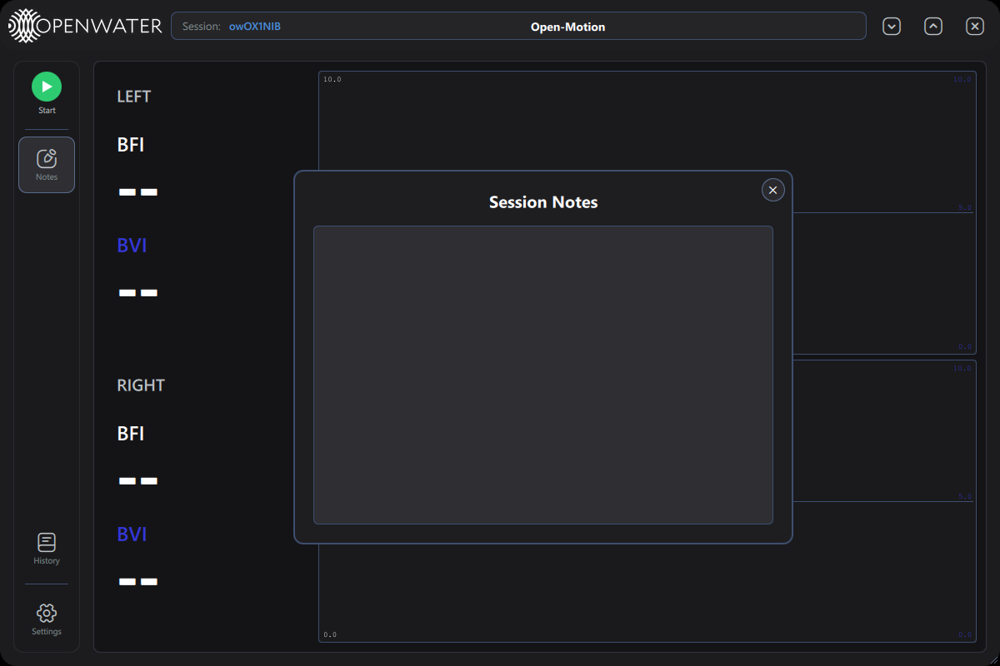

- Open at any time with the **Notes** button, or automatically after every scan, or
  with **Space** during a scan (which inserts a timestamp line for you).
- Everything you type is saved to the current session's scan record when the window
  closes (`✕`, clicking outside, or `Esc`) — a "Note saved." toast confirms.
- Notes are visible later in Scan History's detail pane (read-only there).

---

## 7. Scan History

Press **History** to review past scans.

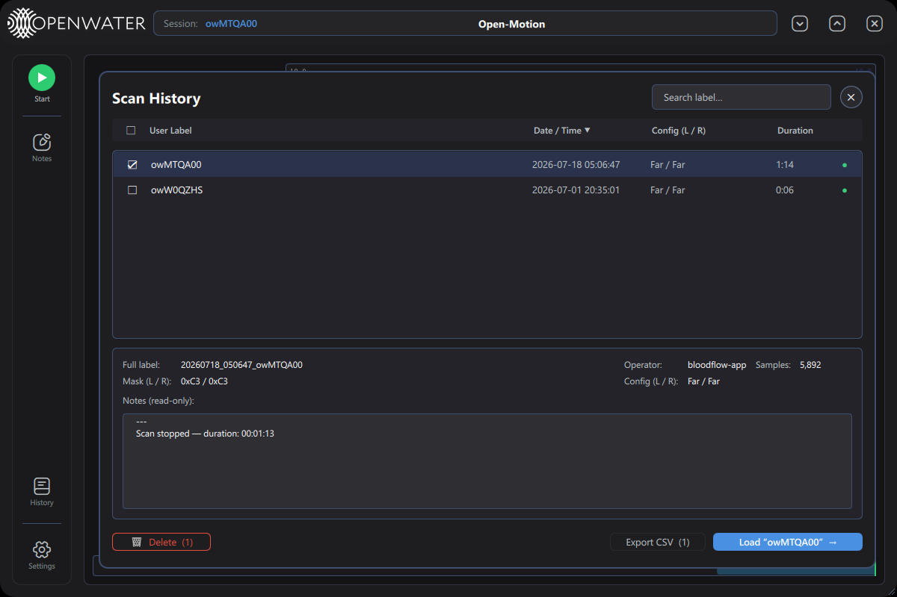

The list shows your recorded scans. Times in the **Date / Time** column are shown
in UTC.

| Control | What it does |
|---|---|
| **Search label…** | Filters the list by label text. |
| **Column headers** | Click *User Label*, *Date / Time*, *Config (L/R)* or *Duration* to sort; click again to reverse (▲/▼). |
| **Row click** | Selects a scan and fills the detail pane below (full label, operator, sample count, camera masks, notes). |
| **Checkbox** (per row / header) | Marks scans for Delete / Export. The header checkbox selects all. |
| **Status dot** (right edge) | Green ● = complete scan. Amber ⚠ = interrupted scan (cannot be replayed or exported). |
| **🗑 Delete (N)** | Permanently deletes the checked scans. Password-protected and irreversible — a *"Confirm Delete"* prompt asks for a password before anything is removed. |
| **Export CSV (N)** | Exports the checked scan(s) to CSV. One scan opens a save-file dialog; several scans ask for a folder. |
| **Load "label" →** | Loads the selected scan into the plot viewer for replay. |
| **✕** | Closes History. |

**Replay:** after *Load*, the plot area shows the recorded scan with a *"Viewing
〈label · date〉"* badge and a red **"← Back to live scan"** pill for returning to the
live view. All plot navigation (timeline, zoom, hover) works identically on replays.

---

## 8. Settings

Press **Settings**. The panel contains the following cards (scroll for more):

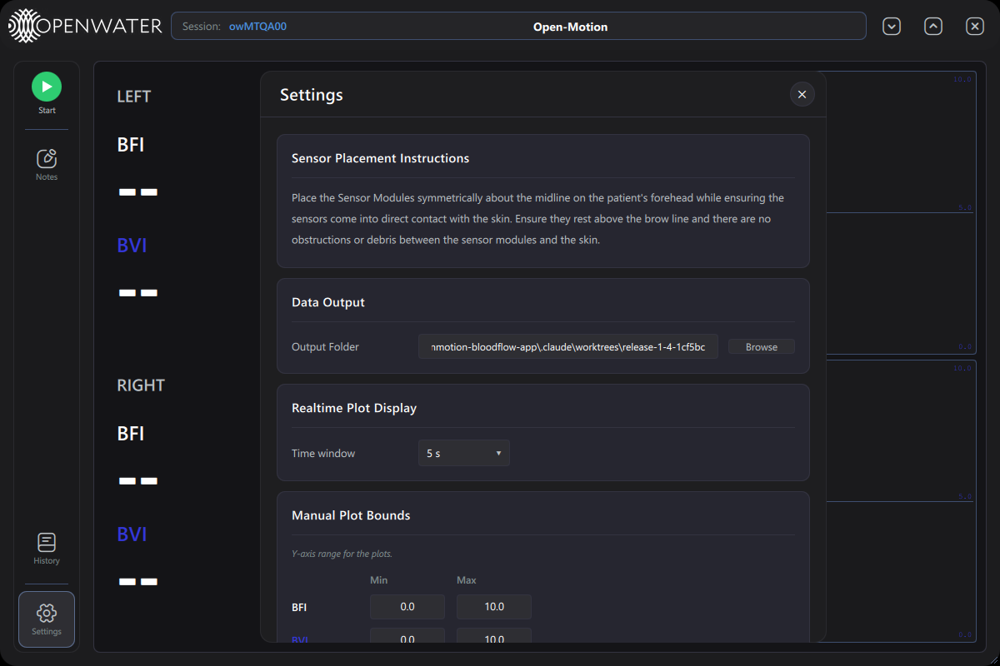

**Sensor Placement Instructions** — reference text: place the sensor modules
symmetrically about the midline on the patient's forehead, above the brow line, in
direct skin contact with no obstructions.

**Data Output** — where the application stores its data (scan database, logs, exports).
*Output Folder* shows the current location; **Browse** selects a different folder.

**Realtime Plot Display** — *Time window* sets the default plot history length.

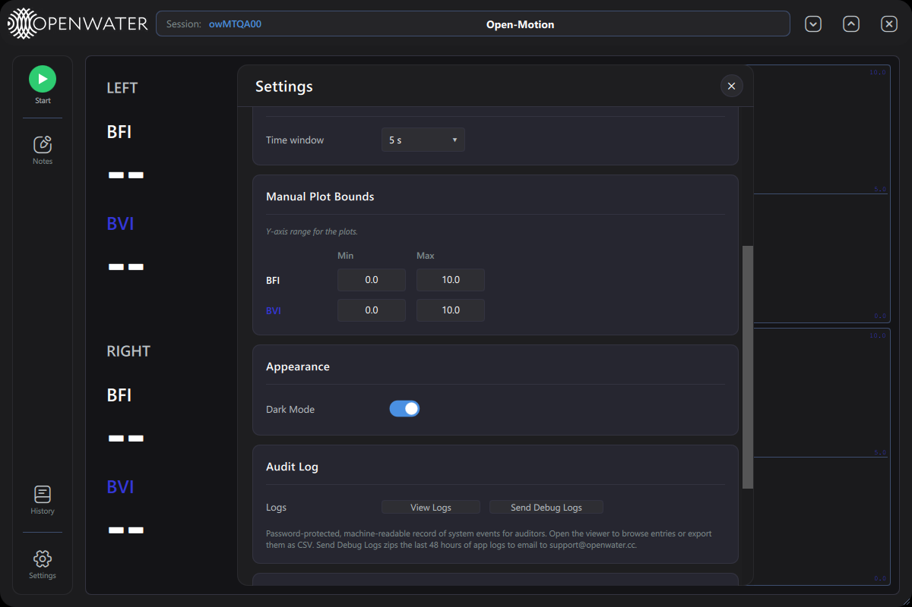

**Manual Plot Bounds** — the fixed Y-axis range used by the plots and numeric panels
(Min/Max for BFI and BVI; defaults 0.0–10.0).

**Appearance** — *Dark Mode* switch. The entire interface re-themes immediately
(a light theme is available for bright environments).

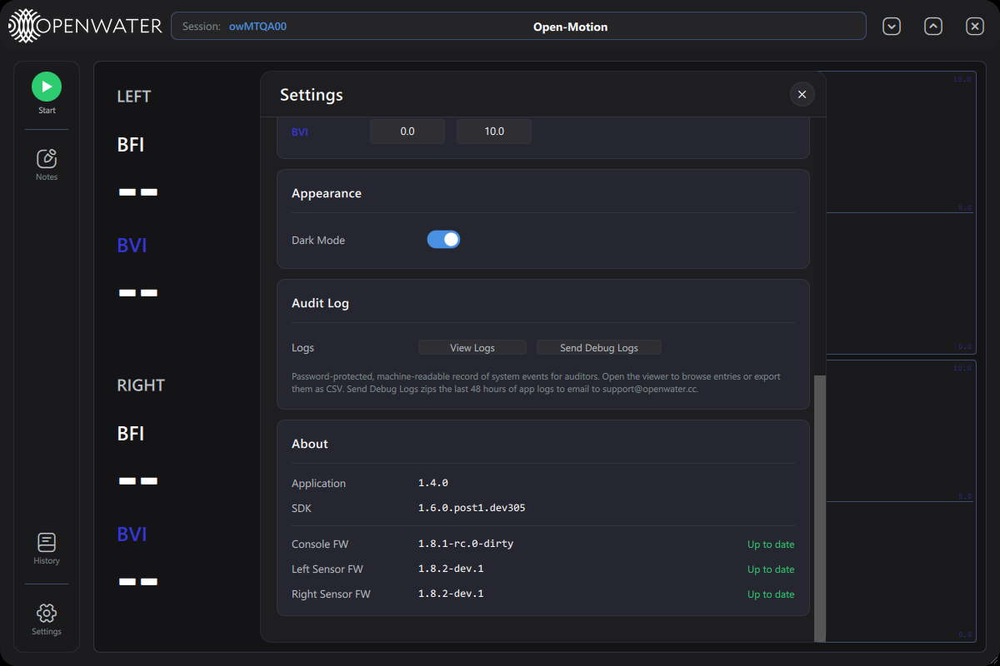

**Audit Log** — a machine-readable record of system events for auditors:

| Button | What it does |
|---|---|
| **View Logs** | Opens the audit-log viewer. Password-protected (for auditors and Openwater support). |
| **Send Debug Logs** | Packages the last 48 hours of application logs into a zip under the data folder, opens its location in Explorer, and shows instructions to email it to **support@openwater.cc**. Use this when reporting a problem. |

**About** — versions of the application, SDK, console firmware and both sensors'
firmware.

Closing Settings (`✕` or `Esc`) saves any changes.

---

## 9. Alerts and errors

### 9.1 Toast notifications

Short status messages appear in the bottom-right corner, color-coded: green = success,
yellow = warning, red = error, blue = information. They dismiss themselves after a few
seconds (hovering pauses the countdown); some carry an `✕` to dismiss manually.
Safety-critical toasts (see below) stay on screen.

Notable messages:

| Message | Meaning / action |
|---|---|
| *"Note saved."* | Session notes were stored. |
| *"Could not start scan — the previous step is still finishing. Please press Start again."* | The system was still busy; wait a few seconds and press Start again. |
| *"Laser safety warning detected. Please restart your console. If this error persists, please contact support."* (red, persistent) | The console's hardware laser-safety monitor tripped. Power-cycle the console; contact support if it recurs. |
| *"Laser safety system tripped. Scan will be cancelled in 5 seconds."* | A safety trip occurred mid-scan; the scan stops automatically. |
| Console / sensor "not detected" warnings at startup | A device did not enumerate within the expected time — check cables/power. |

### 9.2 Critical Error dialog

Show-stopping conditions raise a blocking **Critical Error** dialog with an error code,
explanation, and a suggested action. Buttons:

| Button | What it does |
|---|---|
| **Copy details** | Copies the full error report to the clipboard. |
| **Send Bug Report to Openwater** | Emails the session log and error context to Openwater support (opens your mail client if direct send is unavailable). |
| **▶ Details** | Expands the technical detail block. |
| **Dismiss** | Closes the dialog (shows the next queued error, if any). |

### 9.3 Error code reference

| Code | Title | Meaning (summary) | Suggested action |
|---|---|---|---|
| E-101 | Sensor self-check failed | A sensor's internal device (mux, IMU, camera, FPGA) failed its power-on self-check. | Power-cycle the sensor and reconnect; if persistent, the sensor needs service. |
| E-102 | Sensor self-check unreadable | The sensor connected but did not report its self-check result. | Power-cycle and reconnect; update firmware or send a bug report if persistent. |
| E-103 | Console initialization failed | The console's laser-power configuration could not be applied. | Power-cycle the console and reconnect; send a bug report if persistent. |
| E-105 | Camera power-on failed | The sensor could not power its cameras during initialization. | Power-cycle the sensor and reconnect; service may be required. |
| E-201 | Laser safety monitor unresponsive | The safety monitor stopped reporting a known-good state; the laser was shut off as a precaution. | Power-cycle the system. Do not scan until this clears. |
| E-202 | Laser safety trip | The safety monitor tripped during a scan; the laser was shut off and the scan stopped. | Remove any obstruction, let the system settle, start a new scan. |
| E-301 | Scan aborted before start | A precondition check failed before the laser fired. | Resolve the reported issue and start again. |
| E-302 | Scan could not start | The system refused a new scan, usually because the previous one is still finishing. | Wait a few seconds and try again. |
| E-303 | Camera data lost during scan | Every camera stopped delivering data; the scan was stopped. Data captured before the loss was saved. | Check sensor cables/power, reconnect, start a new scan. |

---

## 10. Data storage

All application data lives under the configured output folder (Settings → Data Output):

| Location | Contents |
|---|---|
| `logs/` | One application log file per launch. |
| `data/scans.db` | The scan database: all scan data, sessions and notes. |
| `data/debug-bundles/` | Zips created by *Send Debug Logs*. |

Scan data is retained in the database automatically; CSV files are only created when
you explicitly export from Scan History.

---

## 11. Getting help

1. Use **Settings → Send Debug Logs** to package the recent logs.
2. Email the zip to **support@openwater.cc** with a description of the issue, or use
   **Send Bug Report to Openwater** directly from a Critical Error dialog.

---

*Open-Motion User Manual · App 1.4.0 · July 2026 draft*
