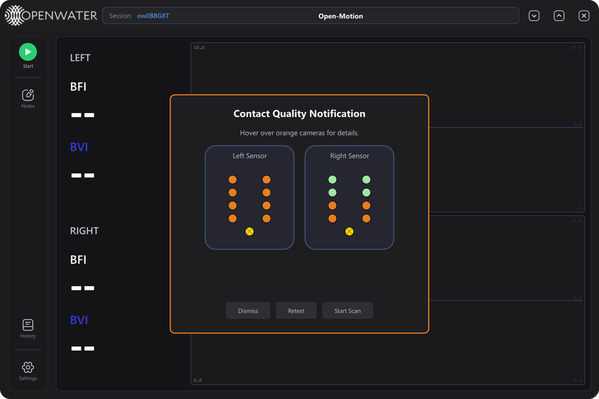
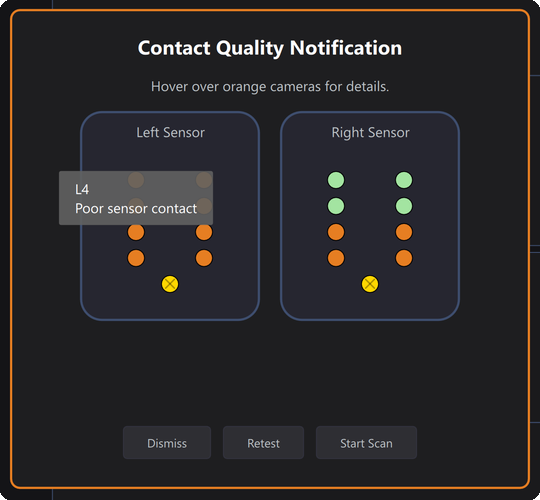
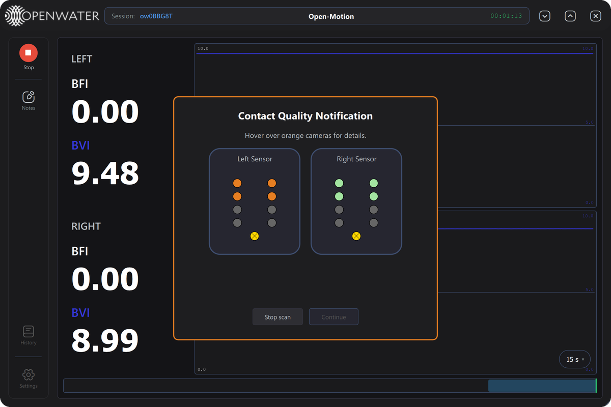
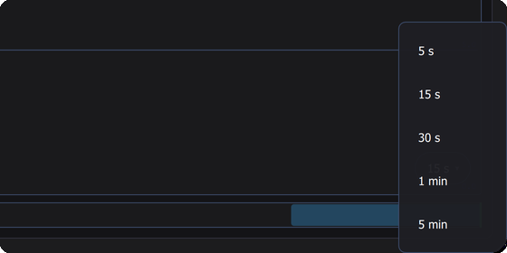
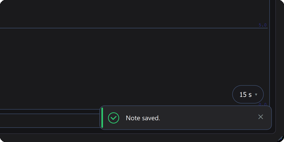
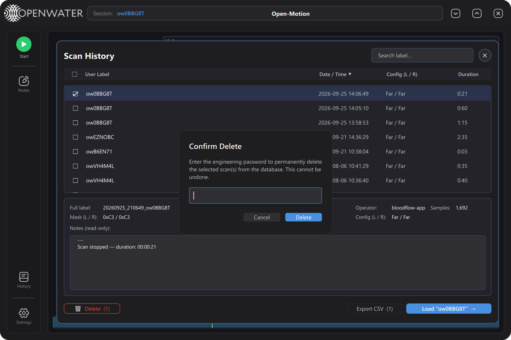
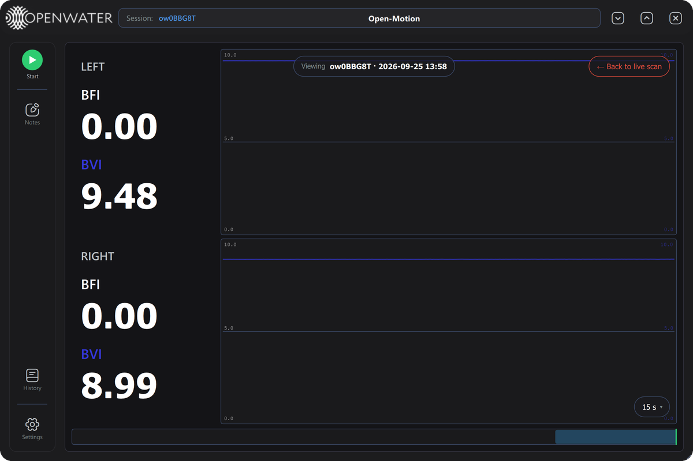
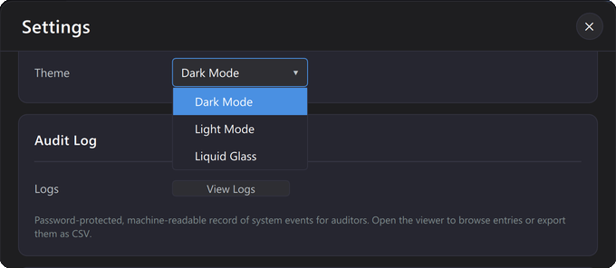
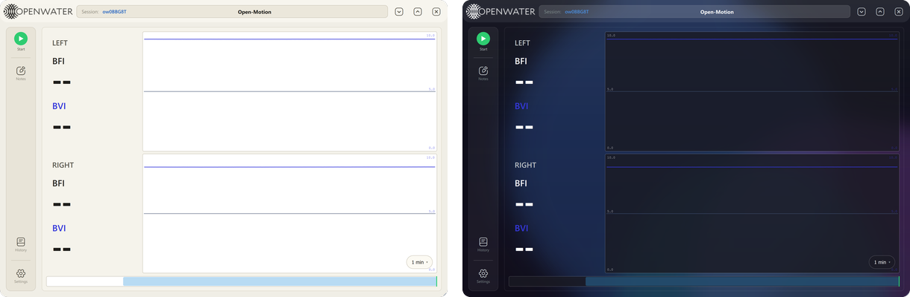
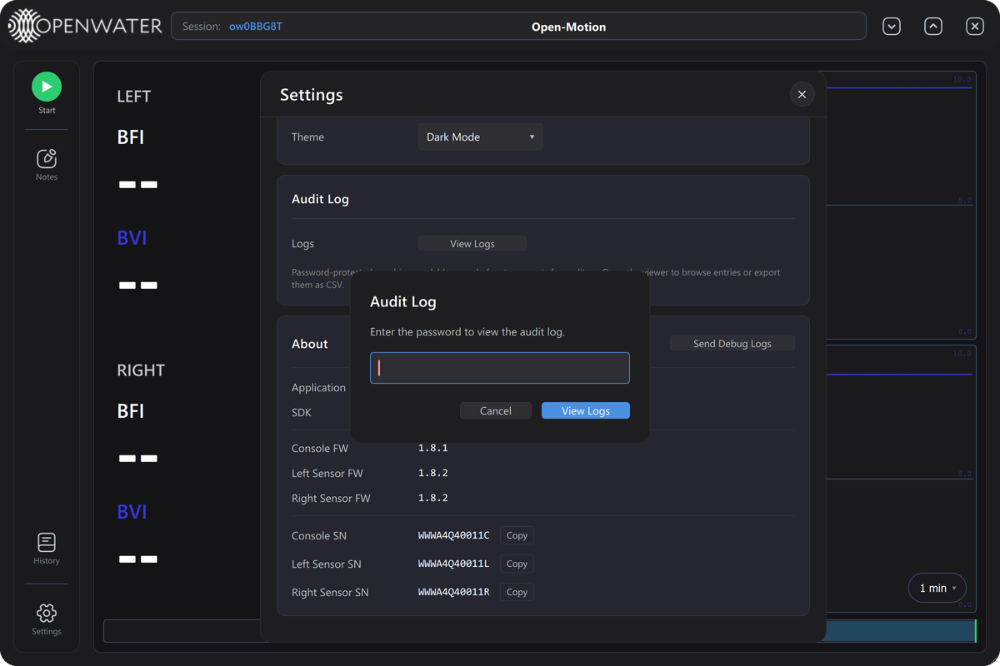

{.cover-logo}

# Open-Motion

User Manual — Clinical build
{: .subtitle }

| | |
|---|---|
| **Product** | Open-Motion blood-flow monitor |
| **Application version** | 1.5.3 (Clinical build) |
| **Compatible firmware** | Console 1.8.1 · Sensor modules 1.8.2 |
| **Document revision** | September 2026 — draft |
| **Audience** | Operators |

> **DRAFT — not a controlled document.** This manual is a documentation preview written
> against Open-Motion 1.5.3 and illustrated with screenshots of the 1.5.3 Clinical build
> running on bench hardware. It is not a validated Instructions-For-Use document — always
> defer to official Openwater labeling and training.

---

## 1. About the system

Open-Motion is Openwater's optical blood-flow monitor. Two forehead **sensor modules**
(eight cameras each) and a **console** containing a near-infrared laser measure
laser-speckle images through the skin and compute, in real time:

- **BFI — Blood Flow Index**: a relative index of blood flow (white trace).
- **BVI — Blood Volume Index**: a relative index of blood volume (blue trace). BVI is
  smoothed with a low-pass filter, which is always on in the Clinical build.

The **Open-Motion** application presents a simple, guided workflow: connect, check
sensor contact, scan, review. Each scan uses four cameras per sensor module (cameras 1, 2,
7 and 8, shown as the **Far** configuration). The display shows large LEFT and RIGHT BFI
and BVI readouts — the average of that side's active cameras — beside one live plot per
side. Every scan starts with an automatic check that the sensors are seated against the
skin.

Laser safety is enforced by a hardware interlock inside the console, independently of
this software.

---

## 2. Installing and starting

### 2.1 Installation and updates

- Open-Motion is installed with the installer supplied by Openwater. The installer and the
  application are code-signed by Openwater, so Windows names Openwater as the publisher
  during installation.
- The Clinical build has **no in-app updater**. To move to a newer version, install the
  new release supplied by Openwater.
- **Each Windows account has its own scan history, settings and logs** (see §10).
  Sign in to Windows with the same account each time so earlier scans remain visible.
- **Upgrading from 1.5.2 or earlier:** the installed application starts with an empty
  scan history and default display preferences. Earlier scans are not deleted — they
  remain in `C:\ProgramData\Openwater\data` — but this version does not show them.

### 2.2 Starting the application

Launch **Open-Motion** from the Start menu or the desktop shortcut. The application is a
single signed file that unpacks itself on launch, so the window takes a few seconds to
appear.

- Only one copy can run at a time. A second launch shows *"Another instance of the
  application is already running. Please close the existing instance before opening a new
  one."* — close the other copy first.
- The application connects to the console and the sensor modules **automatically**
  whenever they are plugged in and powered on. There is no Connect button.
- About 12 seconds after launch the application checks what it found. If a device is
  missing, a yellow message appears in the bottom-right corner:
    - *"Console not detected. Check the console USB cable and power, then reconnect."*
    - *"Sensor not detected. Check the sensor USB cable and power, then reconnect."*
    - *"System not found. Check that the console and sensor are connected and powered on."*
      (nothing was found)
- After a sensor module connects, the system initializes it for a few seconds. The
  **Start** label stays dimmed and cannot be pressed until initialization finishes.

### 2.3 Connection states

The round badge at the top of the left toolbar shows the system state:

| Badge | Label | Meaning |
|---|---|---|
| Grey circle, chain-link icon | `Disconnected` | The console or both sensor modules are not connected. Scanning is disabled. |
| Green circle, dimmed label | `Start` | Connected; a sensor module is still initializing. Wait a few seconds. |
| Green circle, play icon | `Start` | Ready to scan. |
| Yellow circle | `Start` | Start was pressed; the system is finishing the previous step before the scan begins (normally a few seconds). |
| Red circle, stop icon | `Stop` | A scan is running. Press to stop it. |

*Disconnected: the grey badge reads "Disconnected" and the plot area shows "No active
cameras selected".*

*Ready: green Start badge; the LEFT and RIGHT panels show `--` until a scan produces data.*

### 2.4 Console indicator light

| Console light | Meaning |
|---|---|
| Solid green | Powered and idle. |
| Solid blue | The laser is active (during a contact-quality check or a scan). |
| Blinking blue | An error. The application shows an error dialog (§9.3); the light returns to green once the dialog is dismissed. If the light blinks with no dialog in the application, power-cycle the console. |

---

## 3. The main screen

| # | Element | What it does |
|---|---|---|
| 1 | **Openwater logo** | Branding. |
| 2 | **Session** | The session label, e.g. `ow0BBG8T`. A new label is generated each time the application starts and is stored with every scan recorded during that session. |
| 3 | **Scan clock** | Blank while idle. During a scan it shows the elapsed time `HH:MM:SS` in green. |
| 4 | **Window controls** | Minimize, maximize/restore, and close. |
| 5 | **Start / Stop badge** | Starts the scan workflow (contact-quality check, then scan) or stops the running scan. Disabled until the system is ready (§2.3). |
| 6 | **Notes** | Opens Session Notes (§6). Always available. |
| 7 | **History** | Opens Scan History — review, replay, export or delete past scans (§7). Disabled during a scan. |
| 8 | **Settings** | Opens Settings (§8). Disabled during a scan. |
| 9 | **LEFT / RIGHT panels** | Large live BFI and BVI readouts for each side (§5.1). |
| 10 | **Plots** | One plot per side with the BFI (white) and BVI (blue) traces. The timeline bar and window-length control appear under the plots once a scan has been recorded (§5). |

Window behavior:

- **Move** the window by dragging the header bar.
- **Resize** with the diagonal grip in the bottom-right corner (minimum 800 × 600).
- **Close while busy:** if you press `✕` during a scan or contact-quality check, the
  application does not exit immediately. A yellow message such as *"Scan in progress.
  Click X again to cancel and exit."* appears. Press `✕` again within 5 seconds to cancel
  the work and exit.

---

## 4. Running a scan

### Step 1 — Place the sensors

Place the sensor modules symmetrically about the midline on the patient's forehead, in
direct contact with the skin, above the brow line, with no obstructions or debris between
the sensor modules and the skin. (The same instructions are in Settings → Sensor Placement
Instructions.)

### Step 2 — Press Start

Press the green **Start** badge. Every scan begins with an automatic
**contact-quality check**. The laser is on during the check.

*"Checking contact quality…" — usually about 10 seconds. The first check after the sensor
modules are powered up can take up to about a minute while the cameras are configured.*

The check tests **all eight cameras** on each connected sensor module — including the
cameras a scan does not use — so it confirms that the whole module is seated. The check
dialog cannot be closed by clicking outside it; use its buttons.

### Step 3 — Review the contact-quality result

*A result with warnings. Here the left module was not in contact, and the right module had
good contact on its top four cameras only.*

The border color and title summarize the result:

| Border | Title | Meaning |
|---|---|---|
| **Green** | *Good signal quality* | All cameras report acceptable ambient light and contact levels. |
| **Orange** | *Contact Quality Notification* | One or more cameras have a problem. Hover over an orange camera for the reason. |
| **Red** | *Contact check failed* | The check could not be completed; the reason is shown in red (for example, a device disconnected). |

Each sensor diagram shows the eight cameras in the module's U shape — cameras 1 to 4 down
the left column and 8 to 5 down the right column — with the laser aperture (yellow ⊗)
at the bottom:

| Camera dot | Meaning |
|---|---|
| Green | Good contact. |
| Orange | Problem detected — hover for the reason. |
| Grey | Not evaluated (still checking, or not part of the running scan). |

*Hovering over a camera shows its label (L = left module, R = right module, then the camera
number) and the problem found.*

| Reason | What to do |
|---|---|
| **Poor sensor contact** | The camera is not receiving enough light back from the skin. Re-seat the module flat against the skin and check for hair or debris. |
| **Ambient light detected** | Room light is reaching the camera. Improve the seal against the skin or shade the sensors from bright light. |

Buttons:

| Button | Action |
|---|---|
| **Dismiss** | Close the dialog without scanning. |
| **Retest** | Run the check again (after adjusting the sensors). |
| **Start Scan** | Start the scan. Available as soon as the check has finished, whatever the result — for best data quality, resolve orange cameras before starting. |

### Step 4 — During the scan

After **Start Scan** the badge may turn yellow for a moment, then red (**Stop**), and the
header clock starts counting. The LEFT and RIGHT panels show live BFI and BVI values and
the plots draw the traces.

- The scan is **open-ended**: it runs until you press **Stop**, up to a maximum of
  12 hours.
- **History** and **Settings** are disabled during a scan. **Notes** stays available.
- Press **Space** to open Session Notes with a timestamp already inserted (§6).
- The console light is solid blue while the laser is on.

**Contact warnings during a scan.** If contact degrades while scanning, the
contact-quality dialog reappears on top of the plots:

*A contact warning during a scan. Only the four scan cameras per side are evaluated; the
others are grey. The scan keeps recording while the dialog is shown.*

| Button | Action |
|---|---|
| **Stop scan** | End the scan now. |
| **Continue** | Return to the plots. Enabled only after every problem has stayed clear for a few seconds — re-seat the sensor and wait for the border to turn green and the message *"All contact quality issues are currently inactive. You may dismiss."* |

While problems remain active, the dialog stays open until they clear or the scan is
stopped (with **Stop scan** or the red **Stop** badge in the toolbar).

**Camera messages.** Short messages in the bottom-right corner report individual cameras:

- *"Camera LEFT 2 connection lost at 00:01:23 — last temp 41.2°C"* — that camera has
  delivered no data for more than 2 seconds. The scan continues on the remaining cameras.
  Check the sensor module's cable and power; if cameras keep dropping out, stop the scan
  and contact support.
- *"Camera LEFT 2 reconnected at 00:01:40"* — data from that camera resumed.

If every camera stops delivering data, the scan is stopped automatically (error E-303,
§9.4).

### Step 5 — Stop and annotate

Press the red **Stop** badge (or **Stop scan** in a contact warning). After a few seconds
of shutdown, **Session Notes** opens automatically with a record of the scan:

*The stop line and the duration are filled in automatically ("Scan stopped — duration:
00:01:14"). Type any observations, then close the window with ✕ to save them.*

- If the application detected gaps longer than 1 second in the data, a
  *"Data gaps (>1.0s): …"* line is added under the duration.
- All scan data is saved automatically to the application's encrypted database. Nothing
  needs to be exported for the data to be retained.
- If a scan ends unexpectedly, a message reports what was kept:
    - *"Scan ended unexpectedly — partial data was saved. The final segment could not be
    dark-corrected and was discarded."* (yellow)
    - *"Scan ended unexpectedly and no data was recorded (the device may have disconnected
    mid-scan). This scan was not saved."* (red; stays on screen until dismissed)

---

## 5. Reading and navigating the plots

### 5.1 The readouts

- Each side has one plot with two traces: **BFI** (white) and **BVI** (blue). The vertical
  axis is fixed to the Manual Plot Bounds in Settings (default 0 to 10 for both).
- The large numbers are the side average of the active cameras at the latest time shown.
  Readings are limited to the 0–10 display range: a value below 0 shows as `0.00` and a
  value above 10 shows as `10.00`.
- `--` means there is no valid reading — no scan has run yet, the scan has stopped, or the
  data at that moment was invalid.

### 5.2 Navigation

The plot area works like a video recorder: you can rewind during or after a scan without
losing the live recording.

| Control | Where | What it does |
|---|---|---|
| **Window-length pill** (e.g. `15 s ▾`) | Bottom-right of the plots | Chooses how much time is visible: 5 s, 15 s, 30 s, 1 min or 5 min. The plots open at 15 s. |
| **Timeline bar** | Under the plots | Shows the whole scan. Drag the highlighted window to move through time, or click the bar to jump. Blue = following the live edge; orange = paused in the past. |
| **Drag on a plot** | Plot area | Pans back or forward in time (stops following live). |
| **Mouse wheel on a plot** | Plot area | Zooms the time window in or out around the pointer. |
| **Hover** | Plot area | Shows a readout box (top-right) with the time and the BFI/BVI values under the pointer for each side (`L AVG`, `R AVG`). |
| **`● Back to live`** | Top-right of the plots | Appears when you have moved into the past during a scan. Click to return to the live edge. |

*The window-length menu, opened from the pill at the bottom-right of the plots.*

Keyboard shortcuts (active when the plot area has keyboard focus — click a plot first):

| Key | Action |
|---|---|
| `←` / `→` | Pan 1 second back / forward (hold `Shift` to pan a full window) |
| `+` or `↑` | Zoom in |
| `-` or `↓` | Zoom out |
| `0` | Reset the zoom and return to live |
| `Home` / `End` | Jump to the start of the scan / return to the live edge |
| `Esc` | Release keyboard focus from the plots |
| `Space` | Open Session Notes with a timestamp (during a scan) |

---

## 6. Session Notes

- Open the notes with the **Notes** button at any time. They open automatically after
  every scan, and **Space** during a scan opens them with a timestamp line
  `[elapsed / clock time] - ` ready for you to type after, for example
  `[00:04:32 / 14:32:05] - `.
- Notes are attached to a scan. During a scan they belong to that scan; after a scan they
  edit the scan just recorded. Each new scan starts with empty notes, so text typed before
  a session's first scan is cleared when that scan starts — record observations once the
  scan is running (Space is the quickest way) or after it ends.
- Notes are saved when the window closes — with `✕`, `Esc`, or by clicking outside the
  window. *"Note saved."* confirms it. **Always close the Notes window after typing** so
  the text is saved.
- Saved notes appear, read-only, in Scan History (§7).

> **Do not enter patient-identifiable information in the notes.** The same reminder is
> shown at the bottom of the Notes window. Notes are stored with the scan and included in
> exported CSV files.

*Closing the Notes window saves the text.*

---

## 7. Scan History

Press **History** (available when no scan is running) to review past scans.

The list shows the scans recorded by the Clinical build under your Windows account,
newest first.

| Column / control | What it shows or does |
|---|---|
| **User Label** | The session label the scan was recorded under (§3). Several scans from one session share a label; use the date and time to tell them apart. |
| **Date / Time** | When the scan started, in the computer's local time. |
| **Config (L / R)** | The camera configuration used on each side (`Far` for clinical scans). |
| **Duration** | Scan length in minutes:seconds. `—` means the scan was interrupted and has no recorded end. |
| **Search label…** | Filters the list by label. |
| **Column headers** | Click to sort; click again to reverse (▲ / ▼). |
| **Row click** | Selects the scan and shows its details below: full label, operator, number of samples, camera masks, configuration and notes (read-only). The full label starts with the scan's start time in UTC, e.g. `20260925_205853_ow0BBG8T`. |
| **Checkboxes** | Mark several scans for Delete or Export. The header checkbox selects all. |
| **Export CSV (N)** | Exports the checked scans to CSV. One scan opens a Save dialog (default name `<full label>_export.csv`); several scans ask for a destination folder. Interrupted scans cannot be exported. |
| **Load "label" →** | Opens the selected scan in the plot viewer for replay. |
| **🗑 Delete (N)** | Permanently deletes the checked scans (§7.1). |
| **✕** | Closes History. |

### 7.1 Deleting scans

Deleting is permanent and password-protected. Pressing **Delete** opens a *Confirm Delete*
prompt; the scans are removed only after the password issued by Openwater is entered.
Delete is unavailable while a scan is running.

### 7.2 Replaying a scan

After **Load**, the plots show the recorded scan with a **Viewing** badge naming it
(label · date and time). All plot navigation (§5) works the same way on a replay. When it
is shown, the red **← Back to live scan** pill returns to the live view.

*A recorded scan loaded from History. The values shown come from a bench recording without
a subject.*

---

## 8. Settings

Press **Settings** (available when no scan is running). Changes apply immediately and are
saved when you close Settings with `✕`, `Esc`, or by clicking outside it.

*Settings, top. Captured on the 1.5.3 release candidate, which still used the shared
`C:\ProgramData\Openwater` folder; a 1.5.3 installation shows your own folder under
`AppData\Local\Openwater` (§10).*

| Card | Contents |
|---|---|
| **Sensor Placement Instructions** | The placement instructions from §4, Step 1. |
| **Data Output** | *Output Folder*: where this Windows account's scan database, logs and support files are kept. Shown for reference; it cannot be changed. |
| **Realtime Plot Display** | *Time window*: 3, 5, 15 or 30 s. To change how much time the plots show during a scan or replay, use the window-length pill under the plots (§5.2). |
| **Manual Plot Bounds** | The fixed vertical range of the plots: *Min* and *Max* for BFI and BVI, each between 0 and 10 (defaults 0.0 and 10.0). Min always stays below Max; out-of-range entries are corrected automatically. |
| **Appearance** | *Theme*: **Dark Mode** (default), **Light Mode**, or **Liquid Glass**. The whole interface re-themes immediately. |
| **Audit Log** | **View Logs** opens the password-protected audit log (§8.1). |
| **About** | Versions and serial numbers, plus **Send Debug Logs** (§11). |

*Settings → Appearance → Theme.*

*Light Mode (left) and Liquid Glass (right). Light Mode suits brightly lit rooms.*

*Settings → About. Captured on the 1.5.3 release candidate; a 1.5.3 installation shows
`1.5.3` in the Application row.*

The **About** card lists:

| Row | Meaning |
|---|---|
| **Application**, **SDK** | Software versions. |
| **Console FW**, **Left Sensor FW**, **Right Sensor FW** | Firmware version of each connected device, or *Not connected*. |
| **Console SN**, **Left Sensor SN**, **Right Sensor SN** | Hardware serial numbers. **Copy** puts a serial number on the clipboard — include them when contacting support. |

### 8.1 Audit Log

The audit log is a machine-readable record of system events (scans, settings changes,
errors and similar) kept for auditors. **View Logs** asks for a password issued by
Openwater. The viewer can filter entries by event type, date range and text, and export
them as CSV.

---

## 9. Messages and errors

### 9.1 Messages (toasts)

Short messages appear in the bottom-right corner, color-coded: **green** = success,
**yellow** = warning, **red** = error, **blue** = information. Most dismiss themselves after
a few seconds (hovering over one pauses its countdown); those with an `✕` can be closed by
hand. Up to five are shown at a time.

| Message | Meaning / action |
|---|---|
| *"Note saved."* | Session notes were stored. |
| *"Console not detected…"*, *"Sensor not detected…"*, *"System not found…"* | A device was not found at startup (§2.2). Check cables and power. |
| *"Left sensor disconnected"* (or *Right sensor*, *Console*) | A device was unplugged or powered off while no scan was running. Reconnect it. |
| *"Could not start scan — the previous step is still finishing. Please press Start again."* | The system was still busy. Wait a few seconds and press Start again. |
| *"Scan failed: …"* | The scan could not start or run; the reason follows. |
| *"Camera … connection lost …"*, *"Camera … reconnected …"* | A camera stopped or resumed delivering data during a scan (§4, Step 4). |
| *"Scan ended unexpectedly …"* | See §4, Step 5. |
| *"Laser safety warning detected. Please restart your console. If this error persists, please contact support."* (red, stays on screen) | The console's hardware laser-safety monitor reported a fault. Power-cycle the console. Contact support if it recurs. |
| *"Exported to …"*, *"Exported N scan(s) to …"* | A CSV export finished. |
| *"Interrupted scans can't be exported."* | The selected scan was interrupted and has no exportable data. |
| *"Console SN copied to clipboard."* (or *Left / Right Sensor SN*) | A serial number was copied from Settings → About. |
| *"Preparing debug logs…"*, *"Debug logs saved to …"* | See §11. |

### 9.2 Closing while busy

See §3: pressing `✕` during a scan or check shows *"… in progress. Click X again to cancel
and exit."* Press `✕` again within 5 seconds only if you intend to abandon the work.

### 9.3 Error dialog

Serious conditions raise a blocking **ERROR** dialog. It shows the error code (for example
`E-202`), a title, an explanation, and a suggested action (→). While it is shown, the
console light blinks blue.

| Control | What it does |
|---|---|
| **▶ Details** | Expands technical detail, when available. |
| **N more** | Several errors are queued; they are shown one after another. |
| **Copy details** | Copies the error report to the clipboard. |
| **Contact Support** | Opens your email program with a pre-filled message to Openwater support, copies the report to the clipboard, and opens the folder containing the application log with the file selected — attach it to the email before sending. |
| **Dismiss** | Closes the dialog (or shows the next queued error). Clicking outside the dialog or pressing `Esc` does the same. |

Quote the error code when contacting support.

### 9.4 Error code reference

| Code | Title | Meaning | What to do |
|---|---|---|---|
| `E-101` | Sensor self-check failed | One or more of a sensor module's internal devices did not respond to its power-on self-check. The system cannot scan reliably. | Power-cycle the sensor module and reconnect. If it persists, the module needs service — contact support. |
| `E-102` | Sensor self-check unreadable | The sensor module connected but did not report its self-check result. | Power-cycle and reconnect. If it persists, contact support. |
| `E-103` | Console initialization failed | The console's laser-power configuration could not be applied. | Power-cycle the console and reconnect. If it persists, contact support. |
| `E-104` | Console not detected | Startup check: no console found (yellow message, not a dialog). | Check the console USB cable and power. |
| `E-105` | Camera power-on failed | The sensor module could not power on its cameras. | Power-cycle the sensor module and reconnect. If it persists, the module may need service. |
| `E-106` | Sensor not detected | Startup check: no sensor module found (yellow message, not a dialog). | Check the sensor USB cable and power. |
| `E-201` | Laser safety monitor unresponsive | Laser safety could not be confirmed, so the laser was shut off as a precaution. | Power-cycle the system and reconnect. **Do not scan until this clears.** Contact support if it persists. |
| `E-202` | Laser safety trip | The laser-safety monitor tripped during a scan. The laser was shut off and the scan stops about 5 seconds later. | Remove any obstruction, let the system settle, and start a new scan. If it trips repeatedly, stop and contact support. |
| `E-301` | Scan aborted before start | A check before the laser fired failed, so the scan did not start. | Resolve the reported problem (connection, safety or configuration) and start again. |
| `E-302` | Scan could not start | The system refused a new scan, usually because the previous one is still finishing. | Wait a few seconds and try again. Reconnect if it stays busy. |
| `E-303` | Camera data lost during scan | Every camera stopped delivering data for about 3 seconds, so the scan was stopped. Data captured before the loss was saved. | Check the sensor cables and power, reconnect, and start a new scan. |
| `E-304` | Device disconnected during scan | The console or a sensor module in use was disconnected during the scan, so the scan was stopped. Data captured before the disconnection may not have been saved. | Check the USB cables and power, reconnect, and start a new scan. |

---

## 10. Data storage and privacy

Each Windows account keeps its own data in a private folder:

`C:\Users\<Windows user>\AppData\Local\Openwater`

| Location | Contents |
|---|---|
| `logs\` | One application log file per launch (`open-motion-<date>_<time>.log`). |
| `data\scans.db` | The scan database: all scans, their notes, and your display preferences. **Encrypted** in the Clinical build; the key is held by Windows for your account. |
| `data\debug-bundles\` | Zip files created by *Send Debug Logs*. |

- Scan data is kept automatically. CSV files are only created when you export from Scan
  History (§7). Exported files are not encrypted — store them according to your site's
  data-handling rules.
- Because the database key belongs to your Windows account, another Windows user cannot
  open your scans, and you will not see theirs.
- Scans recorded by version 1.5.2 or earlier remain in `C:\ProgramData\Openwater\data`
  and are not shown by this version (§2.1).

---

## 11. Getting help

1. Open **Settings → About** and press **Send Debug Logs**. The application packages the
   last 48 hours of application logs into a zip file under `data\debug-bundles\`, opens
   the folder with the file selected, and shows the file's location. The package contains
   application logs only — no scan data.
2. Email the zip file to Openwater support at **support@openwater.health** with a
   description of the problem, the error code if there was one, and the serial numbers from
   Settings → About.
3. From an error dialog, **Contact Support** prepares the email for you (§9.3).

---

## 12. Known issues in 1.5.3

| Issue | Workaround |
|---|---|
| The *"Debug logs saved…"* message names `support@openwater.cc`. | Send debug logs to the support address in §11. |
| Plot data loads slowly when zooming out to the beginning of a long scan. | Allow a moment for the plot to fill in. |
| A scan just under a whole minute can show a duration such as `0:60` in Scan History. | Read it as `1:00`. The duration line in the scan's notes is correct. |
| When the window is maximized, the restore button shows an incorrect icon. | The button still restores the window. |

---

*Open-Motion User Manual — Clinical build · App 1.5.3 · September 2026 draft*
